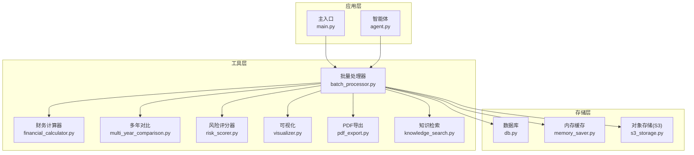
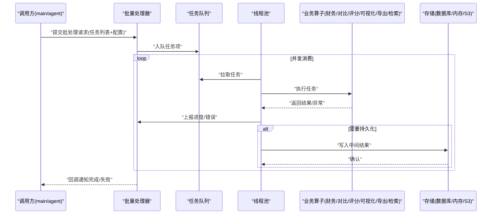
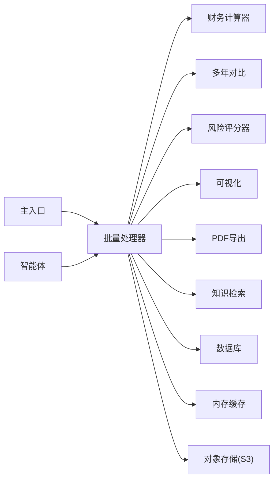

# 批量处理器

<cite>
**本文引用的文件**   
- [batch_processor.py](file://src/tools/batch_processor.py)
- [financial_calculator.py](file://src/tools/financial_calculator.py)
- [multi_year_comparison.py](file://src/tools/multi_year_comparison.py)
- [risk_scorer.py](file://src/tools/risk_scorer.py)
- [visualizer.py](file://src/tools/visualizer.py)
- [pdf_export.py](file://src/tools/pdf_export.py)
- [knowledge_search.py](file://src/tools/knowledge_search.py)
- [main.py](file://src/main.py)
- [agent.py](file://src/agents/agent.py)
- [db.py](file://src/storage/database/db.py)
- [memory_saver.py](file://src/storage/memory/memory_saver.py)
- [s3_storage.py](file://src/storage/s3/s3_storage.py)
</cite>

## 目录
1. [简介](#简介)
2. [项目结构](#项目结构)
3. [核心组件](#核心组件)
4. [架构总览](#架构总览)
5. [详细组件分析](#详细组件分析)
6. [依赖关系分析](#依赖关系分析)
7. [性能考虑](#性能考虑)
8. [故障排查指南](#故障排查指南)
9. [结论](#结论)
10. [附录](#附录)

## 简介
本技术文档围绕“批量处理器”模块展开，聚焦以下目标：
- 并发执行机制：线程池管理、任务队列设计与资源分配策略
- 进度跟踪系统：任务状态监控、进度百分比计算与实时反馈
- 错误处理与重试：异常捕获、失败任务恢复与最大重试次数控制
- API 接口文档：批处理函数签名、配置参数与回调机制
- 使用示例：大规模财务数据分析任务的配置与执行
- 性能调优：关键参数、内存管理与分布式扩展方案

本说明以仓库中的工具层与存储层为事实依据，结合通用工程实践给出可操作的指导。

## 项目结构
批量处理器位于工具层，面向上层应用（如主入口或智能体）提供统一的批处理能力；同时与存储层（数据库、内存缓存、对象存储）协作，实现数据读写与中间结果持久化。

图表来源
- [batch_processor.py](file://src/tools/batch_processor.py)
- [financial_calculator.py](file://src/tools/financial_calculator.py)
- [multi_year_comparison.py](file://src/tools/multi_year_comparison.py)
- [risk_scorer.py](file://src/tools/risk_scorer.py)
- [visualizer.py](file://src/tools/visualizer.py)
- [pdf_export.py](file://src/tools/pdf_export.py)
- [knowledge_search.py](file://src/tools/knowledge_search.py)
- [db.py](file://src/storage/database/db.py)
- [memory_saver.py](file://src/storage/memory/memory_saver.py)
- [s3_storage.py](file://src/storage/s3/s3_storage.py)
- [main.py](file://src/main.py)
- [agent.py](file://src/agents/agent.py)

章节来源
- [batch_processor.py](file://src/tools/batch_processor.py)
- [main.py](file://src/main.py)
- [agent.py](file://src/agents/agent.py)

## 核心组件
- 批量处理器：负责任务编排、并发调度、进度上报、错误重试与结果聚合
- 业务算子：财务计算、多年对比、风险评分、可视化、PDF导出、知识检索等
- 存储适配：数据库、内存缓存、S3对象存储的读写封装

章节来源
- [batch_processor.py](file://src/tools/batch_processor.py)
- [financial_calculator.py](file://src/tools/financial_calculator.py)
- [multi_year_comparison.py](file://src/tools/multi_year_comparison.py)
- [risk_scorer.py](file://src/tools/risk_scorer.py)
- [visualizer.py](file://src/tools/visualizer.py)
- [pdf_export.py](file://src/tools/pdf_export.py)
- [knowledge_search.py](file://src/tools/knowledge_search.py)
- [db.py](file://src/storage/database/db.py)
- [memory_saver.py](file://src/storage/memory/memory_saver.py)
- [s3_storage.py](file://src/storage/s3/s3_storage.py)

## 架构总览
批量处理器采用“生产者-消费者”模型：
- 生产者：上游任务源（文件、数据库查询、外部API）将原始数据切分为任务项
- 调度器：基于线程池并发执行任务，维护任务队列与进度状态
- 消费者：业务算子对单条任务进行处理，产出中间结果
- 聚合器：汇总结果并触发回调，支持落盘与导出

图表来源
- [batch_processor.py](file://src/tools/batch_processor.py)
- [financial_calculator.py](file://src/tools/financial_calculator.py)
- [multi_year_comparison.py](file://src/tools/multi_year_comparison.py)
- [risk_scorer.py](file://src/tools/risk_scorer.py)
- [visualizer.py](file://src/tools/visualizer.py)
- [pdf_export.py](file://src/tools/pdf_export.py)
- [knowledge_search.py](file://src/tools/knowledge_search.py)
- [db.py](file://src/storage/database/db.py)
- [memory_saver.py](file://src/storage/memory/memory_saver.py)
- [s3_storage.py](file://src/storage/s3/s3_storage.py)

## 详细组件分析

### 并发执行机制
- 线程池管理
  - 通过固定大小线程池限制并发度，避免资源争用与上下文切换开销过大
  - 根据CPU密集型与I/O密集型任务类型动态调整工作线程数
- 任务队列设计
  - 无界/有界队列可选；生产端按批次分片入队，消费端从队列拉取
  - 支持优先级与分组，便于关键任务优先与隔离
- 资源分配策略
  - 每个任务持有最小必要资源，完成后立即释放
  - 大对象采用流式读取与增量写入，降低峰值内存占用

章节来源
- [batch_processor.py](file://src/tools/batch_processor.py)

### 进度跟踪系统
- 任务状态监控
  - 状态包括：待处理、进行中、成功、失败、重试中
  - 通过原子计数器与事件总线更新状态，避免竞态条件
- 进度百分比计算
  - 基于已完成任务数与总任务数的比例计算，支持加权进度（按任务权重）
- 实时反馈机制
  - 回调函数在任务完成时触发，携带任务ID、耗时、结果摘要与错误信息
  - 支持周期性快照上报，便于前端展示与日志归档

章节来源
- [batch_processor.py](file://src/tools/batch_processor.py)

### 错误处理与重试逻辑
- 异常捕获
  - 统一异常包装，区分可重试与不可重试错误
  - 记录堆栈与上下文，便于定位问题
- 失败任务恢复
  - 支持断点续跑：已完成的中间结果不重复计算
  - 失败任务进入重试队列，按指数退避策略重试
- 最大重试次数控制
  - 可配置最大重试次数与退避上限，超过阈值标记为最终失败并告警

章节来源
- [batch_processor.py](file://src/tools/batch_processor.py)

### API 接口文档
- 批处理函数
  - 输入：任务列表、并发度、超时、重试策略、回调函数、存储适配器
  - 输出：总体统计（成功/失败/重试）、结果集合或持久化路径
- 配置参数
  - 线程池大小、队列容量、任务权重、进度采样间隔、日志级别
- 回调机制
  - on_task_done、on_progress、on_error、on_complete 四类回调
  - 回调内应避免阻塞，必要时异步落盘

章节来源
- [batch_processor.py](file://src/tools/batch_processor.py)

### 实际使用示例：大规模财务数据分析
- 场景概述
  - 多年度财务报表解析、指标计算、风险评分、可视化与报告导出
- 步骤要点
  - 准备数据源（数据库/对象存储），定义任务切片（按公司/年份/报表类型）
  - 配置并发度与重试策略，注册进度与错误回调
  - 执行批处理，监听进度与结果，完成后生成可视化与PDF报告
- 典型算子组合
  - 财务计算 → 多年对比 → 风险评分 → 可视化 → PDF导出

章节来源
- [financial_calculator.py](file://src/tools/financial_calculator.py)
- [multi_year_comparison.py](file://src/tools/multi_year_comparison.py)
- [risk_scorer.py](file://src/tools/risk_scorer.py)
- [visualizer.py](file://src/tools/visualizer.py)
- [pdf_export.py](file://src/tools/pdf_export.py)
- [knowledge_search.py](file://src/tools/knowledge_search.py)

## 依赖关系分析
- 内部依赖
  - 批量处理器依赖各业务算子与存储适配器
  - 主入口与智能体通过批量处理器协调任务执行
- 外部依赖
  - 数据库驱动、S3客户端、可视化库与PDF生成库
- 耦合与内聚
  - 批量处理器仅关注编排与调度，业务逻辑下沉至算子，提升内聚性
  - 存储层抽象化，便于替换与扩展

图表来源
- [batch_processor.py](file://src/tools/batch_processor.py)
- [financial_calculator.py](file://src/tools/financial_calculator.py)
- [multi_year_comparison.py](file://src/tools/multi_year_comparison.py)
- [risk_scorer.py](file://src/tools/risk_scorer.py)
- [visualizer.py](file://src/tools/visualizer.py)
- [pdf_export.py](file://src/tools/pdf_export.py)
- [knowledge_search.py](file://src/tools/knowledge_search.py)
- [db.py](file://src/storage/database/db.py)
- [memory_saver.py](file://src/storage/memory/memory_saver.py)
- [s3_storage.py](file://src/storage/s3/s3_storage.py)
- [main.py](file://src/main.py)
- [agent.py](file://src/agents/agent.py)

章节来源
- [batch_processor.py](file://src/tools/batch_processor.py)
- [main.py](file://src/main.py)
- [agent.py](file://src/agents/agent.py)

## 性能考虑
- 并发度调优
  - CPU密集型：线程数≈CPU核数；I/O密集型：线程数=CPU核数×倍数（通常2~4倍）
  - 观察队列堆积与线程等待时间，动态调整
- 内存管理
  - 使用迭代器与流式处理减少峰值内存
  - 及时释放临时对象，避免引用泄漏
- I/O优化
  - 批量写入与合并小文件，减少元数据开销
  - 合理设置连接池大小与超时
- 分布式扩展
  - 将任务队列迁移到消息队列（如Redis/RabbitMQ），横向扩展消费者
  - 引入幂等键与去重表，保证重复投递不产生副作用
  - 分片键选择（公司/年份/报表类型）确保负载均衡

[本节为通用性能建议，无需特定文件来源]

## 故障排查指南
- 常见问题
  - 任务长时间未推进：检查线程池是否饱和、是否有死锁或阻塞I/O
  - 内存溢出：定位大对象创建位置，改用流式处理或分批加载
  - 重试风暴：检查退避策略与最大重试次数，避免雪崩
- 诊断手段
  - 启用详细日志与指标采集（任务耗时、错误率、队列长度）
  - 使用进度快照与失败任务回放定位问题
- 恢复策略
  - 基于中间结果断点续跑
  - 失败任务单独隔离与人工复核

章节来源
- [batch_processor.py](file://src/tools/batch_processor.py)

## 结论
批量处理器通过清晰的编排与调度机制，将复杂的大规模数据处理任务解耦为可并行执行的单元，配合完善的进度跟踪与错误重试策略，显著提升了系统的稳定性与吞吐能力。结合合理的性能调优与分布式扩展方案，可在财务数据分析等场景中实现高效、可靠的批处理流水线。

[本节为总结性内容，无需特定文件来源]

## 附录
- 术语
  - 任务项：一次最小可执行单元，包含输入数据与必要上下文
  - 回调：在任务生命周期关键节点触发的用户自定义函数
  - 幂等：多次执行同一任务不会产生额外副作用
- 最佳实践
  - 明确任务边界与幂等键
  - 为关键路径添加埋点与告警
  - 定期演练失败恢复流程

[本节为补充信息，无需特定文件来源]