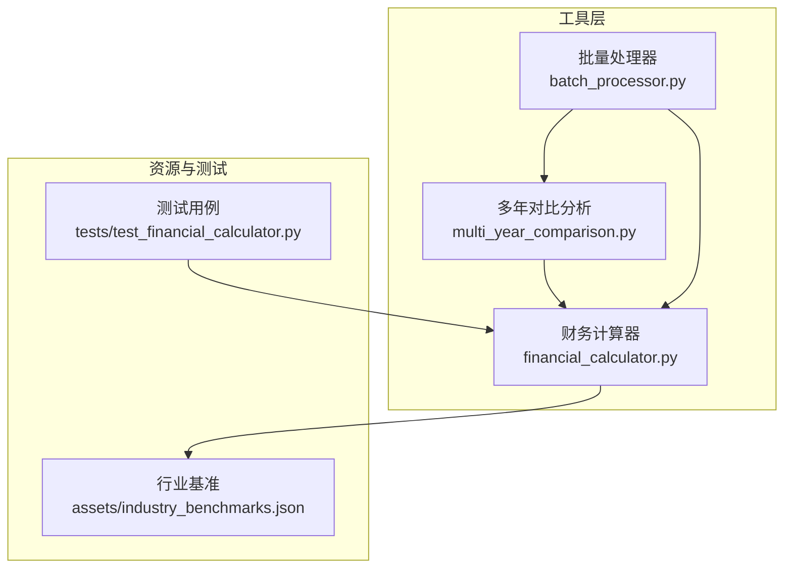
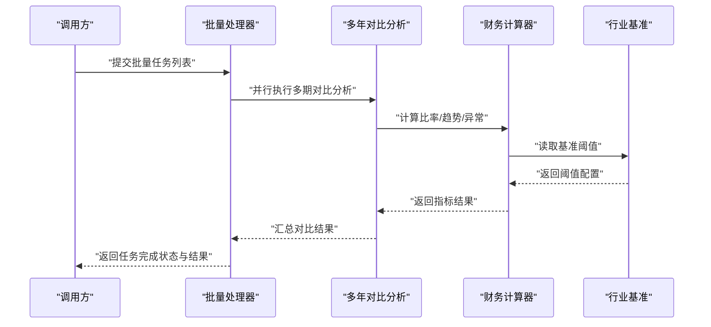
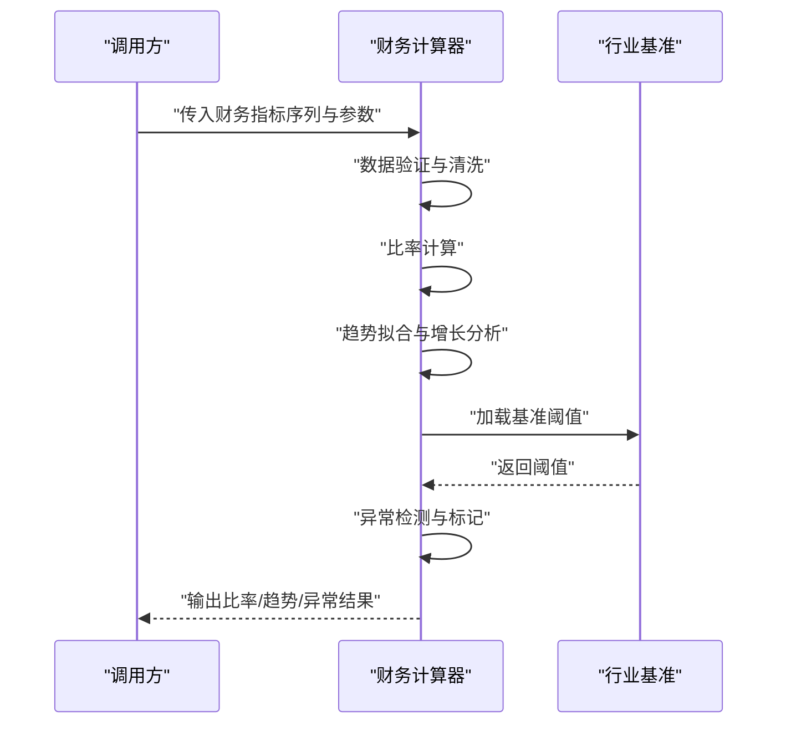
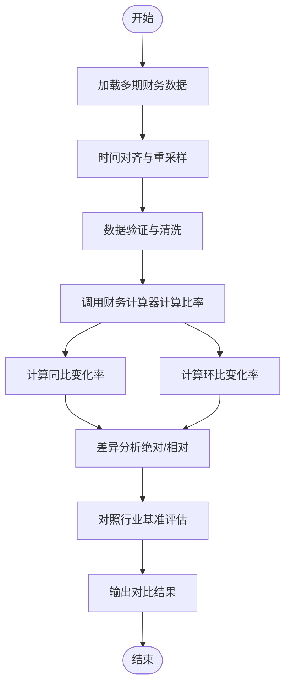
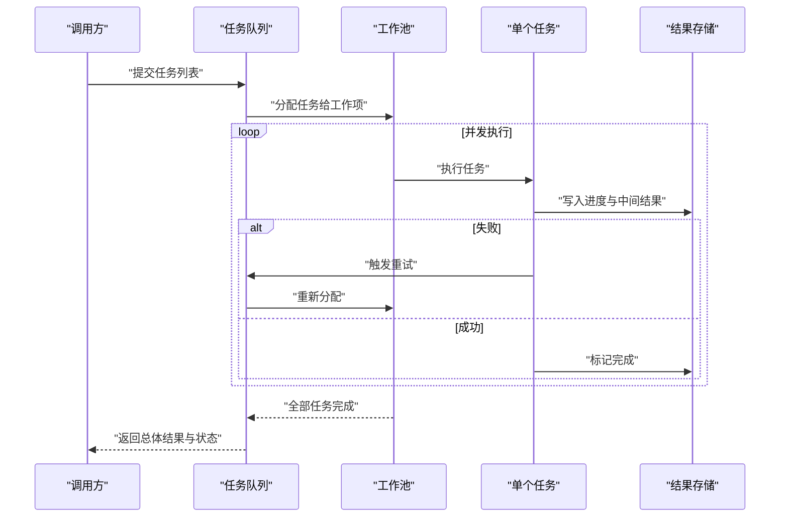
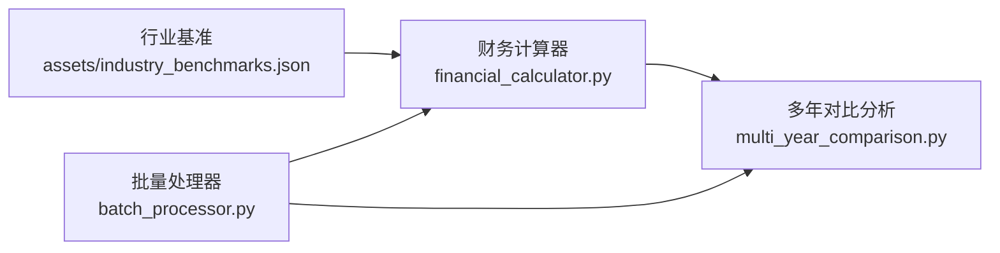

# 财务分析工具

<cite>
**本文引用的文件**   
- [financial_calculator.py](file://src/tools/financial_calculator.py)
- [multi_year_comparison.py](file://src/tools/multi_year_comparison.py)
- [batch_processor.py](file://src/tools/batch_processor.py)
- [test_financial_calculator.py](file://tests/test_financial_calculator.py)
- [assets/industry_benchmarks.json](file://assets/industry_benchmarks.json)
</cite>

## 目录
1. [简介](#简介)
2. [项目结构](#项目结构)
3. [核心组件](#核心组件)
4. [架构总览](#架构总览)
5. [详细组件分析](#详细组件分析)
6. [依赖关系分析](#依赖关系分析)
7. [性能考虑](#性能考虑)
8. [故障排查指南](#故障排查指南)
9. [结论](#结论)
10. [附录](#附录)

## 简介
本技术文档面向“财务分析工具”模块，聚焦以下目标：
- 深入解释财务计算器的实现原理，包括比率分析算法、趋势计算方法与异常检测逻辑。
- 详细说明多年对比分析功能，涵盖时间序列数据处理、同比环比计算与差异分析。
- 描述批量处理器的并发执行机制，包括任务队列管理、进度跟踪与错误重试。
- 提供具体API接口说明（函数签名、参数与返回值格式）。
- 给出实际使用示例与最佳实践建议。
- 解释数据验证规则、精度控制与性能优化策略。

## 项目结构
围绕财务分析工具的核心代码位于 src/tools 目录下，关键文件如下：
- financial_calculator.py：财务计算器，负责比率计算、趋势分析与异常检测。
- multi_year_comparison.py：多年对比分析，支持时间序列处理、同比环比与差异分析。
- batch_processor.py：批量处理器，提供并发执行、任务队列、进度跟踪与重试机制。
- tests/test_financial_calculator.py：财务计算器测试用例，覆盖输入校验、边界条件与典型场景。
- assets/industry_benchmarks.json：行业基准数据，用于比率阈值与评分参考。

图表来源
- [financial_calculator.py](file://src/tools/financial_calculator.py)
- [multi_year_comparison.py](file://src/tools/multi_year_comparison.py)
- [batch_processor.py](file://src/tools/batch_processor.py)
- [assets/industry_benchmarks.json](file://assets/industry_benchmarks.json)
- [test_financial_calculator.py](file://tests/test_financial_calculator.py)

章节来源
- [financial_calculator.py](file://src/tools/financial_calculator.py)
- [multi_year_comparison.py](file://src/tools/multi_year_comparison.py)
- [batch_processor.py](file://src/tools/batch_processor.py)
- [assets/industry_benchmarks.json](file://assets/industry_benchmarks.json)
- [test_financial_calculator.py](file://tests/test_financial_calculator.py)

## 核心组件
本节概述三大核心组件的职责与交互关系：
- 财务计算器：提供比率分析、趋势计算与异常检测能力，作为其他组件的基础服务。
- 多年对比分析：基于时间序列数据进行同比、环比与差异分析，并调用财务计算器进行指标计算。
- 批量处理器：对多个分析任务进行并发调度，管理任务队列、进度追踪与失败重试。

章节来源
- [financial_calculator.py](file://src/tools/financial_calculator.py)
- [multi_year_comparison.py](file://src/tools/multi_year_comparison.py)
- [batch_processor.py](file://src/tools/batch_processor.py)

## 架构总览
下图展示了财务分析工具的整体架构与数据流：
- 输入数据经多年对比分析模块组织为时间序列；
- 财务计算器对序列中的各期数据进行比率计算、趋势拟合与异常检测；
- 批量处理器将多个分析任务分发到工作线程或进程池，统一收集结果与状态；
- 行业基准数据用于阈值判定与评分辅助。

图表来源
- [batch_processor.py](file://src/tools/batch_processor.py)
- [multi_year_comparison.py](file://src/tools/multi_year_comparison.py)
- [financial_calculator.py](file://src/tools/financial_calculator.py)
- [assets/industry_benchmarks.json](file://assets/industry_benchmarks.json)

## 详细组件分析

### 财务计算器（财务计算引擎）
职责与能力：
- 比率分析：计算流动性、盈利性、杠杆、效率等维度的关键比率。
- 趋势计算：对多期比率序列进行线性回归、移动平均与增长率计算。
- 异常检测：基于统计方法（如Z-Score、IQR）识别偏离正常区间的值。
- 数据验证：检查输入缺失、类型与范围，保证计算稳定性。
- 精度控制：统一数值精度与舍入策略，避免浮点误差累积。

关键流程（时序图）：

图表来源
- [financial_calculator.py](file://src/tools/financial_calculator.py)
- [assets/industry_benchmarks.json](file://assets/industry_benchmarks.json)

类与方法概览（概念性）：
- 财务计算器类：封装比率、趋势、异常检测的公共方法与配置。
- 比率计算：按维度分组计算，支持加权与标准化。
- 趋势计算：支持线性回归、指数平滑与滚动窗口。
- 异常检测：支持Z-Score、IQR与分位数阈值。
- 数据验证：空值填充、类型转换、范围约束。
- 精度控制：小数位设置、四舍五入策略、数值溢出保护。

章节来源
- [financial_calculator.py](file://src/tools/financial_calculator.py)
- [assets/industry_benchmarks.json](file://assets/industry_benchmarks.json)

### 多年对比分析（时间序列与同比环比）
职责与能力：
- 时间序列处理：对齐年份/季度/月度周期，处理缺失与重采样。
- 同比与环比：计算相邻周期与同周期跨年的变化率。
- 差异分析：绝对差异与相对差异，结合行业基准进行归因提示。
- 可视化准备：生成结构化结果供后续图表渲染。

关键流程（流程图）：

图表来源
- [multi_year_comparison.py](file://src/tools/multi_year_comparison.py)
- [financial_calculator.py](file://src/tools/financial_calculator.py)
- [assets/industry_benchmarks.json](file://assets/industry_benchmarks.json)

章节来源
- [multi_year_comparison.py](file://src/tools/multi_year_comparison.py)
- [financial_calculator.py](file://src/tools/financial_calculator.py)
- [assets/industry_benchmarks.json](file://assets/industry_benchmarks.json)

### 批量处理器（并发执行与任务管理）
职责与能力：
- 任务队列：接收任务列表，维护待处理、进行中与已完成状态。
- 并发执行：通过线程池或进程池并行处理任务，提高吞吐。
- 进度跟踪：实时记录每个任务的进度与中间状态。
- 错误重试：对失败任务进行有限次重试，支持退避策略。
- 结果聚合：汇总成功与失败任务的结果，提供整体报告。

关键流程（时序图）：

图表来源
- [batch_processor.py](file://src/tools/batch_processor.py)

章节来源
- [batch_processor.py](file://src/tools/batch_processor.py)

## 依赖关系分析
- 财务计算器依赖行业基准数据以进行阈值判断与评分。
- 多年对比分析依赖财务计算器进行指标计算。
- 批量处理器可并行调用多年对比分析与财务计算器。

图表来源
- [financial_calculator.py](file://src/tools/financial_calculator.py)
- [multi_year_comparison.py](file://src/tools/multi_year_comparison.py)
- [batch_processor.py](file://src/tools/batch_processor.py)
- [assets/industry_benchmarks.json](file://assets/industry_benchmarks.json)

章节来源
- [financial_calculator.py](file://src/tools/financial_calculator.py)
- [multi_year_comparison.py](file://src/tools/multi_year_comparison.py)
- [batch_processor.py](file://src/tools/batch_processor.py)
- [assets/industry_benchmarks.json](file://assets/industry_benchmarks.json)

## 性能考虑
- 并发度调优：根据CPU核数与I/O特性调整工作池大小，避免过度竞争。
- 批大小控制：合理划分批次，平衡内存占用与吞吐。
- 缓存策略：对行业基准与常用配置进行缓存，减少重复加载。
- 增量计算：在时间序列较长时采用滚动窗口与增量更新，降低计算开销。
- 精度与速度权衡：在高吞吐场景适当放宽精度，或在关键路径提升精度。

[本节为通用指导，不直接分析具体文件]

## 故障排查指南
常见问题与定位建议：
- 输入数据缺失或类型错误：检查数据验证规则与清洗步骤，确保字段完整与类型一致。
- 比率计算异常：核对基准阈值与权重配置，确认是否出现除零或负值处理不当。
- 趋势拟合不稳定：检查时间对齐与重采样策略，必要时增加平滑或剔除极端值。
- 异常检测误报：调整Z-Score或IQR阈值，结合业务背景修正。
- 批量任务失败：查看任务日志与重试次数，确认外部依赖可用性。

章节来源
- [test_financial_calculator.py](file://tests/test_financial_calculator.py)
- [financial_calculator.py](file://src/tools/financial_calculator.py)

## 结论
财务分析工具模块通过财务计算器、多年对比分析与批量处理器形成完整的分析流水线。其优势在于：
- 模块化设计清晰，职责分离明确；
- 支持并发与重试，具备较好的可扩展性与鲁棒性；
- 结合行业基准进行阈值与评分，增强业务可解释性。
建议在工程实践中关注数据质量、精度控制与性能调优，以获得稳定高效的分析结果。

[本节为总结性内容，不直接分析具体文件]

## 附录

### API 接口文档（函数签名、参数与返回值）
以下为财务计算器与多年对比分析的关键接口约定（概念性说明，便于集成与测试）：
- 财务计算器
  - 计算比率
    - 参数：财务指标序列、比率维度配置、基准阈值
    - 返回：比率结果字典（含原始值、标准化值、基准对比）
  - 趋势计算
    - 参数：比率序列、窗口大小、模型类型（线性/指数）
    - 返回：趋势拟合结果（斜率、截距、预测值）
  - 异常检测
    - 参数：比率序列、检测方法（Z-Score/IQR）、阈值
    - 返回：异常标记列表（索引、原因、严重等级）
- 多年对比分析
  - 同比环比计算
    - 参数：多期财务数据、周期粒度（年/季/月）
    - 返回：同比/环比变化率表
  - 差异分析
    - 参数：对比期数据、基准阈值
    - 返回：差异明细（绝对/相对差异、归因提示）
- 批量处理器
  - 提交任务
    - 参数：任务列表、并发度、重试次数
    - 返回：任务ID集合与初始状态
  - 查询进度
    - 参数：任务ID
    - 返回：任务状态与进度百分比
  - 获取结果
    - 参数：任务ID
    - 返回：任务最终结果与错误信息（如有）

章节来源
- [financial_calculator.py](file://src/tools/financial_calculator.py)
- [multi_year_comparison.py](file://src/tools/multi_year_comparison.py)
- [batch_processor.py](file://src/tools/batch_processor.py)

### 数据验证规则与精度控制
- 数据验证
  - 必填字段检查、类型转换、范围约束、缺失值处理策略。
- 精度控制
  - 统一小数位、四舍五入策略、数值溢出保护、浮点误差抑制。
- 基准与阈值
  - 从行业基准加载阈值，支持动态更新与版本管理。

章节来源
- [financial_calculator.py](file://src/tools/financial_calculator.py)
- [assets/industry_benchmarks.json](file://assets/industry_benchmarks.json)

### 实际使用示例与最佳实践
- 示例流程
  - 准备多期财务数据，定义比率维度与基准阈值；
  - 调用多年对比分析进行同比环比与差异分析；
  - 使用批量处理器并发执行多个公司或部门的分析任务；
  - 汇总结果并输出报告。
- 最佳实践
  - 严格的数据治理：确保数据完整性与一致性；
  - 合理的并发配置：依据系统资源调整工作池大小；
  - 监控与告警：对失败任务与异常指标建立告警机制；
  - 持续优化：定期校准基准阈值与模型参数。

章节来源
- [multi_year_comparison.py](file://src/tools/multi_year_comparison.py)
- [batch_processor.py](file://src/tools/batch_processor.py)
- [financial_calculator.py](file://src/tools/financial_calculator.py)