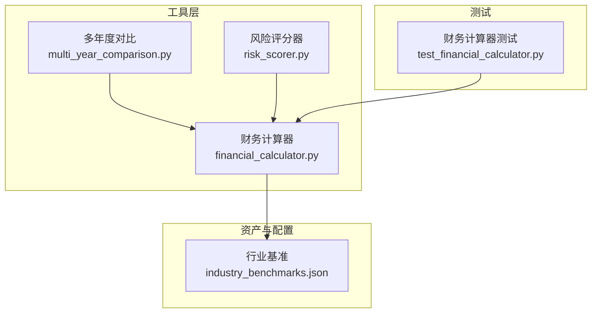
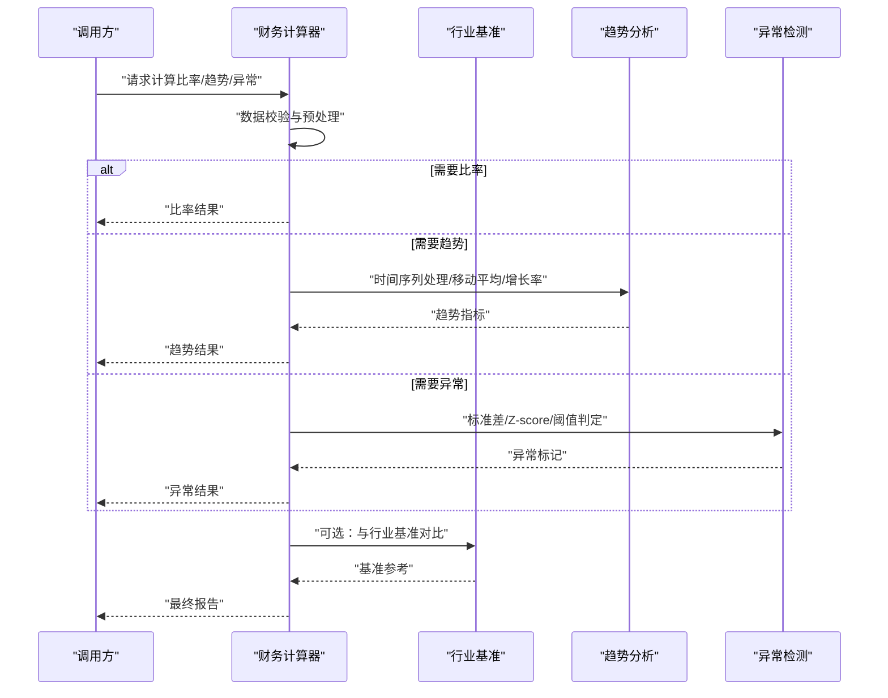
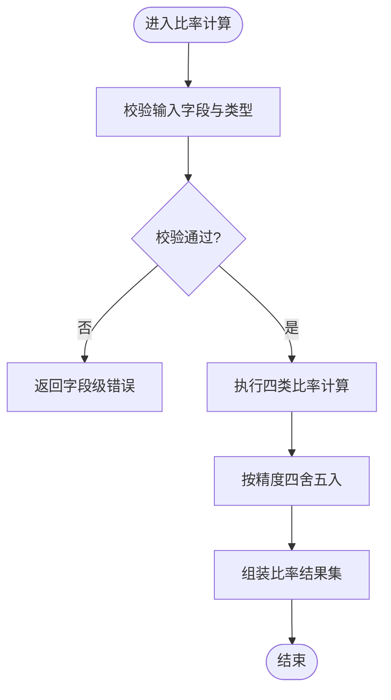
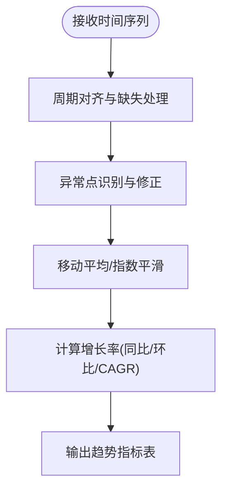
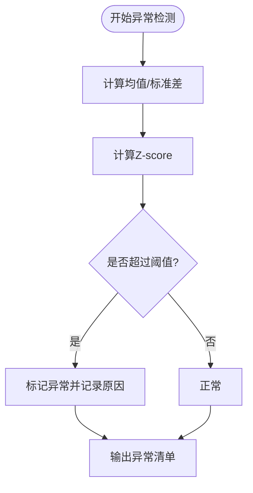
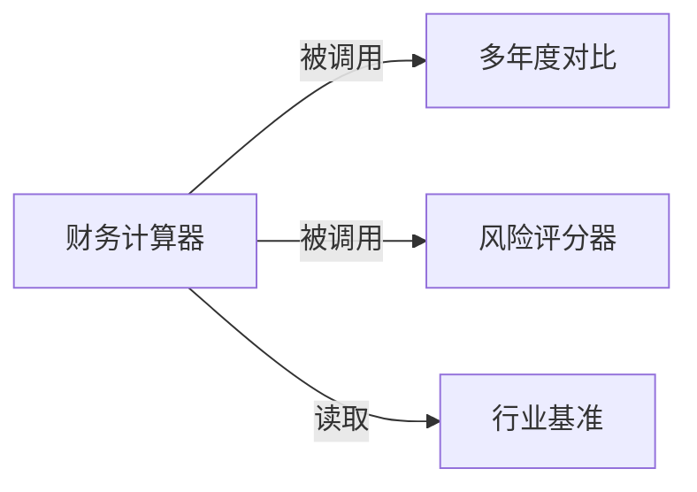

# 财务计算器

<cite>
**本文引用的文件**   
- [financial_calculator.py](file://src/tools/financial_calculator.py)
- [test_financial_calculator.py](file://tests/test_financial_calculator.py)
- [multi_year_comparison.py](file://src/tools/multi_year_comparison.py)
- [risk_scorer.py](file://src/tools/risk_scorer.py)
- [industry_benchmarks.json](file://assets/industry_benchmarks.json)
</cite>

## 目录
1. [简介](#简介)
2. [项目结构](#项目结构)
3. [核心组件](#核心组件)
4. [架构总览](#架构总览)
5. [详细组件分析](#详细组件分析)
6. [依赖关系分析](#依赖关系分析)
7. [性能考虑](#性能考虑)
8. [故障排查指南](#故障排查指南)
9. [结论](#结论)
10. [附录：API 参考与使用示例](#附录api-参考与使用示例)

## 简介
本技术文档围绕“财务计算器”模块，系统性阐述其实现原理与使用方法。内容覆盖：
- 财务比率计算：流动性比率、盈利能力比率、偿债能力比率、运营效率比率
- 趋势分析：时间序列处理、移动平均、增长率统计
- 异常检测：标准差分析、Z-score 方法与阈值判断
- API 接口：函数签名、参数类型、返回值格式与错误处理
- 数据验证规则、精度控制策略与性能优化方法
- 实际调用示例与常见问题排查

## 项目结构
财务计算器位于工具层，提供面向上层应用（如多年度对比、风险评分等）的标准化计算能力；测试用例用于保障正确性与回归稳定性；行业基准数据作为外部参考输入。

图表来源
- [financial_calculator.py](file://src/tools/financial_calculator.py)
- [multi_year_comparison.py](file://src/tools/multi_year_comparison.py)
- [risk_scorer.py](file://src/tools/risk_scorer.py)
- [industry_benchmarks.json](file://assets/industry_benchmarks.json)
- [test_financial_calculator.py](file://tests/test_financial_calculator.py)

章节来源
- [financial_calculator.py](file://src/tools/financial_calculator.py)
- [multi_year_comparison.py](file://src/tools/multi_year_comparison.py)
- [risk_scorer.py](file://src/tools/risk_scorer.py)
- [industry_benchmarks.json](file://assets/industry_benchmarks.json)
- [test_financial_calculator.py](file://tests/test_financial_calculator.py)

## 核心组件
- 财务比率计算引擎：封装流动性、盈利能力、偿债能力、运营效率四大类比率算法，统一输入输出规范与错误处理。
- 趋势分析工具：对时间序列进行清洗、对齐、移动平均与增长率统计，支持窗口化与缺失值处理。
- 异常检测模块：基于标准差与 Z-score 的异常识别，结合可配置阈值输出异常标记与建议。
- 多年度对比与风险评分：消费财务计算器能力，完成跨期比较与风险打分。

章节来源
- [financial_calculator.py](file://src/tools/financial_calculator.py)
- [multi_year_comparison.py](file://src/tools/multi_year_comparison.py)
- [risk_scorer.py](file://src/tools/risk_scorer.py)

## 架构总览
财务计算器采用“计算引擎 + 工具编排 + 外部基准”的分层设计。上层通过统一接口获取比率、趋势与异常检测结果；底层负责数值计算、校验与精度控制。

图表来源
- [financial_calculator.py](file://src/tools/financial_calculator.py)
- [industry_benchmarks.json](file://assets/industry_benchmarks.json)

## 详细组件分析

### 财务比率计算引擎
- 功能范围
  - 流动性比率：衡量短期偿债能力
  - 盈利能力比率：衡量利润生成能力
  - 偿债能力比率：衡量长期债务负担与资本结构
  - 运营效率比率：衡量资产周转与营运资金管理效率
- 输入规范
  - 以结构化字典或对象形式传入关键科目余额或期间发生额
  - 字段命名需遵循内部约定，缺失字段将触发校验错误
- 输出规范
  - 返回标准化比率集合，包含比率名称、数值、单位与备注
  - 对除零、负数、不可比口径等情况给出明确错误码与提示
- 精度控制
  - 默认保留两位小数，可通过参数调整
  - 中间计算过程采用高精度浮点运算，避免累积误差
- 错误处理
  - 输入校验失败：返回具体字段级错误信息
  - 数值异常：记录警告并跳过受影响比率，继续计算其他可用项
  - 业务逻辑异常：抛出带上下文的错误对象，便于上层捕获

图表来源
- [financial_calculator.py](file://src/tools/financial_calculator.py)

章节来源
- [financial_calculator.py](file://src/tools/financial_calculator.py)

### 趋势分析方法
- 时间序列数据处理
  - 对齐周期（年/季/月），填充缺失值（前向/后向/线性插值）
  - 剔除极端值与异常点后再进行平滑处理
- 移动平均
  - 支持固定窗口与指数加权移动平均
  - 窗口大小与衰减因子可配置
- 增长率统计
  - 同比、环比、复合年均增长率（CAGR）
  - 支持百分比与绝对变化量双输出
- 输出
  - 时序指标表：含原始值、平滑值、增长率、置信区间（可选）

图表来源
- [financial_calculator.py](file://src/tools/financial_calculator.py)

章节来源
- [financial_calculator.py](file://src/tools/financial_calculator.py)

### 异常检测机制
- 标准差分析
  - 基于窗口内均值与标准差，识别偏离超过阈值的观测点
- Z-score 方法
  - 计算各点标准化得分，超过设定阈值即标记为异常
- 阈值判断
  - 支持全局阈值与分指标阈值
  - 可结合业务经验动态调整
- 输出
  - 异常标记列表：含指标名、时间点、得分、建议动作

图表来源
- [financial_calculator.py](file://src/tools/financial_calculator.py)

章节来源
- [financial_calculator.py](file://src/tools/financial_calculator.py)

### 多年度对比与风险评分
- 多年度对比
  - 聚合多年比率与趋势指标，生成横向对比视图
  - 支持行业基准对照与差异分析
- 风险评分
  - 基于比率与趋势特征构建评分模型
  - 输出综合风险等级与分项贡献度

章节来源
- [multi_year_comparison.py](file://src/tools/multi_year_comparison.py)
- [risk_scorer.py](file://src/tools/risk_scorer.py)

## 依赖关系分析
- 内部依赖
  - 多年度对比与风险评分均依赖财务计算器提供的比率与趋势能力
- 外部依赖
  - 行业基准数据用于对比与校准
- 耦合与内聚
  - 财务计算器保持高内聚，对外暴露稳定接口；上层工具仅关注业务编排

图表来源
- [financial_calculator.py](file://src/tools/financial_calculator.py)
- [multi_year_comparison.py](file://src/tools/multi_year_comparison.py)
- [risk_scorer.py](file://src/tools/risk_scorer.py)
- [industry_benchmarks.json](file://assets/industry_benchmarks.json)

章节来源
- [financial_calculator.py](file://src/tools/financial_calculator.py)
- [multi_year_comparison.py](file://src/tools/multi_year_comparison.py)
- [risk_scorer.py](file://src/tools/risk_scorer.py)
- [industry_benchmarks.json](file://assets/industry_benchmarks.json)

## 性能考虑
- 批量计算
  - 对多公司或多年度场景，优先使用批处理接口以减少重复初始化开销
- 内存与缓存
  - 对频繁访问的行业基准与移动平均窗口进行缓存
- 并行与异步
  - 在独立指标间启用并发计算，注意共享资源锁与线程安全
- I/O 优化
  - 大文件读取采用流式解析，避免一次性加载到内存
- 精度与速度权衡
  - 默认精度满足审计需求；若追求极致性能，可降低中间计算精度并开启近似模式

[本节为通用指导，不直接分析具体文件]

## 故障排查指南
- 常见错误
  - 输入字段缺失或类型不符：检查字段命名与数据类型映射
  - 除零或负数导致比率无效：确认会计口径与期间匹配
  - 时间序列缺失过多：补充缺失值策略或缩短窗口
  - 异常阈值过严：放宽阈值或增加样本量
- 定位步骤
  - 查看错误码与上下文信息
  - 打印输入摘要与中间结果
  - 逐步关闭功能（如移动平均、异常检测）以隔离问题
- 日志与调试
  - 开启详细日志级别，记录关键路径与耗时
  - 使用单元测试样例数据进行回归验证

章节来源
- [test_financial_calculator.py](file://tests/test_financial_calculator.py)

## 结论
财务计算器模块以清晰的职责边界与稳定的接口，为比率计算、趋势分析与异常检测提供了可靠基础。配合多年度对比与风险评分工具，可形成完整的财务分析闭环。建议在工程实践中重视数据校验、精度控制与性能优化，确保在大规模场景下的稳定性与可维护性。

[本节为总结性内容，不直接分析具体文件]

## 附录：API 参考与使用示例

### 财务比率计算
- 函数签名
  - 计算比率：compute_ratios(data, precision=2, mode="standard")
- 参数
  - data：字典或对象，包含必要财务科目
  - precision：数值精度，默认 2
  - mode：计算模式，默认 standard
- 返回值
  - 比率结果集：包含比率名称、数值、单位与备注
- 错误处理
  - 输入校验失败：返回字段级错误
  - 数值异常：记录警告并跳过受影响比率
- 使用示例
  - 准备输入数据，调用 compute_ratios，遍历结果集输出比率与备注
  - 捕获异常并记录错误上下文

章节来源
- [financial_calculator.py](file://src/tools/financial_calculator.py)
- [test_financial_calculator.py](file://tests/test_financial_calculator.py)

### 趋势分析
- 函数签名
  - 计算趋势：compute_trends(series, window=3, method="ma", growth_types=["yoy","mom","cagr"])
- 参数
  - series：时间序列数据（年/季/月）
  - window：移动平均窗口
  - method：平滑方法（ma/ewm）
  - growth_types：增长率类型列表
- 返回值
  - 趋势指标表：含原始值、平滑值、增长率与置信区间（可选）
- 错误处理
  - 序列长度不足：返回空或最小可用窗口结果
  - 缺失值过多：提示填充策略
- 使用示例
  - 构造时间序列，设置窗口与方法，调用 compute_trends，输出可视化所需数据

章节来源
- [financial_calculator.py](file://src/tools/financial_calculator.py)

### 异常检测
- 函数签名
  - 检测异常：detect_anomalies(series, z_threshold=2.0, std_threshold=2.0)
- 参数
  - series：时间序列数据
  - z_threshold：Z-score 阈值
  - std_threshold：标准差倍数阈值
- 返回值
  - 异常标记列表：含指标名、时间点、得分与建议
- 错误处理
  - 样本不足：返回空列表并提示
  - 阈值不合理：自动回退至默认值并记录警告
- 使用示例
  - 对关键比率序列运行 detect_anomalies，筛选高风险时点并人工复核

章节来源
- [financial_calculator.py](file://src/tools/financial_calculator.py)

### 多年度对比
- 函数签名
  - 多年度对比：compare_multi_years(years_data, benchmark_path=None)
- 参数
  - years_data：多年比率与趋势数据
  - benchmark_path：行业基准文件路径
- 返回值
  - 对比报告：含差异分析与基准对照
- 错误处理
  - 基准文件缺失：跳过基准对比并记录
  - 年份不一致：对齐或提示
- 使用示例
  - 准备多年数据，指定基准文件，调用 compare_multi_years，导出对比报告

章节来源
- [multi_year_comparison.py](file://src/tools/multi_year_comparison.py)
- [industry_benchmarks.json](file://assets/industry_benchmarks.json)

### 风险评分
- 函数签名
  - 风险评分：score_risk(ratios, trends, weights=None)
- 参数
  - ratios：比率结果集
  - trends：趋势指标表
  - weights：权重配置（可选）
- 返回值
  - 风险等级与分项贡献度
- 错误处理
  - 输入不完整：返回部分评分并标注缺失项
  - 权重非法：回退至默认权重
- 使用示例
  - 组合比率与趋势结果，调用 score_risk，输出风险等级与建议

章节来源
- [risk_scorer.py](file://src/tools/risk_scorer.py)

### 数据验证规则与精度控制
- 数据验证
  - 必填字段检查、类型校验、取值范围约束
  - 会计口径一致性校验（如期间匹配、币种一致）
- 精度控制
  - 默认两位小数，支持自定义
  - 中间计算使用高精度浮点，避免累积误差
- 性能优化
  - 批处理、缓存、并发与流式 I/O

章节来源
- [financial_calculator.py](file://src/tools/financial_calculator.py)
- [test_financial_calculator.py](file://tests/test_financial_calculator.py)