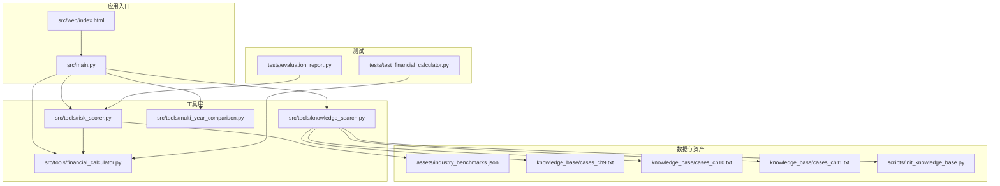
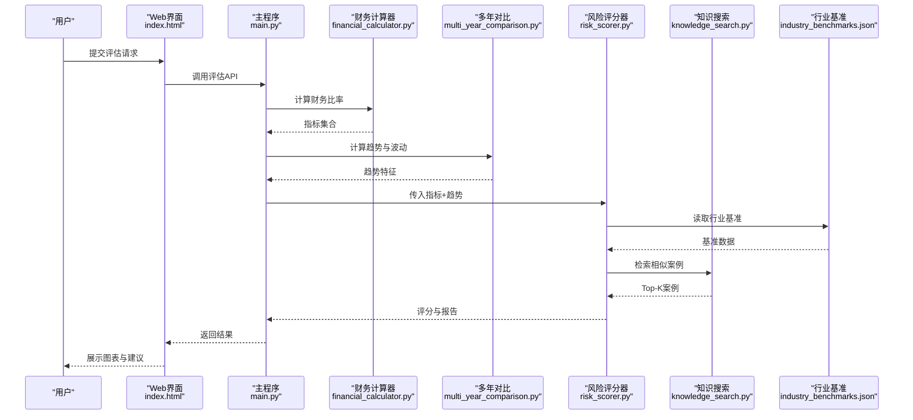
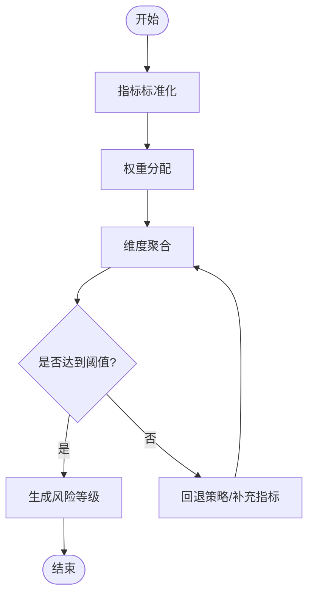
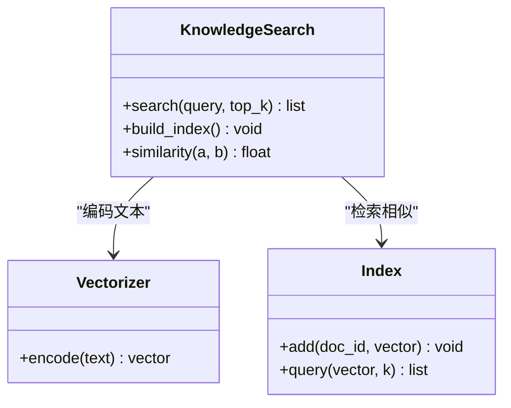
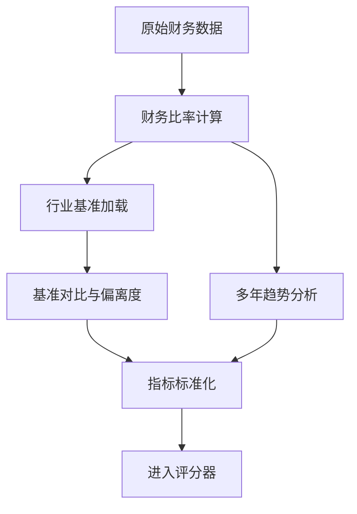
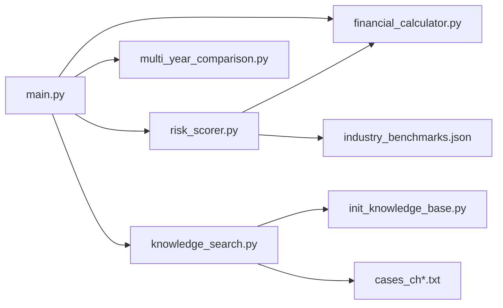

# 风险评估引擎

<cite>
**本文引用的文件**   
- [src/tools/risk_scorer.py](file://src/tools/risk_scorer.py)
- [src/tools/financial_calculator.py](file://src/tools/financial_calculator.py)
- [src/tools/knowledge_search.py](file://src/tools/knowledge_search.py)
- [src/tools/multi_year_comparison.py](file://src/tools/multi_year_comparison.py)
- [assets/industry_benchmarks.json](file://assets/industry_benchmarks.json)
- [knowledge_base/cases_ch9.txt](file://knowledge_base/cases_ch9.txt)
- [knowledge_base/cases_ch10.txt](file://knowledge_base/cases_ch10.txt)
- [knowledge_base/cases_ch11.txt](file://knowledge_base/cases_ch11.txt)
- [scripts/init_knowledge_base.py](file://scripts/init_knowledge_base.py)
- [src/main.py](file://src/main.py)
- [src/web/index.html](file://src/web/index.html)
- [tests/test_financial_calculator.py](file://tests/test_financial_calculator.py)
- [tests/evaluation_report.py](file://tests/evaluation_report.py)
</cite>

## 目录
1. [简介](#简介)
2. [项目结构](#项目结构)
3. [核心组件](#核心组件)
4. [架构总览](#架构总览)
5. [详细组件分析](#详细组件分析)
6. [依赖关系分析](#依赖关系分析)
7. [性能考虑](#性能考虑)
8. [故障排查指南](#故障排查指南)
9. [结论](#结论)
10. [附录](#附录)

## 简介
本技术文档面向“风险评估引擎”，系统性阐述其算法实现与工程化落地，覆盖以下关键主题：
- 多维度评分模型、权重分配机制与阈值设定
- 知识搜索的语义匹配（向量相似度计算、案例检索策略、结果排序）
- 风险指标计算方法（财务比率分析、行业基准对比、历史趋势评估）
- API接口与使用示例（参数配置、评分标准调整）
- 评估结果解读与可视化展示方法
- 模型调优方法与准确性验证策略

## 项目结构
仓库采用按功能模块组织的分层结构：工具层（tools）承载核心算法与业务逻辑；资产与知识库提供外部数据；脚本负责初始化与运行；测试用于回归与验证。

图表来源
- [src/main.py](file://src/main.py)
- [src/tools/risk_scorer.py](file://src/tools/risk_scorer.py)
- [src/tools/financial_calculator.py](file://src/tools/financial_calculator.py)
- [src/tools/knowledge_search.py](file://src/tools/knowledge_search.py)
- [src/tools/multi_year_comparison.py](file://src/tools/multi_year_comparison.py)
- [assets/industry_benchmarks.json](file://assets/industry_benchmarks.json)
- [knowledge_base/cases_ch9.txt](file://knowledge_base/cases_ch9.txt)
- [knowledge_base/cases_ch10.txt](file://knowledge_base/cases_ch10.txt)
- [knowledge_base/cases_ch11.txt](file://knowledge_base/cases_ch11.txt)
- [scripts/init_knowledge_base.py](file://scripts/init_knowledge_base.py)
- [src/web/index.html](file://src/web/index.html)
- [tests/test_financial_calculator.py](file://tests/test_financial_calculator.py)
- [tests/evaluation_report.py](file://tests/evaluation_report.py)

章节来源
- [src/main.py](file://src/main.py)
- [src/tools/risk_scorer.py](file://src/tools/risk_scorer.py)
- [src/tools/financial_calculator.py](file://src/tools/financial_calculator.py)
- [src/tools/knowledge_search.py](file://src/tools/knowledge_search.py)
- [src/tools/multi_year_comparison.py](file://src/tools/multi_year_comparison.py)
- [assets/industry_benchmarks.json](file://assets/industry_benchmarks.json)
- [knowledge_base/cases_ch9.txt](file://knowledge_base/cases_ch9.txt)
- [knowledge_base/cases_ch10.txt](file://knowledge_base/cases_ch10.txt)
- [knowledge_base/cases_ch11.txt](file://knowledge_base/cases_ch11.txt)
- [scripts/init_knowledge_base.py](file://scripts/init_knowledge_base.py)
- [src/web/index.html](file://src/web/index.html)
- [tests/test_financial_calculator.py](file://tests/test_financial_calculator.py)
- [tests/evaluation_report.py](file://tests/evaluation_report.py)

## 核心组件
- 风险评分器（risk_scorer.py）
  - 职责：聚合多维指标、执行加权评分、判定风险等级、输出结构化报告。
  - 输入：企业财务指标、行业基准、历史序列、知识检索结果等。
  - 输出：综合风险分、维度得分、风险等级、建议与依据。
- 财务计算器（financial_calculator.py）
  - 职责：计算各类财务比率（如流动性、盈利性、杠杆、营运效率等），支持多期比较。
  - 输入：财务报表字段或比率原始值。
  - 输出：标准化后的指标集合，供评分器消费。
- 知识搜索（knowledge_search.py）
  - 职责：对案例库进行语义检索，返回相似案例及匹配度，辅助解释与归因。
  - 输入：查询文本或特征描述。
  - 输出：Top-K相似案例、相似度分数、摘要信息。
- 多年对比（multi_year_comparison.py）
  - 职责：对连续年份指标进行趋势分析与波动度量，为趋势风险贡献提供依据。
  - 输入：时间序列指标。
  - 输出：趋势方向、斜率、波动率、异常点标记等。

章节来源
- [src/tools/risk_scorer.py](file://src/tools/risk_scorer.py)
- [src/tools/financial_calculator.py](file://src/tools/financial_calculator.py)
- [src/tools/knowledge_search.py](file://src/tools/knowledge_search.py)
- [src/tools/multi_year_comparison.py](file://src/tools/multi_year_comparison.py)

## 架构总览
系统以“指标计算—评分聚合—知识增强—可视化”为主线，形成可插拔的工具链。主程序协调各工具完成端到端评估流程，Web界面提供交互入口。

图表来源
- [src/main.py](file://src/main.py)
- [src/web/index.html](file://src/web/index.html)
- [src/tools/financial_calculator.py](file://src/tools/financial_calculator.py)
- [src/tools/multi_year_comparison.py](file://src/tools/multi_year_comparison.py)
- [src/tools/risk_scorer.py](file://src/tools/risk_scorer.py)
- [src/tools/knowledge_search.py](file://src/tools/knowledge_search.py)
- [assets/industry_benchmarks.json](file://assets/industry_benchmarks.json)

## 详细组件分析

### 多维度评分模型与权重分配
- 模型要点
  - 维度划分：通常包含偿债能力、盈利能力、营运能力、成长性与现金流等维度。
  - 指标标准化：将不同量纲指标映射到统一区间，便于加权聚合。
  - 权重分配：可按专家经验、AHP层次分析法或基于信息熵/方差赋权；支持动态权重配置。
  - 阈值设定：为每个维度与总分设置分级阈值（如低/中/高/极高），并允许按行业或场景微调。
- 实现位置
  - 评分聚合与阈值判定逻辑位于风险评分器模块。
  - 权重与阈值可通过配置文件或运行时参数注入。

图表来源
- [src/tools/risk_scorer.py](file://src/tools/risk_scorer.py)

章节来源
- [src/tools/risk_scorer.py](file://src/tools/risk_scorer.py)

### 知识搜索：语义匹配与案例检索
- 语义匹配
  - 文本向量化：将查询与案例文本转换为向量表示。
  - 相似度计算：常用余弦相似度或内积相似度，结合归一化提升稳定性。
- 检索策略
  - 倒排索引/向量索引混合：先粗筛再精排，兼顾召回与速度。
  - 过滤条件：按行业、年份、风险类型等元数据进行预过滤。
- 结果排序
  - 融合相似度、相关性、时效性等因子进行重排。
  - 返回Top-K并附带可解释片段。

图表来源
- [src/tools/knowledge_search.py](file://src/tools/knowledge_search.py)
- [scripts/init_knowledge_base.py](file://scripts/init_knowledge_base.py)
- [knowledge_base/cases_ch9.txt](file://knowledge_base/cases_ch9.txt)
- [knowledge_base/cases_ch10.txt](file://knowledge_base/cases_ch10.txt)
- [knowledge_base/cases_ch11.txt](file://knowledge_base/cases_ch11.txt)

章节来源
- [src/tools/knowledge_search.py](file://src/tools/knowledge_search.py)
- [scripts/init_knowledge_base.py](file://scripts/init_knowledge_base.py)
- [knowledge_base/cases_ch9.txt](file://knowledge_base/cases_ch9.txt)
- [knowledge_base/cases_ch10.txt](file://knowledge_base/cases_ch10.txt)
- [knowledge_base/cases_ch11.txt](file://knowledge_base/cases_ch11.txt)

### 风险指标计算：财务比率、行业基准与历史趋势
- 财务比率分析
  - 常见比率：流动比率、速动比率、资产负债率、ROE、毛利率、存货周转率等。
  - 计算路径：由财务计算器模块根据输入报表字段推导比率。
- 行业基准对比
  - 基准来源：行业基准JSON文件提供分位数或均值参考。
  - 对比方式：计算相对偏离度或Z-Score，作为维度得分的重要输入。
- 历史趋势评估
  - 趋势特征：线性斜率、波动率、拐点检测、同比/环比变化。
  - 用途：识别恶化趋势与周期性波动，影响风险等级上调概率。

图表来源
- [src/tools/financial_calculator.py](file://src/tools/financial_calculator.py)
- [assets/industry_benchmarks.json](file://assets/industry_benchmarks.json)
- [src/tools/multi_year_comparison.py](file://src/tools/multi_year_comparison.py)

章节来源
- [src/tools/financial_calculator.py](file://src/tools/financial_calculator.py)
- [assets/industry_benchmarks.json](file://assets/industry_benchmarks.json)
- [src/tools/multi_year_comparison.py](file://src/tools/multi_year_comparison.py)

### API接口与使用示例
- 典型接口
  - 评估接口：接收企业财务数据与配置，返回综合评分、维度得分、风险等级与建议。
  - 知识检索接口：接收查询文本与过滤条件，返回Top-K相似案例。
  - 指标计算接口：接收原始财务字段，返回标准化比率与趋势特征。
- 参数配置
  - 权重配置：按维度指定权重，总和归一化。
  - 阈值配置：定义各维度与总分的风险等级边界。
  - 检索参数：top_k、相似度阈值、过滤条件等。
- 使用示例（概念说明）
  - 调用评估接口时，传入企业财务数据与权重/阈值配置，获取结构化报告。
  - 调用知识检索接口时，传入问题描述与行业/年份过滤，获得相似案例列表。
  - 在Web界面中，通过表单提交数据并查看图表与建议。

章节来源
- [src/main.py](file://src/main.py)
- [src/web/index.html](file://src/web/index.html)
- [src/tools/risk_scorer.py](file://src/tools/risk_scorer.py)
- [src/tools/knowledge_search.py](file://src/tools/knowledge_search.py)

### 结果解读与可视化
- 结果解读
  - 总分与等级：直观反映整体风险水平。
  - 维度得分：定位薄弱环节（如偿债压力、盈利下滑）。
  - 知识证据：相似案例支撑结论，便于审计与复核。
- 可视化
  - 雷达图：展示各维度得分分布。
  - 趋势折线：展示关键比率的多期走势。
  - 热力图：展示指标偏离度矩阵。
  - 案例关联图：展示与相似案例的关联强度。

章节来源
- [src/web/index.html](file://src/web/index.html)
- [src/tools/risk_scorer.py](file://src/tools/risk_scorer.py)

### 模型调优与准确性验证
- 调优方法
  - 权重优化：基于历史样本的回测与网格搜索，最大化区分度（如AUC/KS）。
  - 阈值校准：使用ROC曲线或PR曲线选择最佳切点。
  - 指标筛选：剔除冗余与弱相关指标，提升稳健性。
  - 知识检索优化：调整相似度阈值与重排策略，提高可解释性与命中率。
- 验证策略
  - 交叉验证：按年份或行业分组，避免数据泄露。
  - 回溯测试：在历史窗口上评估预测准确率与稳定性。
  - 一致性检验：对比专家打分与模型输出的一致性。

章节来源
- [tests/test_financial_calculator.py](file://tests/test_financial_calculator.py)
- [tests/evaluation_report.py](file://tests/evaluation_report.py)

## 依赖关系分析
- 内部依赖
  - main.py 编排 risk_scorer、financial_calculator、multi_year_comparison、knowledge_search。
  - risk_scorer 依赖 financial_calculator 的输出与 industry_benchmarks.json 的基准数据。
  - knowledge_search 依赖 init_knowledge_base.py 构建的索引与 cases_* 文本库。
- 外部依赖
  - 数值计算与统计库（如NumPy/Pandas）、向量检索库（如FAISS/Annoy）、可视化库（如Matplotlib/Plotly）。
- 潜在耦合点
  - 指标命名与口径需在各模块间保持一致。
  - 基准JSON结构与评分器解析逻辑强耦合，变更需谨慎。

图表来源
- [src/main.py](file://src/main.py)
- [src/tools/risk_scorer.py](file://src/tools/risk_scorer.py)
- [src/tools/financial_calculator.py](file://src/tools/financial_calculator.py)
- [src/tools/multi_year_comparison.py](file://src/tools/multi_year_comparison.py)
- [src/tools/knowledge_search.py](file://src/tools/knowledge_search.py)
- [assets/industry_benchmarks.json](file://assets/industry_benchmarks.json)
- [scripts/init_knowledge_base.py](file://scripts/init_knowledge_base.py)
- [knowledge_base/cases_ch9.txt](file://knowledge_base/cases_ch9.txt)
- [knowledge_base/cases_ch10.txt](file://knowledge_base/cases_ch10.txt)
- [knowledge_base/cases_ch11.txt](file://knowledge_base/cases_ch11.txt)

章节来源
- [src/main.py](file://src/main.py)
- [src/tools/risk_scorer.py](file://src/tools/risk_scorer.py)
- [src/tools/financial_calculator.py](file://src/tools/financial_calculator.py)
- [src/tools/multi_year_comparison.py](file://src/tools/multi_year_comparison.py)
- [src/tools/knowledge_search.py](file://src/tools/knowledge_search.py)
- [assets/industry_benchmarks.json](file://assets/industry_benchmarks.json)
- [scripts/init_knowledge_base.py](file://scripts/init_knowledge_base.py)
- [knowledge_base/cases_ch9.txt](file://knowledge_base/cases_ch9.txt)
- [knowledge_base/cases_ch10.txt](file://knowledge_base/cases_ch10.txt)
- [knowledge_base/cases_ch11.txt](file://knowledge_base/cases_ch11.txt)

## 性能考虑
- 指标计算
  - 批量处理：对多企业或多期数据并行计算，减少I/O开销。
  - 缓存：对行业基准与静态配置做内存缓存。
- 知识检索
  - 向量索引：使用近似最近邻（ANN）索引加速Top-K检索。
  - 预过滤：按行业/年份等元数据缩小候选集。
- 评分聚合
  - 向量化运算：尽量使用矩阵/向量操作替代循环。
  - 增量更新：仅对变动指标重新计算，降低重复计算成本。

[本节为通用性能建议，不直接分析具体文件]

## 故障排查指南
- 常见问题
  - 指标缺失或异常值：检查财务计算器输入校验与缺失值填充策略。
  - 基准不匹配：确认行业分类与基准JSON中的行业键一致。
  - 检索无结果：检查索引是否成功构建、查询文本是否过短或噪声过多。
  - 评分不稳定：核查权重与阈值配置，确认标准化方法一致。
- 调试建议
  - 打印中间指标与相似度分数，定位异常环节。
  - 使用单元测试用例复现问题，逐步缩小范围。
  - 对关键路径添加日志与断言，确保契约稳定。

章节来源
- [tests/test_financial_calculator.py](file://tests/test_financial_calculator.py)
- [tests/evaluation_report.py](file://tests/evaluation_report.py)

## 结论
本风险评估引擎以模块化设计实现了从指标计算、评分聚合到知识增强的完整链路。通过灵活的权重与阈值配置、稳健的行业基准对比与历史趋势评估，以及高效的语义检索，系统在准确性与可解释性之间取得良好平衡。后续可在权重自动学习、检索重排与可视化交互方面持续优化。

[本节为总结性内容，不直接分析具体文件]

## 附录
- 术语表
  - 维度：评分模型的子域（如偿债能力、盈利能力等）。
  - 标准化：将不同量纲指标映射到统一区间的过程。
  - 基准：行业或市场平均水平，用于相对评估。
  - 相似度：衡量两个向量或文本相近程度的指标。
- 配置清单（示例字段）
  - 权重：各维度权重字典。
  - 阈值：各维度与总分的等级边界。
  - 检索：top_k、相似度阈值、过滤条件。
- 数据来源
  - 行业基准：assets/industry_benchmarks.json
  - 案例库：knowledge_base/cases_ch*.txt

[本节为补充信息，不直接分析具体文件]