# 测试指南

<cite>
**本文引用的文件**   
- [pyproject.toml](file://pyproject.toml)
- [test_financial_calculator.py](file://tests/test_financial_calculator.py)
- [test_data_validator.py](file://tests/test_data_validator.py)
- [evaluation_report.py](file://tests/evaluation_report.py)
- [financial_calculator.py](file://src/tools/financial_calculator.py)
- [risk_scorer.py](file://src/tools/risk_scorer.py)
- [batch_processor.py](file://src/tools/batch_processor.py)
- [multi_year_comparison.py](file://src/tools/multi_year_comparison.py)
- [pdf_export.py](file://src/tools/pdf_export.py)
- [visualizer.py](file://src/tools/visualizer.py)
- [db.py](file://src/storage/database/db.py)
- [memory_saver.py](file://src/storage/memory/memory_saver.py)
- [s3_storage.py](file://src/storage/s3/s3_storage.py)
- [agent.py](file://src/agents/agent.py)
- [main.py](file://src/main.py)
- [load_env.py](file://scripts/load_env.py)
- [init_knowledge_base.py](file://scripts/init_knowledge_base.py)
- [http_run.sh](file://scripts/http_run.sh)
- [local_run.sh](file://scripts/local_run.sh)
- [Dockerfile](file://Dockerfile)
</cite>

## 目录
1. [简介](#简介)
2. [项目结构](#项目结构)
3. [核心组件](#核心组件)
4. [架构总览](#架构总览)
5. [详细组件分析](#详细组件分析)
6. [依赖分析](#依赖分析)
7. [性能考虑](#性能考虑)
8. [故障排查指南](#故障排查指南)
9. [结论](#结论)
10. [附录](#附录)

## 简介
本指南面向智能审计风险识别系统的测试工作，覆盖测试框架选择与配置、单元测试/集成测试/性能测试的落地方法，现有测试用例的设计与实现说明（财务计算器、数据验证、评估报告生成），新测试用例编写规范与最佳实践，测试数据准备与管理策略，持续集成流水线与自动化执行，覆盖率统计与质量门禁，以及性能与压力测试方法与工具。文档同时提供调试技巧与常见问题定位建议，帮助开发者快速构建稳定可靠的测试体系。

## 项目结构
仓库采用分层组织：业务逻辑位于 src 下，工具类集中在 tools，存储层在 storage，Agent 与入口在 agents 与 main；测试用例集中于 tests；脚本与部署相关在 scripts 与根目录。

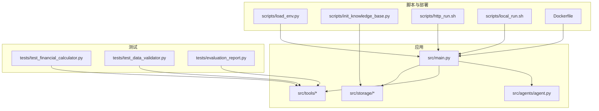

图表来源
- [main.py:1-200](file://src/main.py#L1-L200)
- [agent.py:1-200](file://src/agents/agent.py#L1-L200)
- [financial_calculator.py:1-200](file://src/tools/financial_calculator.py#L1-L200)
- [db.py:1-200](file://src/storage/database/db.py#L1-L200)
- [memory_saver.py:1-200](file://src/storage/memory/memory_saver.py#L1-L200)
- [s3_storage.py:1-200](file://src/storage/s3/s3_storage.py#L1-L200)
- [test_financial_calculator.py:1-200](file://tests/test_financial_calculator.py#L1-L200)
- [test_data_validator.py:1-200](file://tests/test_data_validator.py#L1-L200)
- [evaluation_report.py:1-200](file://tests/evaluation_report.py#L1-L200)
- [load_env.py:1-200](file://scripts/load_env.py#L1-L200)
- [init_knowledge_base.py:1-200](file://scripts/init_knowledge_base.py#L1-L200)
- [http_run.sh:1-200](file://scripts/http_run.sh#L1-L200)
- [local_run.sh:1-200](file://scripts/local_run.sh#1-L200)
- [Dockerfile:1-200](file://Dockerfile#L1-L200)

章节来源
- [pyproject.toml:1-200](file://pyproject.toml#L1-L200)
- [main.py:1-200](file://src/main.py#L1-L200)
- [test_financial_calculator.py:1-200](file://tests/test_financial_calculator.py#L1-L200)
- [test_data_validator.py:1-200](file://tests/test_data_validator.py#L1-L200)
- [evaluation_report.py:1-200](file://tests/evaluation_report.py#L1-L200)

## 核心组件
- 财务计算工具：用于指标计算与汇总，是单元测试的重点对象。
- 风险评估器：根据输入特征输出风险评分与等级，适合做边界值与异常路径测试。
- 批量处理器：对多期数据进行批处理，适合集成测试与性能测试。
- 多年对比工具：跨年度指标对比，适合回归与一致性测试。
- PDF导出与可视化：输出能力，适合端到端与产物校验测试。
- 存储层：数据库、内存保存、S3对象存储，适合集成测试与环境隔离。
- Agent与主入口：编排流程与对外接口，适合集成与冒烟测试。

章节来源
- [financial_calculator.py:1-200](file://src/tools/financial_calculator.py#L1-L200)
- [risk_scorer.py:1-200](file://src/tools/risk_scorer.py#L1-L200)
- [batch_processor.py:1-200](file://src/tools/batch_processor.py#L1-L200)
- [multi_year_comparison.py:1-200](file://src/tools/multi_year_comparison.py#L1-L200)
- [pdf_export.py:1-200](file://src/tools/pdf_export.py#L1-L200)
- [visualizer.py:1-200](file://src/tools/visualizer.py#L1-L200)
- [db.py:1-200](file://src/storage/database/db.py#L1-L200)
- [memory_saver.py:1-200](file://src/storage/memory/memory_saver.py#L1-L200)
- [s3_storage.py:1-200](file://src/storage/s3/s3_storage.py#L1-L200)
- [agent.py:1-200](file://src/agents/agent.py#L1-L200)
- [main.py:1-200](file://src/main.py#L1-L200)

## 架构总览
下图展示从入口到工具与存储的调用关系，以及测试如何覆盖关键路径。

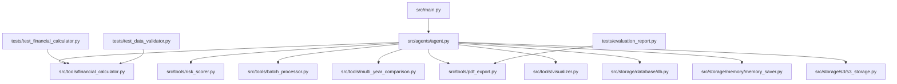

图表来源
- [main.py:1-200](file://src/main.py#L1-L200)
- [agent.py:1-200](file://src/agents/agent.py#L1-L200)
- [financial_calculator.py:1-200](file://src/tools/financial_calculator.py#L1-L200)
- [risk_scorer.py:1-200](file://src/tools/risk_scorer.py#L1-L200)
- [batch_processor.py:1-200](file://src/tools/batch_processor.py#L1-L200)
- [multi_year_comparison.py:1-200](file://src/tools/multi_year_comparison.py#L1-L200)
- [pdf_export.py:1-200](file://src/tools/pdf_export.py#L1-L200)
- [visualizer.py:1-200](file://src/tools/visualizer.py#L1-L200)
- [db.py:1-200](file://src/storage/database/db.py#L1-L200)
- [memory_saver.py:1-200](file://src/storage/memory/memory_saver.py#L1-L200)
- [s3_storage.py:1-200](file://src/storage/s3/s3_storage.py#L1-L200)
- [test_financial_calculator.py:1-200](file://tests/test_financial_calculator.py#L1-L200)
- [test_data_validator.py:1-200](file://tests/test_data_validator.py#L1-L200)
- [evaluation_report.py:1-200](file://tests/evaluation_report.py#L1-L200)

## 详细组件分析

### 财务计算器测试
- 目标：确保财务指标计算正确性、数值精度与边界条件处理。
- 设计要点：
  - 正向用例：典型输入组合，断言结果范围与精度。
  - 边界用例：零值、负值、极大极小值、缺失字段等。
  - 异常用例：非法类型、单位不一致、除零场景。
  - 可重复性：使用固定种子或确定性数据，避免随机性影响。
- 推荐断言：数值近似比较、区间断言、错误类型断言。
- 参考路径：[tests/test_financial_calculator.py](file://tests/test_financial_calculator.py)

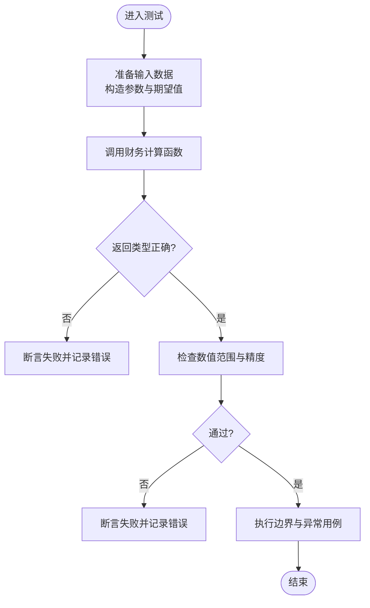

图表来源
- [test_financial_calculator.py:1-200](file://tests/test_financial_calculator.py#L1-L200)
- [financial_calculator.py:1-200](file://src/tools/financial_calculator.py#L1-L200)

章节来源
- [test_financial_calculator.py:1-200](file://tests/test_financial_calculator.py#L1-L200)
- [financial_calculator.py:1-200](file://src/tools/financial_calculator.py#L1-L200)

### 数据验证测试
- 目标：保障输入数据的完整性、合法性与一致性。
- 设计要点：
  - 必填字段校验、类型校验、取值范围校验。
  - 关联一致性：如年份连续性、科目编码唯一性等。
  - 容错策略：跳过无效行、记录警告、抛出明确异常。
- 参考路径：[tests/test_data_validator.py](file://tests/test_data_validator.py)

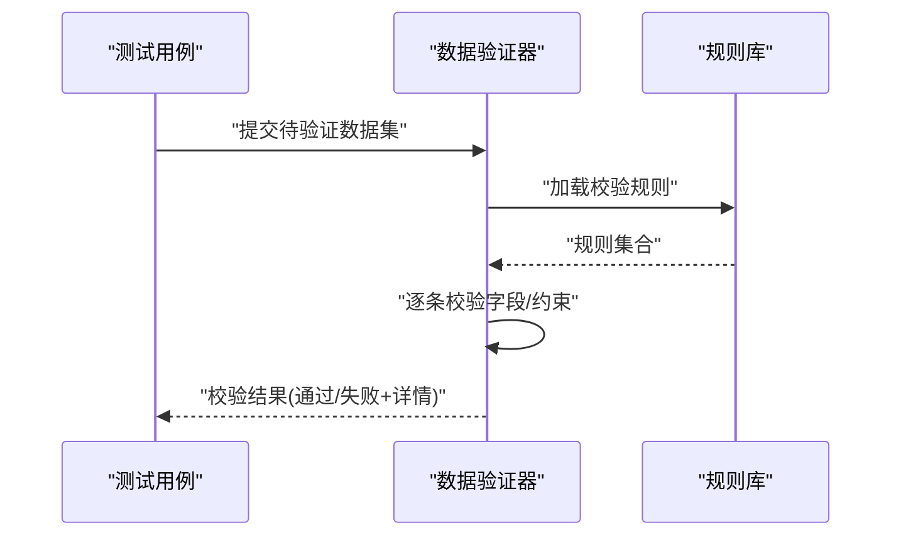

图表来源
- [test_data_validator.py:1-200](file://tests/test_data_validator.py#L1-L200)

章节来源
- [test_data_validator.py:1-200](file://tests/test_data_validator.py#L1-L200)

### 评估报告生成测试
- 目标：验证报告生成的端到端流程与产物质量。
- 设计要点：
  - 输入驱动：以标准化样本数据驱动报告生成。
  - 产物校验：PDF存在性、页数、关键字段、图表渲染。
  - 环境隔离：临时目录写入，避免污染本地存储。
- 参考路径：[tests/evaluation_report.py](file://tests/evaluation_report.py)、[src/tools/pdf_export.py](file://src/tools/pdf_export.py)

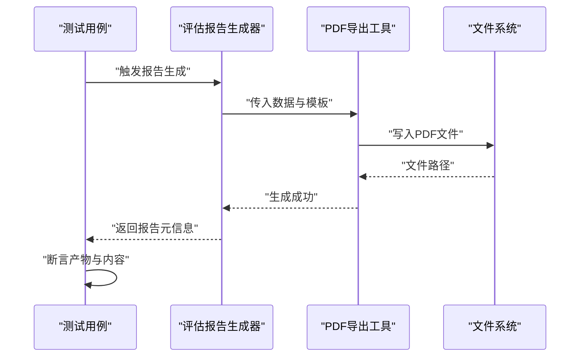

图表来源
- [evaluation_report.py:1-200](file://tests/evaluation_report.py#L1-L200)
- [pdf_export.py:1-200](file://src/tools/pdf_export.py#L1-L200)

章节来源
- [evaluation_report.py:1-200](file://tests/evaluation_report.py#L1-L200)
- [pdf_export.py:1-200](file://src/tools/pdf_export.py#L1-L200)

### 风险评估器测试
- 目标：确保评分模型与阈值判定符合预期。
- 设计要点：
  - 输入特征矩阵覆盖不同风险等级。
  - 阈值变更敏感性测试。
  - 异常输入鲁棒性。
- 参考路径：[src/tools/risk_scorer.py](file://src/tools/risk_scorer.py)

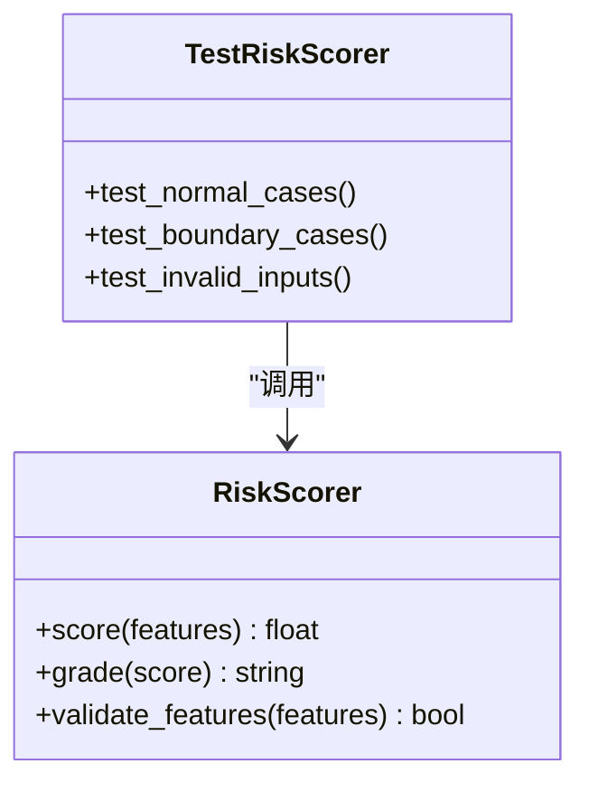

图表来源
- [risk_scorer.py:1-200](file://src/tools/risk_scorer.py#L1-L200)

章节来源
- [risk_scorer.py:1-200](file://src/tools/risk_scorer.py#L1-L200)

### 批量处理器与多年对比测试
- 目标：验证批处理吞吐、幂等性与跨期一致性。
- 设计要点：
  - 大数据集分批处理，断言中间状态与最终结果。
  - 多年对比断言趋势方向与波动范围。
- 参考路径：[src/tools/batch_processor.py](file://src/tools/batch_processor.py)、[src/tools/multi_year_comparison.py](file://src/tools/multi_year_comparison.py)

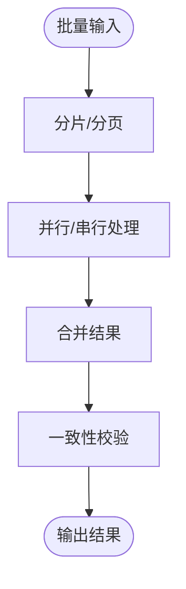

图表来源
- [batch_processor.py:1-200](file://src/tools/batch_processor.py#L1-L200)
- [multi_year_comparison.py:1-200](file://src/tools/multi_year_comparison.py#L1-L200)

章节来源
- [batch_processor.py:1-200](file://src/tools/batch_processor.py#L1-L200)
- [multi_year_comparison.py:1-200](file://src/tools/multi_year_comparison.py#L1-L200)

### 存储层集成测试
- 目标：验证数据库、内存保存与S3对象的读写一致性与事务行为。
- 设计要点：
  - 使用内存数据库或临时实例进行隔离。
  - 清理策略：每个用例前后自动创建与销毁资源。
  - 网络异常模拟：超时、重试、降级。
- 参考路径：[src/storage/database/db.py](file://src/storage/database/db.py)、[src/storage/memory/memory_saver.py](file://src/storage/memory/memory_saver.py)、[src/storage/s3/s3_storage.py](file://src/storage/s3/s3_storage.py)

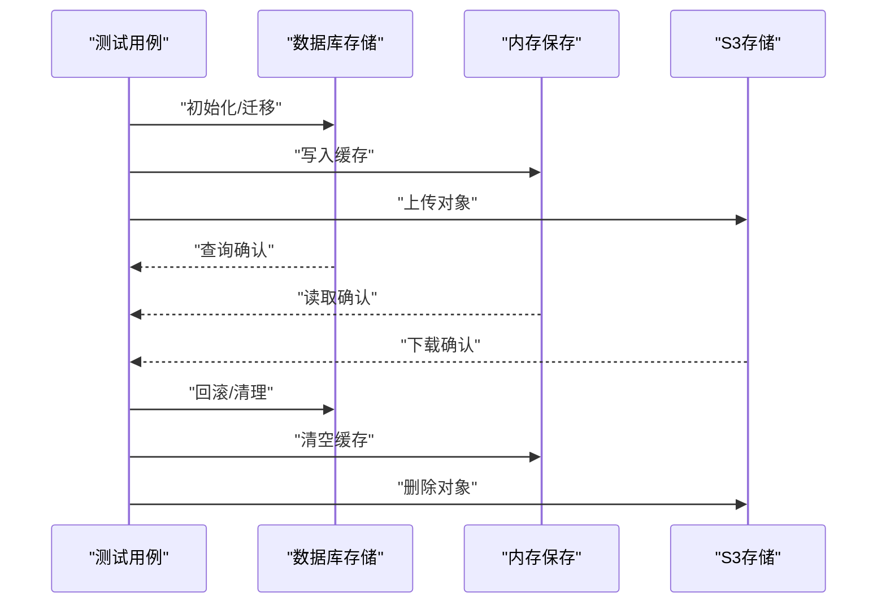

图表来源
- [db.py:1-200](file://src/storage/database/db.py#L1-L200)
- [memory_saver.py:1-200](file://src/storage/memory/memory_saver.py#L1-L200)
- [s3_storage.py:1-200](file://src/storage/s3/s3_storage.py#L1-L200)

章节来源
- [db.py:1-200](file://src/storage/database/db.py#L1-L200)
- [memory_saver.py:1-200](file://src/storage/memory/memory_saver.py#L1-L200)
- [s3_storage.py:1-200](file://src/storage/s3/s3_storage.py#L1-L200)

### Agent与主入口集成测试
- 目标：验证端到端流程编排与外部依赖交互。
- 设计要点：
  - 使用最小可用数据完成一次完整流程。
  - 断言关键中间状态与最终产物。
  - 外部服务Mock化，保证可重复性。
- 参考路径：[src/agents/agent.py](file://src/agents/agent.py)、[src/main.py](file://src/main.py)

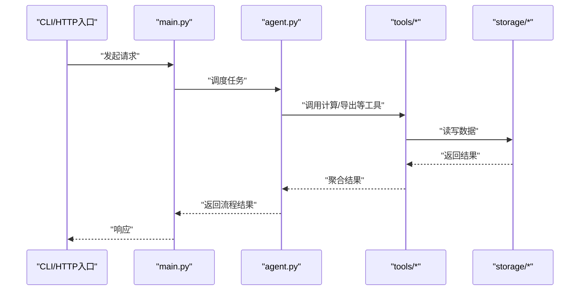

图表来源
- [main.py:1-200](file://src/main.py#L1-L200)
- [agent.py:1-200](file://src/agents/agent.py#L1-L200)

章节来源
- [agent.py:1-200](file://src/agents/agent.py#L1-L200)
- [main.py:1-200](file://src/main.py#L1-L200)

## 依赖分析
- 测试与源码耦合点：
  - 财务计算器测试直接依赖财务计算模块。
  - 数据验证测试依赖输入校验逻辑。
  - 评估报告测试依赖PDF导出与文件系统。
- 外部依赖：
  - 数据库连接、S3客户端、PDF渲染库等需在测试环境中Mock或替换为轻量实现。
- 潜在循环依赖：
  - 工具层不应反向依赖测试；测试仅消费API。

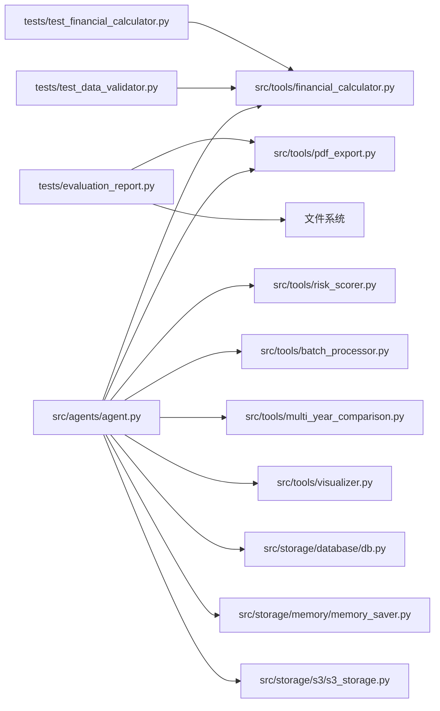

图表来源
- [test_financial_calculator.py:1-200](file://tests/test_financial_calculator.py#L1-L200)
- [test_data_validator.py:1-200](file://tests/test_data_validator.py#L1-L200)
- [evaluation_report.py:1-200](file://tests/evaluation_report.py#L1-L200)
- [financial_calculator.py:1-200](file://src/tools/financial_calculator.py#L1-L200)
- [risk_scorer.py:1-200](file://src/tools/risk_scorer.py#L1-L200)
- [batch_processor.py:1-200](file://src/tools/batch_processor.py#L1-L200)
- [multi_year_comparison.py:1-200](file://src/tools/multi_year_comparison.py#L1-L200)
- [pdf_export.py:1-200](file://src/tools/pdf_export.py#L1-L200)
- [visualizer.py:1-200](file://src/tools/visualizer.py#L1-L200)
- [db.py:1-200](file://src/storage/database/db.py#L1-L200)
- [memory_saver.py:1-200](file://src/storage/memory/memory_saver.py#L1-L200)
- [s3_storage.py:1-200](file://src/storage/s3/s3_storage.py#L1-L200)

章节来源
- [pyproject.toml:1-200](file://pyproject.toml#L1-L200)

## 性能考虑
- 基准测试：
  - 针对财务计算与批量处理器建立微基准，测量CPU与内存占用。
  - 使用固定数据集规模，多次运行取中位数。
- 负载测试：
  - 并发访问Agent接口，观察延迟分布与错误率。
  - 压测存储层I/O，关注磁盘与网络瓶颈。
- 工具建议：
  - Python内置timeit或第三方基准库进行函数级基准。
  - HTTP压测可使用wrk、locust或k6。
- 指标阈值：
  - 定义P95/P99延迟上限、吞吐量下限、错误率上限。
  - 将指标纳入质量门禁，不达标则阻断发布。

## 故障排查指南
- 常见环境问题：
  - 环境变量缺失：使用脚本加载环境变量后再运行测试。
  - 外部服务不可用：使用Mock或本地替代实现。
- 定位技巧：
  - 增加结构化日志与断点，缩小问题范围。
  - 使用独立测试数据库与临时目录，避免状态污染。
  - 复现困难问题时，录制输入与输出快照，便于回归。
- 参考路径：
  - 环境变量加载：[scripts/load_env.py](file://scripts/load_env.py)
  - 知识库初始化：[scripts/init_knowledge_base.py](file://scripts/init_knowledge_base.py)
  - 本地运行脚本：[scripts/local_run.sh](file://scripts/local_run.sh)
  - HTTP运行脚本：[scripts/http_run.sh](file://scripts/http_run.sh)

章节来源
- [load_env.py:1-200](file://scripts/load_env.py#L1-L200)
- [init_knowledge_base.py:1-200](file://scripts/init_knowledge_base.py#L1-L200)
- [local_run.sh:1-200](file://scripts/local_run.sh#L1-L200)
- [http_run.sh:1-200](file://scripts/http_run.sh#L1-L200)

## 结论
本指南构建了覆盖单元、集成与性能的完整测试体系，明确了现有测试用例的设计思路与扩展方法，提供了数据管理、CI流水线、覆盖率与质量门禁的实践建议，以及性能与压力测试的方法与工具。遵循本指南，可有效提升系统稳定性与交付质量。

## 附录

### 测试框架选择与配置
- 单元测试：建议使用Python标准测试框架或pytest，统一命名约定与断言风格。
- 集成测试：隔离外部依赖，使用内存数据库与本地文件系统进行替代。
- 性能测试：结合函数级基准与HTTP压测工具，形成多维指标。
- 配置管理：通过配置文件与环境变量区分开发、测试与生产环境。

### 测试数据准备与管理
- 数据来源：
  - 合成数据：基于规则生成，覆盖边界与异常。
  - 脱敏数据：从生产抽取并脱敏，保持真实分布。
- 数据版本：
  - 将测试数据纳入版本控制，附带校验哈希。
- 数据生命周期：
  - 用例前准备、用例后清理，确保幂等与可重复。

### 持续集成流水线与自动化执行
- 触发条件：
  - 代码提交与合并请求时自动运行全量测试。
- 阶段划分：
  - 安装依赖、构建镜像、运行单测、集成测试、性能基准、覆盖率收集。
- 参考脚本与容器：
  - 本地运行：[scripts/local_run.sh](file://scripts/local_run.sh)
  - HTTP运行：[scripts/http_run.sh](file://scripts/http_run.sh)
  - 容器镜像：[Dockerfile](file://Dockerfile)

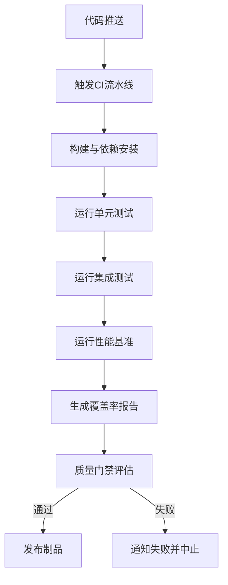

图表来源
- [Dockerfile:1-200](file://Dockerfile#L1-L200)
- [local_run.sh:1-200](file://scripts/local_run.sh#L1-L200)
- [http_run.sh:1-200](file://scripts/http_run.sh#L1-L200)

### 覆盖率统计与质量门禁
- 覆盖率采集：
  - 使用覆盖率工具收集语句、分支与函数覆盖率。
- 阈值设置：
  - 设定最低覆盖率阈值与关键模块更高要求。
- 门禁策略：
  - 覆盖率不达标、新增缺陷、性能退化均阻断合并。

### 性能测试与压力测试方法
- 函数级基准：
  - 针对财务计算与批量处理器建立基准用例，监控耗时与内存。
- 接口压测：
  - 模拟并发用户访问，评估吞吐与延迟。
- 资源监控：
  - 记录CPU、内存、磁盘I/O与网络带宽，定位瓶颈。

### 编写新测试用例的指导与最佳实践
- 命名与组织：
  - 按功能域组织测试文件，命名清晰表达意图。
- 用例粒度：
  - 单一职责，一个用例验证一个行为。
- 数据与Mock：
  - 使用工厂函数生成数据，外部依赖尽量Mock。
- 断言与日志：
  - 断言具体且可解释，失败时输出上下文信息。
- 可维护性：
  - 抽取公共夹具，减少重复代码。