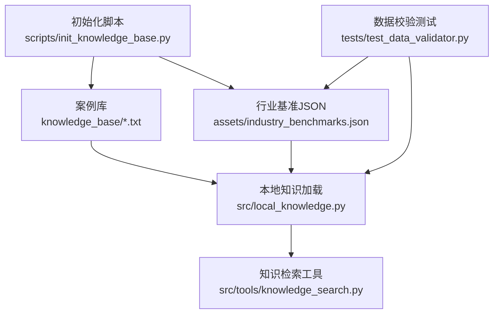
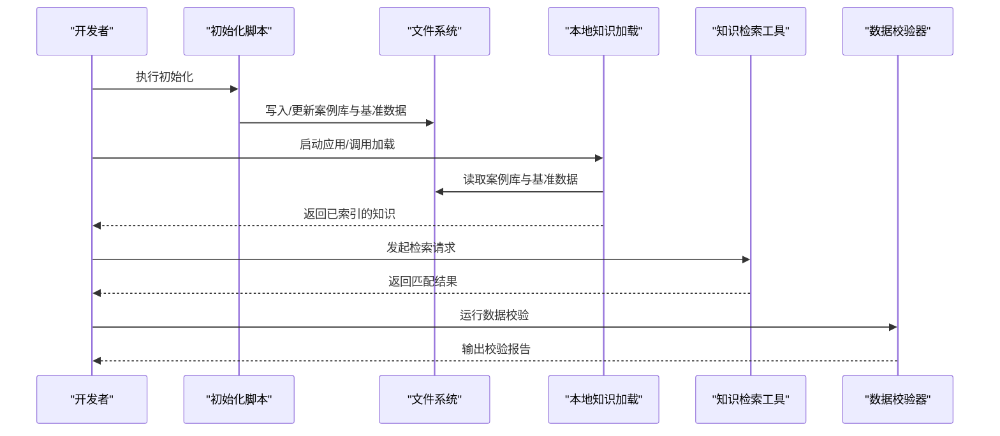
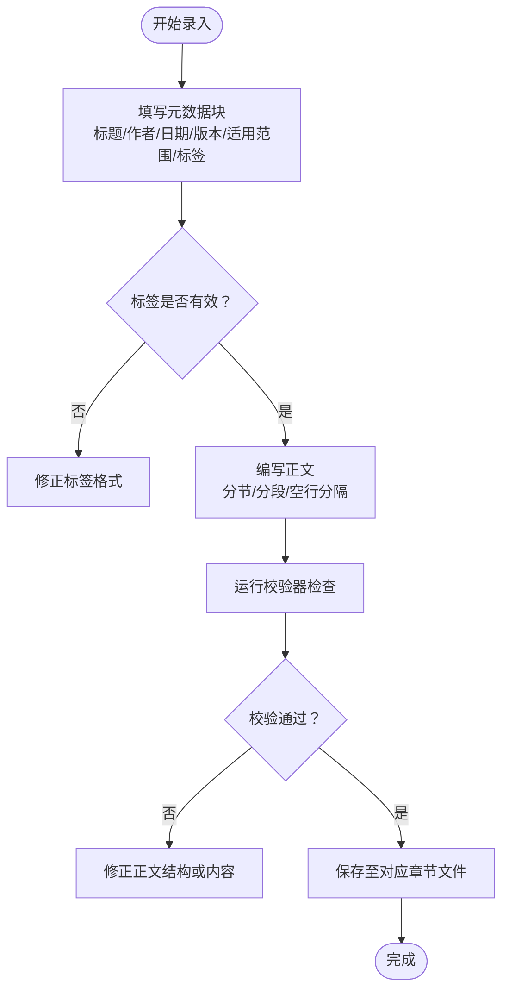
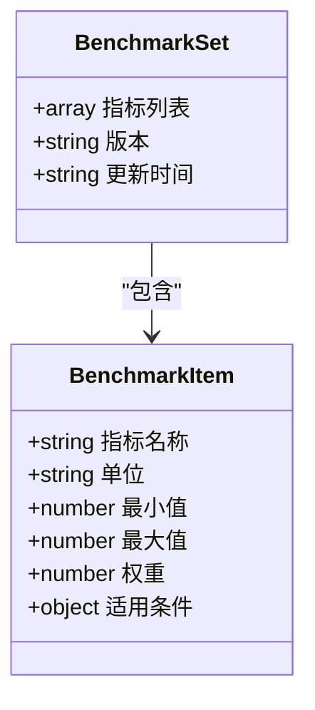
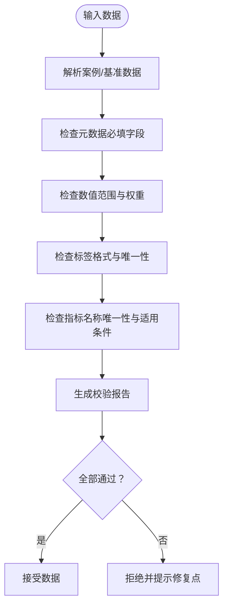
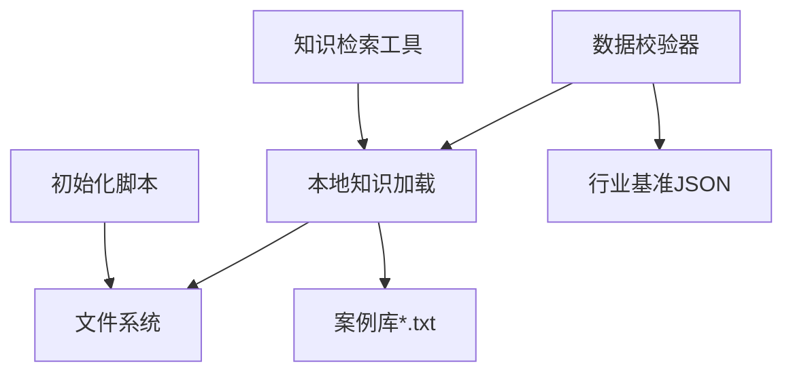

# 数据格式规范

<cite>
**本文引用的文件**   
- [assets/industry_benchmarks.json](file://assets/industry_benchmarks.json)
- [knowledge_base/cases_ch9.txt](file://knowledge_base/cases_ch9.txt)
- [knowledge_base/cases_ch10.txt](file://knowledge_base/cases_ch10.txt)
- [knowledge_base/cases_ch11.txt](file://knowledge_base/cases_ch11.txt)
- [scripts/init_knowledge_base.py](file://scripts/init_knowledge_base.py)
- [src/local_knowledge.py](file://src/local_knowledge.py)
- [src/tools/knowledge_search.py](file://src/tools/knowledge_search.py)
- [tests/test_data_validator.py](file://tests/test_data_validator.py)
</cite>

## 目录
1. [简介](#简介)
2. [项目结构](#项目结构)
3. [核心组件](#核心组件)
4. [架构总览](#架构总览)
5. [详细组件分析](#详细组件分析)
6. [依赖分析](#依赖分析)
7. [性能考虑](#性能考虑)
8. [故障排查指南](#故障排查指南)
9. [结论](#结论)
10. [附录](#附录)

## 简介
本规范面向知识库与行业基准数据的录入、校验、版本管理与迁移，覆盖以下范围：
- 案例库文本文件的结构与格式要求（章节分类、标签系统、元数据字段、正文组织）
- 行业基准数据的JSON结构定义（指标名称、数值范围、权重配置、适用条件）
- 数据验证规则与完整性检查标准
- 数据示例与模板说明（以仓库现有文件为参考）
- 数据版本管理与兼容性处理机制
- 数据迁移工具与格式转换脚本使用方法
- 常见数据错误与修复建议

## 项目结构
与数据格式相关的核心位置如下：
- 案例库：knowledge_base 目录下按章节组织的 .txt 文件
- 行业基准：assets/industry_benchmarks.json
- 初始化脚本：scripts/init_knowledge_base.py
- 本地知识加载与检索：src/local_knowledge.py、src/tools/knowledge_search.py
- 数据校验测试：tests/test_data_validator.py

**图表来源**
- [knowledge_base/cases_ch9.txt](file://knowledge_base/cases_ch9.txt)
- [knowledge_base/cases_ch10.txt](file://knowledge_base/cases_ch10.txt)
- [knowledge_base/cases_ch11.txt](file://knowledge_base/cases_ch11.txt)
- [assets/industry_benchmarks.json](file://assets/industry_benchmarks.json)
- [scripts/init_knowledge_base.py](file://scripts/init_knowledge_base.py)
- [src/local_knowledge.py](file://src/local_knowledge.py)
- [src/tools/knowledge_search.py](file://src/tools/knowledge_search.py)
- [tests/test_data_validator.py](file://tests/test_data_validator.py)

**章节来源**
- [scripts/init_knowledge_base.py](file://scripts/init_knowledge_base.py)
- [src/local_knowledge.py](file://src/local_knowledge.py)
- [src/tools/knowledge_search.py](file://src/tools/knowledge_search.py)
- [assets/industry_benchmarks.json](file://assets/industry_benchmarks.json)
- [knowledge_base/cases_ch9.txt](file://knowledge_base/cases_ch9.txt)
- [knowledge_base/cases_ch10.txt](file://knowledge_base/cases_ch10.txt)
- [knowledge_base/cases_ch11.txt](file://knowledge_base/cases_ch11.txt)
- [tests/test_data_validator.py](file://tests/test_data_validator.py)

## 核心组件
- 案例库文件（.txt）
  - 组织方式：按章节分文件存储，便于维护与增量更新
  - 内容结构：包含标题、元数据块、标签、正文段落等
  - 标签系统：用于快速筛选与检索
  - 元数据字段：记录作者、时间、版本、适用范围等关键信息
- 行业基准数据（JSON）
  - 指标定义：指标名称、单位、取值范围、权重、适用条件
  - 数据结构：数组或对象集合，支持多指标批量管理
- 数据校验器（测试驱动）
  - 基于测试用例定义校验规则，确保数据一致性
- 初始化与加载流程
  - 初始化脚本负责创建/填充基础数据
  - 本地知识模块负责读取与索引
  - 检索工具提供查询接口

**章节来源**
- [knowledge_base/cases_ch9.txt](file://knowledge_base/cases_ch9.txt)
- [knowledge_base/cases_ch10.txt](file://knowledge_base/cases_ch10.txt)
- [knowledge_base/cases_ch11.txt](file://knowledge_base/cases_ch11.txt)
- [assets/industry_benchmarks.json](file://assets/industry_benchmarks.json)
- [tests/test_data_validator.py](file://tests/test_data_validator.py)
- [scripts/init_knowledge_base.py](file://scripts/init_knowledge_base.py)
- [src/local_knowledge.py](file://src/local_knowledge.py)
- [src/tools/knowledge_search.py](file://src/tools/knowledge_search.py)

## 架构总览
数据从“静态资源”到“可检索知识”的流转路径如下：
- 初始化阶段：通过初始化脚本准备案例库与基准数据
- 加载阶段：本地知识模块读取并构建索引
- 检索阶段：检索工具根据标签、关键词、元数据进行匹配
- 校验阶段：测试驱动的校验器对输入数据进行规则检查

**图表来源**
- [scripts/init_knowledge_base.py](file://scripts/init_knowledge_base.py)
- [src/local_knowledge.py](file://src/local_knowledge.py)
- [src/tools/knowledge_search.py](file://src/tools/knowledge_search.py)
- [tests/test_data_validator.py](file://tests/test_data_validator.py)

## 详细组件分析

### 案例库文件格式规范（.txt）
- 文件命名
  - 采用“cases_chX.txt”形式，X为章节编号，便于按章节管理
- 文档头部（元数据块）
  - 建议包含：标题、作者、日期、版本、适用范围、标签列表等
  - 使用键值对形式，便于解析与展示
- 标签系统
  - 标签用于分类与检索，建议采用短横线分隔的小写词组
  - 同一文档可包含多个标签，避免过长或重复
- 正文组织
  - 正文分为若干小节，每节有明确主题
  - 段落之间空行分隔，保持可读性
- 示例与模板
  - 参考仓库中的章节文件作为正确格式的样例
  - 新增条目时遵循相同结构，保证一致性

**图表来源**
- [knowledge_base/cases_ch9.txt](file://knowledge_base/cases_ch9.txt)
- [knowledge_base/cases_ch10.txt](file://knowledge_base/cases_ch10.txt)
- [knowledge_base/cases_ch11.txt](file://knowledge_base/cases_ch11.txt)
- [tests/test_data_validator.py](file://tests/test_data_validator.py)

**章节来源**
- [knowledge_base/cases_ch9.txt](file://knowledge_base/cases_ch9.txt)
- [knowledge_base/cases_ch10.txt](file://knowledge_base/cases_ch10.txt)
- [knowledge_base/cases_ch11.txt](file://knowledge_base/cases_ch11.txt)
- [tests/test_data_validator.py](file://tests/test_data_validator.py)

### 行业基准数据JSON结构定义
- 顶层结构
  - 建议使用数组或对象集合表示多条基准数据
- 指标项字段
  - 指标名称：字符串，唯一标识
  - 单位：字符串，如百分比、比率等
  - 数值范围：最小值、最大值、期望区间
  - 权重配置：数值型，表示该指标在综合评分中的重要性
  - 适用条件：对象或字符串，描述适用的业务场景或约束
- 示例与模板
  - 参考仓库中的基准JSON文件作为结构样例
  - 新增指标时遵循相同字段与类型约定

**图表来源**
- [assets/industry_benchmarks.json](file://assets/industry_benchmarks.json)

**章节来源**
- [assets/industry_benchmarks.json](file://assets/industry_benchmarks.json)

### 数据验证规则与完整性检查
- 必填字段检查
  - 案例库：标题、标签、正文至少包含一个段落
  - 基准数据：指标名称、单位、数值范围、权重、适用条件
- 类型与范围检查
  - 数值范围：最小值不大于最大值；权重非负且合理
  - 标签：小写、无特殊字符、长度限制
- 一致性检查
  - 指标名称唯一；适用条件与业务域一致
- 校验入口
  - 通过测试用例驱动的数据校验器进行自动化检查

**图表来源**
- [tests/test_data_validator.py](file://tests/test_data_validator.py)
- [assets/industry_benchmarks.json](file://assets/industry_benchmarks.json)
- [knowledge_base/cases_ch9.txt](file://knowledge_base/cases_ch9.txt)

**章节来源**
- [tests/test_data_validator.py](file://tests/test_data_validator.py)

### 数据版本管理与兼容性处理
- 版本标记
  - 案例库与基准数据均建议包含版本字段，便于追踪变更
- 兼容策略
  - 向后兼容：新字段可选，旧字段保留
  - 向前兼容：读取时忽略未知字段
- 变更日志
  - 建议在元数据中记录更新时间与主要变更摘要

**章节来源**
- [assets/industry_benchmarks.json](file://assets/industry_benchmarks.json)
- [knowledge_base/cases_ch9.txt](file://knowledge_base/cases_ch9.txt)

### 数据迁移工具与格式转换脚本
- 初始化脚本
  - 负责创建或更新知识库与基准数据的基础结构
  - 适用于环境初始化与批量导入
- 使用方法
  - 在项目根目录执行初始化脚本，确保目标目录存在并可写
  - 完成后验证数据是否被正确加载与索引

**章节来源**
- [scripts/init_knowledge_base.py](file://scripts/init_knowledge_base.py)

### 本地知识加载与检索
- 加载流程
  - 读取案例库与基准数据，构建内存索引
- 检索能力
  - 支持按标签、关键词、元数据字段进行过滤与匹配
- 集成方式
  - 通过工具模块暴露检索接口供上层调用

**章节来源**
- [src/local_knowledge.py](file://src/local_knowledge.py)
- [src/tools/knowledge_search.py](file://src/tools/knowledge_search.py)

## 依赖分析
- 组件耦合
  - 初始化脚本依赖文件系统与目标目录权限
  - 本地知识加载依赖案例库与基准数据的存在与格式正确性
  - 检索工具依赖已构建的索引
  - 校验器依赖测试用例定义的规则集
- 外部依赖
  - JSON解析、文件读写、正则表达式（用于标签与元数据解析）

**图表来源**
- [scripts/init_knowledge_base.py](file://scripts/init_knowledge_base.py)
- [src/local_knowledge.py](file://src/local_knowledge.py)
- [src/tools/knowledge_search.py](file://src/tools/knowledge_search.py)
- [tests/test_data_validator.py](file://tests/test_data_validator.py)
- [assets/industry_benchmarks.json](file://assets/industry_benchmarks.json)
- [knowledge_base/cases_ch9.txt](file://knowledge_base/cases_ch9.txt)

**章节来源**
- [scripts/init_knowledge_base.py](file://scripts/init_knowledge_base.py)
- [src/local_knowledge.py](file://src/local_knowledge.py)
- [src/tools/knowledge_search.py](file://src/tools/knowledge_search.py)
- [tests/test_data_validator.py](file://tests/test_data_validator.py)
- [assets/industry_benchmarks.json](file://assets/industry_benchmarks.json)
- [knowledge_base/cases_ch9.txt](file://knowledge_base/cases_ch9.txt)

## 性能考虑
- 索引构建
  - 首次加载时构建索引，后续检索更高效
- 增量更新
  - 仅对变更的文件重新索引，减少IO开销
- 缓存策略
  - 对高频检索结果进行短期缓存，提升响应速度

[本节为通用指导，不直接分析具体文件]

## 故障排查指南
- 常见问题
  - 标签格式错误：导致检索失败或校验报错
  - 数值范围异常：最小值大于最大值或权重为负
  - 缺失必填字段：元数据不完整导致解析失败
  - 文件编码问题：中文乱码影响检索效果
- 定位方法
  - 运行数据校验器获取详细错误清单
  - 检查初始化脚本的执行日志与返回状态
  - 核对案例库与基准数据的结构与字段
- 修复建议
  - 依据校验报告逐项修正
  - 统一标签命名规范与大小写
  - 补充缺失元数据并确保类型正确

**章节来源**
- [tests/test_data_validator.py](file://tests/test_data_validator.py)
- [scripts/init_knowledge_base.py](file://scripts/init_knowledge_base.py)

## 结论
本规范明确了案例库与行业基准数据的结构与校验规则，提供了版本管理与迁移方法，并通过测试驱动的校验器保障数据质量。遵循本规范可有效降低数据错误率，提升检索准确性与系统稳定性。

[本节为总结性内容，不直接分析具体文件]

## 附录
- 术语表
  - 案例库：按章节组织的文本知识库
  - 行业基准：用于评估与对比的结构化指标集合
  - 标签：用于分类与检索的短词组
  - 元数据：描述数据属性的键值对集合
- 参考文件
  - 案例库样例：knowledge_base/cases_ch9.txt、cases_ch10.txt、cases_ch11.txt
  - 基准数据样例：assets/industry_benchmarks.json
  - 初始化脚本：scripts/init_knowledge_base.py
  - 本地知识与检索：src/local_knowledge.py、src/tools/knowledge_search.py
  - 校验测试：tests/test_data_validator.py

**章节来源**
- [knowledge_base/cases_ch9.txt](file://knowledge_base/cases_ch9.txt)
- [knowledge_base/cases_ch10.txt](file://knowledge_base/cases_ch10.txt)
- [knowledge_base/cases_ch11.txt](file://knowledge_base/cases_ch11.txt)
- [assets/industry_benchmarks.json](file://assets/industry_benchmarks.json)
- [scripts/init_knowledge_base.py](file://scripts/init_knowledge_base.py)
- [src/local_knowledge.py](file://src/local_knowledge.py)
- [src/tools/knowledge_search.py](file://src/tools/knowledge_search.py)
- [tests/test_data_validator.py](file://tests/test_data_validator.py)