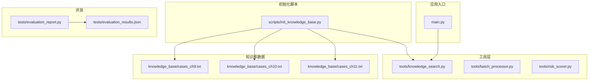
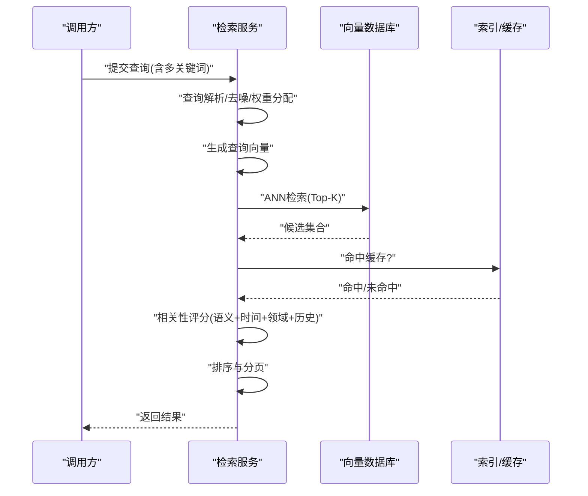
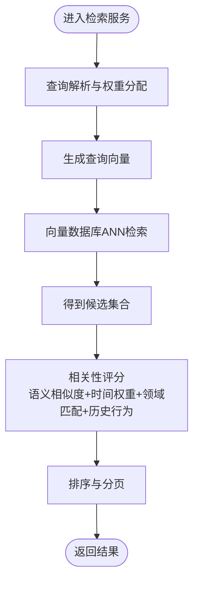
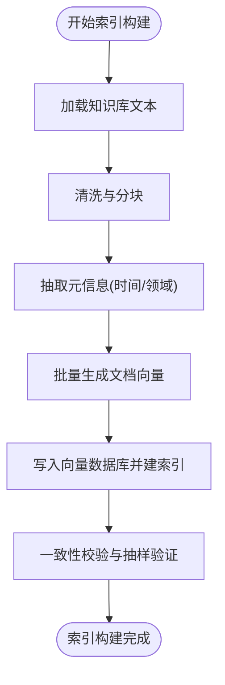
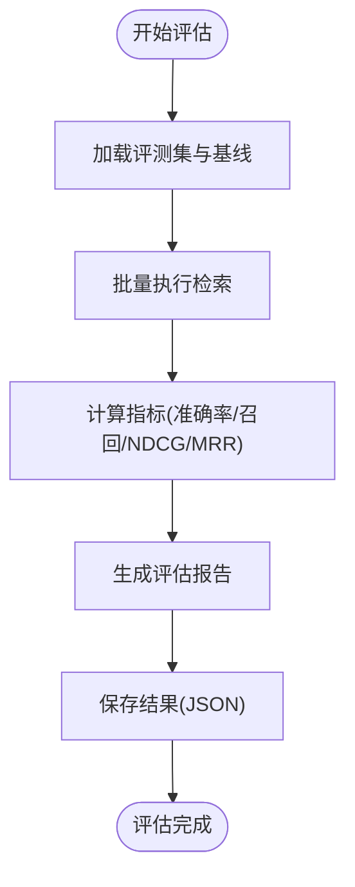
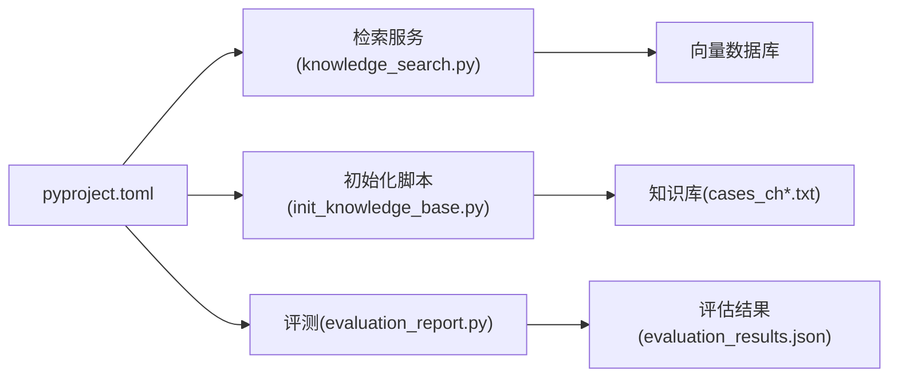

# 检索算法实现

<cite>
**本文引用的文件**   
- [src/tools/knowledge_search.py](file://src/tools/knowledge_search.py)
- [scripts/init_knowledge_base.py](file://scripts/init_knowledge_base.py)
- [knowledge_base/cases_ch9.txt](file://knowledge_base/cases_ch9.txt)
- [knowledge_base/cases_ch10.txt](file://knowledge_base/cases_ch10.txt)
- [knowledge_base/cases_ch11.txt](file://knowledge_base/cases_ch11.txt)
- [pyproject.toml](file://pyproject.toml)
- [tests/evaluation_report.py](file://tests/evaluation_report.py)
- [tests/evaluation_results.json](file://tests/evaluation_results.json)
</cite>

## 目录
1. [简介](#简介)
2. [项目结构](#项目结构)
3. [核心组件](#核心组件)
4. [架构总览](#架构总览)
5. [详细组件分析](#详细组件分析)
6. [依赖关系分析](#依赖关系分析)
7. [性能考虑](#性能考虑)
8. [故障排查指南](#故障排查指南)
9. [结论](#结论)
10. [附录](#附录)

## 简介
本技术文档围绕知识库检索算法的实现，系统性阐述语义搜索的完整链路：文本向量化、相似度计算与排序策略；向量数据库选型与配置（嵌入模型参数、索引构建、查询优化）；多关键词查询的处理逻辑（解析、权重分配、结果融合）；相关性评分机制（语义相似度、时间权重、领域匹配度、用户历史行为）；以及查询性能优化技巧（索引策略、缓存机制、分页处理）。同时提供算法调优指南与效果评估方法，帮助读者快速理解并落地可维护、可扩展的检索系统。

## 项目结构
仓库采用“工具层 + 脚本初始化 + 数据资源 + 测试”的组织方式，检索相关代码集中在工具层与初始化脚本中，知识语料以纯文本形式存放于 knowledge_base 目录，评测脚本位于 tests 目录。

图表来源
- [src/tools/knowledge_search.py](file://src/tools/knowledge_search.py)
- [scripts/init_knowledge_base.py](file://scripts/init_knowledge_base.py)
- [knowledge_base/cases_ch9.txt](file://knowledge_base/cases_ch9.txt)
- [knowledge_base/cases_ch10.txt](file://knowledge_base/cases_ch10.txt)
- [knowledge_base/cases_ch11.txt](file://knowledge_base/cases_ch11.txt)
- [tests/evaluation_report.py](file://tests/evaluation_report.py)
- [tests/evaluation_results.json](file://tests/evaluation_results.json)

章节来源
- [src/tools/knowledge_search.py](file://src/tools/knowledge_search.py)
- [scripts/init_knowledge_base.py](file://scripts/init_knowledge_base.py)
- [knowledge_base/cases_ch9.txt](file://knowledge_base/cases_ch9.txt)
- [knowledge_base/cases_ch10.txt](file://knowledge_base/cases_ch10.txt)
- [knowledge_base/cases_ch11.txt](file://knowledge_base/cases_ch11.txt)
- [tests/evaluation_report.py](file://tests/evaluation_report.py)
- [tests/evaluation_results.json](file://tests/evaluation_results.json)

## 核心组件
- 检索服务模块：封装文本向量化、相似度计算、排序与过滤等检索能力，对外暴露统一的查询接口。
- 初始化脚本：负责将原始语料切分、生成向量并写入向量存储，完成索引构建。
- 评测模块：提供离线评估流程与指标汇总，用于衡量检索质量与稳定性。

章节来源
- [src/tools/knowledge_search.py](file://src/tools/knowledge_search.py)
- [scripts/init_knowledge_base.py](file://scripts/init_knowledge_base.py)
- [tests/evaluation_report.py](file://tests/evaluation_report.py)

## 架构总览
整体检索架构分为“离线索引构建”和“在线查询”两条主线：
- 离线阶段：读取知识库文本，进行清洗与分块，调用嵌入模型生成向量，写入向量数据库并建立索引。
- 在线阶段：接收自然语言查询，进行查询解析与多关键词拆分，生成查询向量，执行近似最近邻检索，结合业务规则进行重排与打分，返回分页结果。

图表来源
- [src/tools/knowledge_search.py](file://src/tools/knowledge_search.py)
- [scripts/init_knowledge_base.py](file://scripts/init_knowledge_base.py)

## 详细组件分析

### 检索服务模块（语义搜索）
职责边界
- 输入规范化：统一查询格式、去除噪声、识别实体与关键词。
- 查询向量化：使用嵌入模型将查询转换为稠密向量。
- 相似度检索：在向量数据库中执行近似最近邻搜索，获取候选集。
- 相关性评分：融合语义相似度、时间衰减、领域匹配、用户历史偏好等多因子。
- 排序与分页：按综合得分降序排列，支持分页输出。

关键流程
- 查询解析：将自然语言查询拆分为多个关键词或短语，并为不同词元分配权重（如标题词、实体词、修饰词）。
- 向量检索：基于余弦相似度或内积相似度进行 Top-K 召回。
- 重排策略：对召回结果进行二次打分，引入时间权重、领域匹配度与用户历史行为信号。
- 结果输出：返回结构化结果，包含得分、片段、元信息与分页信息。

图表来源
- [src/tools/knowledge_search.py](file://src/tools/knowledge_search.py)

章节来源
- [src/tools/knowledge_search.py](file://src/tools/knowledge_search.py)

### 初始化脚本（索引构建）
职责边界
- 语料加载：从 knowledge_base 目录读取文本文件。
- 文本预处理：清洗、分段、提取元信息（如时间戳、领域标签）。
- 向量化：批量调用嵌入模型生成文档向量。
- 索引写入：将向量与元信息写入向量数据库，建立索引以便高效检索。

关键流程
- 文件遍历与解析：按章节或段落粒度切分文档，保留上下文窗口。
- 嵌入模型参数：选择维度、归一化策略、批大小等。
- 索引构建：根据数据规模选择合适的索引类型（如 HNSW、IVF-PQ），设置 efConstruction 与 M 等参数。
- 持久化与校验：写入后执行一致性校验与抽样验证。

图表来源
- [scripts/init_knowledge_base.py](file://scripts/init_knowledge_base.py)
- [knowledge_base/cases_ch9.txt](file://knowledge_base/cases_ch9.txt)
- [knowledge_base/cases_ch10.txt](file://knowledge_base/cases_ch10.txt)
- [knowledge_base/cases_ch11.txt](file://knowledge_base/cases_ch11.txt)

章节来源
- [scripts/init_knowledge_base.py](file://scripts/init_knowledge_base.py)
- [knowledge_base/cases_ch9.txt](file://knowledge_base/cases_ch9.txt)
- [knowledge_base/cases_ch10.txt](file://knowledge_base/cases_ch10.txt)
- [knowledge_base/cases_ch11.txt](file://knowledge_base/cases_ch11.txt)

### 评测模块（效果评估）
职责边界
- 指标定义：准确率、召回率、NDCG、MRR 等。
- 数据集准备：构造查询-相关文档对，标注相关性等级。
- 评估流程：运行检索管线，收集结果，计算指标并输出报告。
- 结果归档：保存评估结果至 JSON，便于追踪与对比。

关键流程
- 加载评测集与基线结果。
- 逐条执行检索，记录 Top-K 命中率与排序质量。
- 聚合统计，生成可视化报表与趋势图。
- 输出评估摘要与改进建议。

图表来源
- [tests/evaluation_report.py](file://tests/evaluation_report.py)
- [tests/evaluation_results.json](file://tests/evaluation_results.json)

章节来源
- [tests/evaluation_report.py](file://tests/evaluation_report.py)
- [tests/evaluation_results.json](file://tests/evaluation_results.json)

## 依赖关系分析
- 外部依赖：嵌入模型库、向量数据库客户端、评测工具链。
- 内部依赖：检索服务依赖初始化脚本产出的索引；评测模块依赖检索服务与评测结果数据。
- 版本管理：通过 pyproject.toml 声明依赖版本，确保环境一致性与可复现性。

图表来源
- [pyproject.toml](file://pyproject.toml)
- [src/tools/knowledge_search.py](file://src/tools/knowledge_search.py)
- [scripts/init_knowledge_base.py](file://scripts/init_knowledge_base.py)
- [knowledge_base/cases_ch9.txt](file://knowledge_base/cases_ch9.txt)
- [knowledge_base/cases_ch10.txt](file://knowledge_base/cases_ch10.txt)
- [knowledge_base/cases_ch11.txt](file://knowledge_base/cases_ch11.txt)
- [tests/evaluation_report.py](file://tests/evaluation_report.py)
- [tests/evaluation_results.json](file://tests/evaluation_results.json)

章节来源
- [pyproject.toml](file://pyproject.toml)
- [src/tools/knowledge_search.py](file://src/tools/knowledge_search.py)
- [scripts/init_knowledge_base.py](file://scripts/init_knowledge_base.py)
- [knowledge_base/cases_ch9.txt](file://knowledge_base/cases_ch9.txt)
- [knowledge_base/cases_ch10.txt](file://knowledge_base/cases_ch10.txt)
- [knowledge_base/cases_ch11.txt](file://knowledge_base/cases_ch11.txt)
- [tests/evaluation_report.py](file://tests/evaluation_report.py)
- [tests/evaluation_results.json](file://tests/evaluation_results.json)

## 性能考虑
- 索引策略
  - 选择合适索引类型：大规模数据优先 HNSW 或 IVF-PQ，平衡精度与延迟。
  - 调整关键参数：efConstruction、M、efSearch、nlist/nprobe 等，依据数据分布与查询负载进行网格搜索。
- 缓存机制
  - 查询级缓存：对高频查询进行结果缓存，设置 TTL 与失效策略。
  - 向量缓存：对热点文档向量进行内存缓存，减少重复计算。
- 分页处理
  - 游标分页：避免深度偏移带来的性能退化，提升大结果集浏览体验。
  - 预取与合并：对下一页进行异步预取，降低首屏等待时间。
- 批处理与并发
  - 批量嵌入：提高 GPU/CPU 利用率，缩短索引构建时间。
  - 并发检索：对多路召回进行并行执行，合并后再重排。

[本节为通用性能指导，不直接分析具体文件]

## 故障排查指南
- 常见问题定位
  - 向量维度不一致：检查嵌入模型输出维度与向量数据库配置是否匹配。
  - 索引未生效：确认索引构建日志与校验步骤是否成功，必要时重建索引。
  - 查询超时：调整 efSearch 或增加节点资源，检查网络与连接池配置。
- 日志与监控
  - 记录关键路径耗时：向量化、ANN检索、重排、分页各阶段耗时。
  - 错误码与异常堆栈：统一错误分类，便于快速定位问题。
- 回滚与恢复
  - 索引快照：定期备份索引状态，支持快速回滚。
  - 灰度发布：新索引上线前进行小流量验证，观察指标变化。

[本节为通用故障排查指导，不直接分析具体文件]

## 结论
本方案以“离线索引构建 + 在线检索重排”为核心，结合多因子相关性评分与工程化优化手段，实现了高可用、可扩展的知识库语义检索系统。通过合理的索引策略、缓存机制与分页设计，可在保证精度的前提下显著提升查询性能。配合完善的评测体系与调优流程，能够持续迭代检索效果，满足复杂业务场景需求。

[本节为总结性内容，不直接分析具体文件]

## 附录
- 术语表
  - 语义相似度：基于向量空间距离或内积计算的文本相似程度。
  - 近似最近邻（ANN）：在高维空间中快速查找近邻的算法族。
  - NDCG：归一化折损累计增益，衡量排序质量。
  - MRR：平均倒数排名，衡量首个相关结果的排名位置。
- 推荐实践
  - 先粗召回再细重排：先用低开销策略扩大候选集，再用高精度模型重排。
  - 动态权重：根据用户画像与上下文实时调整时间、领域与历史行为权重。
  - 持续评估：建立自动化评测流水线，跟踪指标波动并及时回归。

[本节为概念性补充，不直接分析具体文件]