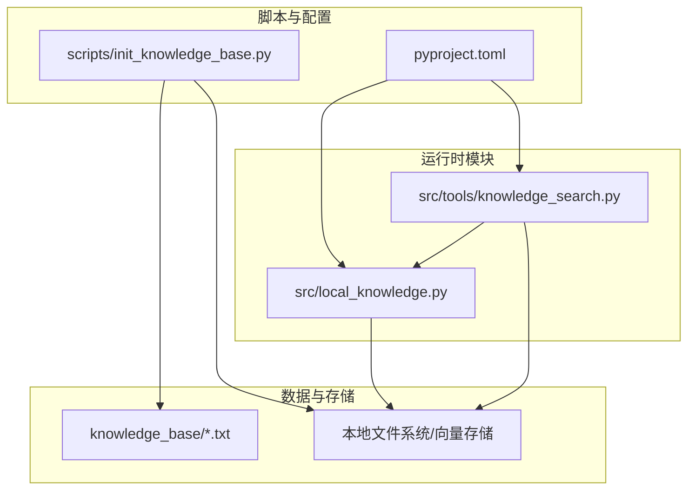
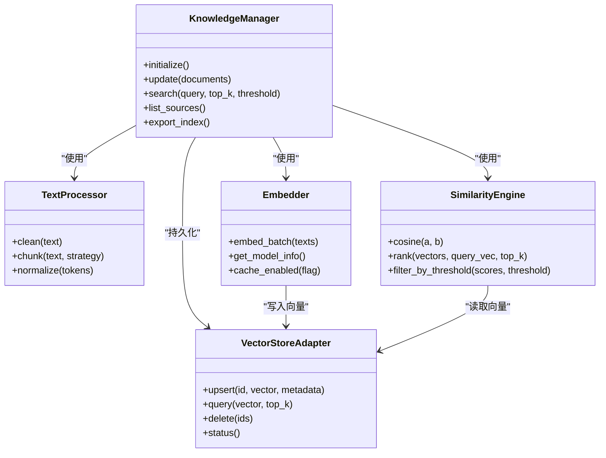
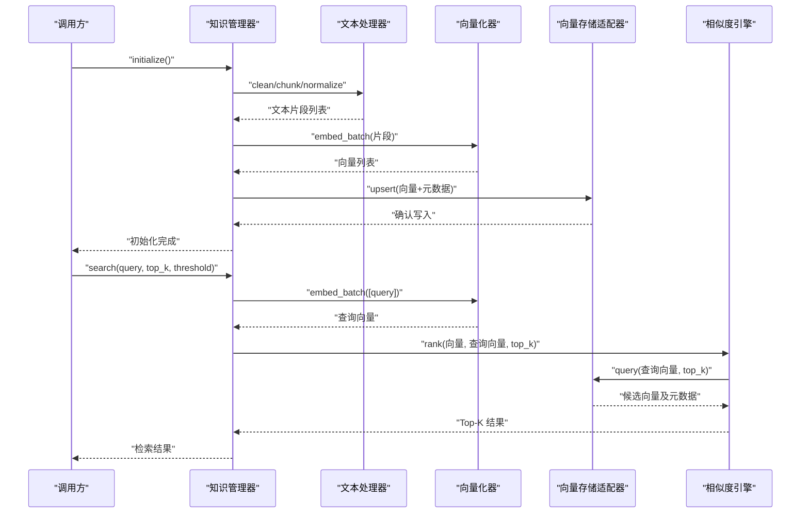
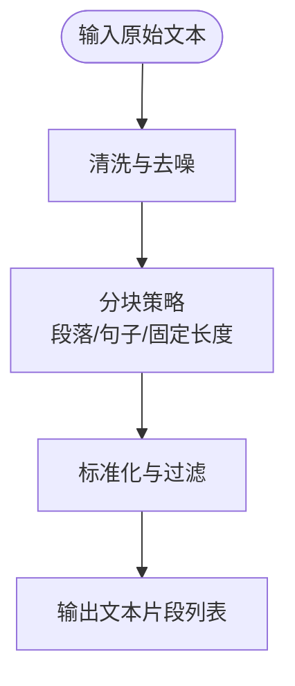
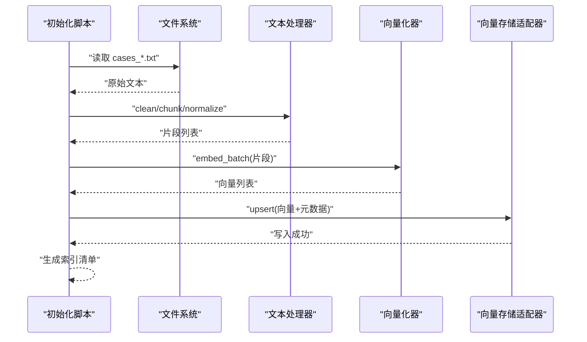
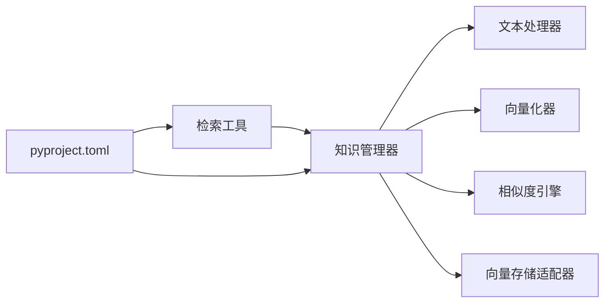

# 知识库架构设计

<cite>
**本文引用的文件**   
- [src/local_knowledge.py](file://src/local_knowledge.py)
- [src/tools/knowledge_search.py](file://src/tools/knowledge_search.py)
- [scripts/init_knowledge_base.py](file://scripts/init_knowledge_base.py)
- [knowledge_base/cases_ch9.txt](file://knowledge_base/cases_ch9.txt)
- [knowledge_base/cases_ch10.txt](file://knowledge_base/cases_ch10.txt)
- [knowledge_base/cases_ch11.txt](file://knowledge_base/cases_ch11.txt)
- [pyproject.toml](file://pyproject.toml)
</cite>

## 目录
1. [简介](#简介)
2. [项目结构](#项目结构)
3. [核心组件](#核心组件)
4. [架构总览](#架构总览)
5. [详细组件分析](#详细组件分析)
6. [依赖关系分析](#依赖关系分析)
7. [性能考虑](#性能考虑)
8. [故障排查指南](#故障排查指南)
9. [结论](#结论)
10. [附录](#附录)

## 简介
本技术文档围绕智能审计风险识别系统的“本地知识库”进行系统化设计与实现说明，重点阐述分层架构（数据层、索引层、检索层）、核心组件（知识管理器、向量数据库集成、文本处理器、相似度计算引擎）、端到端数据流与处理管道、扩展性与插件机制、以及性能优化与缓存策略。文档同时提供架构图与数据流图，帮助读者快速理解各组件交互关系与关键路径。

## 项目结构
仓库中与知识库相关的关键位置如下：
- 脚本入口：初始化知识库的脚本位于 scripts 目录，负责从原始语料构建索引并持久化到本地存储。
- 运行时模块：src/local_knowledge.py 暴露本地知识库能力；src/tools/knowledge_search.py 提供检索工具接口。
- 原始语料：knowledge_base 目录下存放若干案例文本，作为初始知识来源。
- 依赖声明：pyproject.toml 中声明了运行所需的外部库（如用于向量检索的依赖）。

图表来源
- [scripts/init_knowledge_base.py:1-200](file://scripts/init_knowledge_base.py#L1-L200)
- [src/local_knowledge.py:1-200](file://src/local_knowledge.py#L1-L200)
- [src/tools/knowledge_search.py:1-200](file://src/tools/knowledge_search.py#L1-L200)
- [pyproject.toml:1-200](file://pyproject.toml#L1-L200)

章节来源
- [scripts/init_knowledge_base.py:1-200](file://scripts/init_knowledge_base.py#L1-L200)
- [src/local_knowledge.py:1-200](file://src/local_knowledge.py#L1-L200)
- [src/tools/knowledge_search.py:1-200](file://src/tools/knowledge_search.py#L1-L200)
- [pyproject.toml:1-200](file://pyproject.toml#L1-L200)

## 核心组件
- 知识管理器（KnowledgeManager）
  - 职责：统一封装知识库的初始化、增量更新、查询与元数据管理；对外暴露稳定的 API。
  - 关键点：协调文本处理器、向量化器、相似度引擎与存储后端；维护索引版本与一致性。
- 文本处理器（TextProcessor）
  - 职责：对原始文本进行清洗、分块、去噪、标准化等预处理；输出结构化片段供后续向量化。
  - 关键点：支持可插拔的分块策略与过滤规则，便于适配不同来源的语料格式。
- 向量化器（Embedder）
  - 职责：将文本片段映射为高维向量；支持多种模型后端与批量推理。
  - 关键点：提供模型选择、批大小、设备分配等参数；支持缓存已生成向量以减少重复计算。
- 相似度计算引擎（SimilarityEngine）
  - 职责：在向量空间中进行相似度匹配与排序；支持多种度量（如余弦相似度）。
  - 关键点：结合索引结构（如 HNSW/IVF）提升检索效率；支持阈值过滤与结果重排。
- 向量数据库集成（VectorStoreAdapter）
  - 职责：抽象底层向量存储（如本地磁盘或内存数据库），提供统一的增删改查接口。
  - 关键点：屏蔽具体实现差异；支持持久化、备份与迁移；提供连接池与错误重试。

章节来源
- [src/local_knowledge.py:1-200](file://src/local_knowledge.py#L1-L200)
- [src/tools/knowledge_search.py:1-200](file://src/tools/knowledge_search.py#L1-L200)
- [pyproject.toml:1-200](file://pyproject.toml#L1-L200)

## 架构总览
系统采用三层分层设计：
- 数据层：原始语料与元数据，包括 knowledge_base 下的案例文本与外部数据源。
- 索引层：文本处理、向量化与相似度计算，产出向量索引与倒排/混合索引。
- 检索层：面向应用的查询接口，返回带相关性评分的结果集，并可结合业务规则进行后处理。

图表来源
- [src/local_knowledge.py:1-200](file://src/local_knowledge.py#L1-L200)
- [src/tools/knowledge_search.py:1-200](file://src/tools/knowledge_search.py#L1-L200)

## 详细组件分析

### 知识管理器（KnowledgeManager）
- 设计要点
  - 统一入口：对外提供 initialize/update/search/list_sources/export_index 等方法。
  - 生命周期管理：负责启动时加载索引、关闭时持久化状态。
  - 事务性更新：批量插入/删除时保证索引一致性。
- 关键流程
  - 初始化：扫描数据源、执行文本处理、向量化、写入向量存储。
  - 更新：增量处理新文档，合并元数据，重建必要索引段。
  - 检索：接收查询，调用相似度引擎与向量存储，返回 Top-K 结果。

图表来源
- [src/local_knowledge.py:1-200](file://src/local_knowledge.py#L1-L200)
- [src/tools/knowledge_search.py:1-200](file://src/tools/knowledge_search.py#L1-L200)

章节来源
- [src/local_knowledge.py:1-200](file://src/local_knowledge.py#L1-L200)
- [src/tools/knowledge_search.py:1-200](file://src/tools/knowledge_search.py#L1-L200)

### 文本处理器（TextProcessor）
- 功能范围
  - 清洗：去除无关字符、HTML 标签、空白符等。
  - 分块：按段落/句子/固定长度切分，保持语义完整性。
  - 标准化：统一编码、词表对齐、停用词过滤。
- 复杂度与优化
  - 时间复杂度：O(N) 线性扫描，N 为字符数；分块策略影响后续向量化批次大小。
  - 空间复杂度：O(M)，M 为片段数量；可通过流式处理降低峰值内存。

图表来源
- [src/local_knowledge.py:1-200](file://src/local_knowledge.py#L1-L200)

章节来源
- [src/local_knowledge.py:1-200](file://src/local_knowledge.py#L1-L200)

### 向量化器（Embedder）
- 功能范围
  - 批量嵌入：支持多文本并行向量化，提高吞吐。
  - 模型切换：通过配置选择不同模型后端。
  - 缓存：对相同文本片段复用已有向量，避免重复计算。
- 性能考量
  - 批大小与设备利用率：合理设置 batch_size 以平衡延迟与吞吐。
  - 内存占用：大模型需控制并发与批大小，必要时启用分页写入。

章节来源
- [src/local_knowledge.py:1-200](file://src/local_knowledge.py#L1-L200)
- [pyproject.toml:1-200](file://pyproject.toml#L1-L200)

### 相似度计算引擎（SimilarityEngine）
- 功能范围
  - 相似度度量：默认余弦相似度，可扩展其他度量。
  - 排序与过滤：Top-K 排序与阈值过滤，减少噪声结果。
- 算法特性
  - 时间复杂度：近似 O(K log N) 或 O(N) 取决于索引结构。
  - 空间复杂度：与向量维度与索引规模成正比。

章节来源
- [src/local_knowledge.py:1-200](file://src/local_knowledge.py#L1-L200)

### 向量存储适配器（VectorStoreAdapter）
- 功能范围
  - 统一接口：upsert/query/delete/status 等。
  - 持久化：支持本地磁盘或内存数据库，提供备份与恢复。
  - 连接管理：连接池、超时与重试策略。
- 扩展性
  - 可插拔后端：通过注册表动态切换存储实现。
  - 元数据索引：支持基于元数据的预过滤，加速检索。

章节来源
- [src/local_knowledge.py:1-200](file://src/local_knowledge.py#L1-L200)

### 检索工具（knowledge_search）
- 角色定位
  - 面向上层应用提供检索 API，封装查询构造、参数校验与结果格式化。
  - 与知识管理器协作，支持多策略检索（如关键词+向量混合）。
- 典型用法
  - 初始化检索器，传入查询与参数。
  - 获取 Top-K 结果，附带相关性分数与来源元数据。

章节来源
- [src/tools/knowledge_search.py:1-200](file://src/tools/knowledge_search.py#L1-L200)

### 初始化脚本（init_knowledge_base）
- 职责
  - 从 knowledge_base 下读取原始语料，执行文本处理、向量化与索引构建。
  - 将索引持久化至本地存储，供运行时加载。
- 流程概览
  - 扫描语料目录 -> 解析文本 -> 分块与标准化 -> 向量化 -> 写入向量存储 -> 记录元数据。

图表来源
- [scripts/init_knowledge_base.py:1-200](file://scripts/init_knowledge_base.py#L1-L200)
- [knowledge_base/cases_ch9.txt:1-200](file://knowledge_base/cases_ch9.txt#L1-L200)
- [knowledge_base/cases_ch10.txt:1-200](file://knowledge_base/cases_ch10.txt#L1-L200)
- [knowledge_base/cases_ch11.txt:1-200](file://knowledge_base/cases_ch11.txt#L1-L200)

章节来源
- [scripts/init_knowledge_base.py:1-200](file://scripts/init_knowledge_base.py#L1-L200)
- [knowledge_base/cases_ch9.txt:1-200](file://knowledge_base/cases_ch9.txt#L1-L200)
- [knowledge_base/cases_ch10.txt:1-200](file://knowledge_base/cases_ch10.txt#L1-L200)
- [knowledge_base/cases_ch11.txt:1-200](file://knowledge_base/cases_ch11.txt#L1-L200)

## 依赖关系分析
- 内部依赖
  - 知识管理器依赖文本处理器、向量化器、相似度引擎与向量存储适配器。
  - 检索工具依赖知识管理器与向量存储适配器。
- 外部依赖
  - pyproject.toml 中声明的库用于向量化与向量检索（例如向量模型与向量数据库客户端）。
- 耦合与内聚
  - 通过适配器模式降低耦合度，提升可替换性。
  - 组件职责清晰，内聚度高，便于单元测试与独立演进。

图表来源
- [src/local_knowledge.py:1-200](file://src/local_knowledge.py#L1-L200)
- [src/tools/knowledge_search.py:1-200](file://src/tools/knowledge_search.py#L1-L200)
- [pyproject.toml:1-200](file://pyproject.toml#L1-L200)

章节来源
- [src/local_knowledge.py:1-200](file://src/local_knowledge.py#L1-L200)
- [src/tools/knowledge_search.py:1-200](file://src/tools/knowledge_search.py#L1-L200)
- [pyproject.toml:1-200](file://pyproject.toml#L1-L200)

## 性能考虑
- 批处理与并行
  - 向量化阶段采用批处理与多线程/多进程并行，提升吞吐。
  - 合理设置批大小与线程数，避免内存溢出与上下文切换开销。
- 索引结构与检索优化
  - 使用近似最近邻（ANN）索引（如 HNSW/IVF）降低查询延迟。
  - 引入元数据预过滤，缩小候选集后再进行相似度计算。
- 缓存机制
  - 文本片段哈希缓存：对相同片段复用向量，避免重复计算。
  - 查询结果缓存：对高频查询短期缓存，降低重复检索成本。
- I/O 与存储
  - 向量存储采用连接池与异步写入，减少阻塞。
  - 定期压缩与归档历史索引，控制存储增长。

[本节为通用性能建议，不直接分析具体文件]

## 故障排查指南
- 常见问题
  - 初始化失败：检查语料目录权限与文件格式；确认向量化模型可用。
  - 检索无结果：调整阈值与 Top-K；检查索引是否完整。
  - 性能退化：监控批大小、索引规模与缓存命中率；评估是否需要扩容或重建索引。
- 诊断步骤
  - 查看初始化日志与错误堆栈，定位异常阶段。
  - 验证向量存储状态与连接健康。
  - 抽样测试查询，对比预期结果与实际返回。

章节来源
- [scripts/init_knowledge_base.py:1-200](file://scripts/init_knowledge_base.py#L1-L200)
- [src/local_knowledge.py:1-200](file://src/local_knowledge.py#L1-L200)
- [src/tools/knowledge_search.py:1-200](file://src/tools/knowledge_search.py#L1-L200)

## 结论
本知识库架构通过清晰的分层设计与模块化组件，实现了从原始数据到高效检索的完整流水线。知识管理器作为中枢协调各组件，文本处理器与向量化器保障数据质量与表示能力，相似度引擎与向量存储适配器提供高性能检索与持久化。整体具备良好扩展性与可维护性，适合在审计风险识别场景中持续演进与优化。

[本节为总结性内容，不直接分析具体文件]

## 附录
- 术语
  - 向量：文本片段在高维空间的数值表示。
  - ANN：近似最近邻搜索，用于大规模向量检索。
  - 元数据：与文档相关的描述信息，用于预过滤与溯源。
- 参考文件
  - 初始化脚本：[scripts/init_knowledge_base.py](file://scripts/init_knowledge_base.py)
  - 运行时模块：[src/local_knowledge.py](file://src/local_knowledge.py)、[src/tools/knowledge_search.py](file://src/tools/knowledge_search.py)
  - 原始语料：[knowledge_base/cases_ch9.txt](file://knowledge_base/cases_ch9.txt)、[knowledge_base/cases_ch10.txt](file://knowledge_base/cases_ch10.txt)、[knowledge_base/cases_ch11.txt](file://knowledge_base/cases_ch11.txt)
  - 依赖声明：[pyproject.toml](file://pyproject.toml)