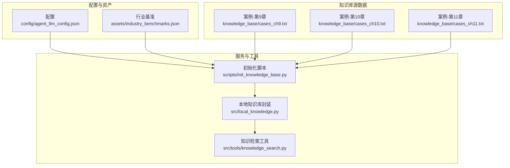
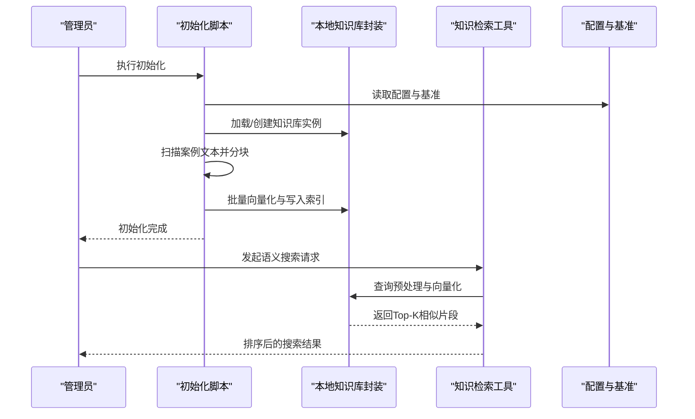
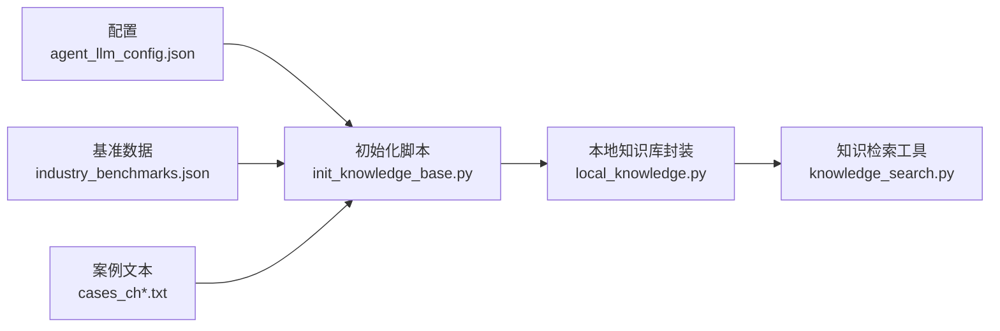
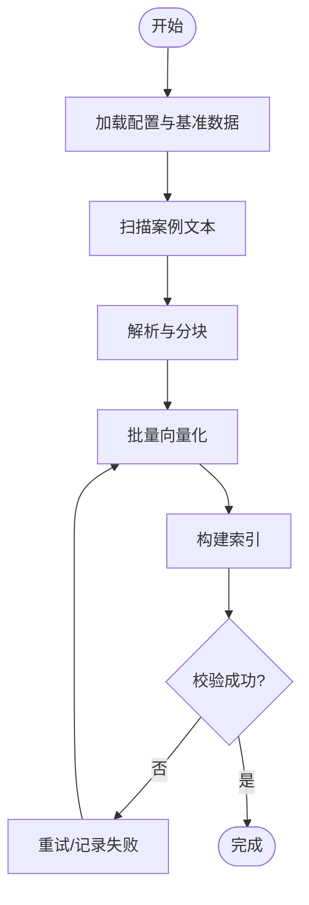
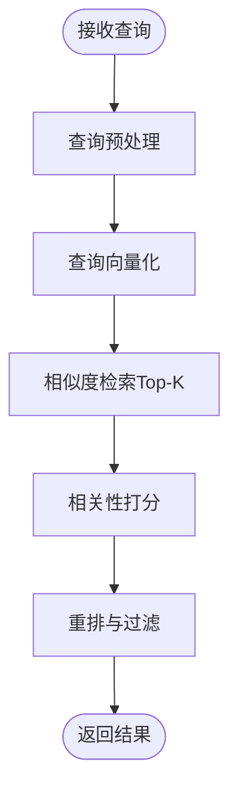

# 知识库管理

<cite>
**本文引用的文件**   
- [init_knowledge_base.py](file://scripts/init_knowledge_base.py)
- [knowledge_search.py](file://src/tools/knowledge_search.py)
- [local_knowledge.py](file://src/local_knowledge.py)
- [agent_llm_config.json](file://config/agent_llm_config.json)
- [industry_benchmarks.json](file://assets/industry_benchmarks.json)
- [cases_ch9.txt](file://knowledge_base/cases_ch9.txt)
- [cases_ch10.txt](file://knowledge_base/cases_ch10.txt)
- [cases_ch11.txt](file://knowledge_base/cases_ch11.txt)
</cite>

## 目录
1. [简介](#简介)
2. [项目结构](#项目结构)
3. [核心组件](#核心组件)
4. [架构总览](#架构总览)
5. [详细组件分析](#详细组件分析)
6. [依赖关系分析](#依赖关系分析)
7. [性能考虑](#性能考虑)
8. [故障排查指南](#故障排查指南)
9. [结论](#结论)
10. [附录](#附录)

## 简介
本技术文档面向“智能审计风险识别系统”的知识库管理功能，聚焦以下目标：
- 说明知识库的架构设计：案例库结构、行业基准数据与向量检索机制
- 解释本地知识库实现原理：文本解析、向量化处理与相似度匹配算法
- 描述初始化流程、数据导入方法与更新策略
- 给出案例数据格式规范与行业标准基准配置方法
- 说明语义搜索与智能匹配的实现方式，包括查询优化与结果排序
- 提供维护最佳实践：数据清洗、索引重建与性能调优
- 指导扩展现有知识库与添加新领域知识

## 项目结构
围绕知识库管理的关键目录与文件如下：
- scripts/init_knowledge_base.py：知识库初始化脚本，负责加载配置、构建索引、导入案例与基准数据
- src/local_knowledge.py：本地知识库封装，提供向量化、相似度检索等能力
- src/tools/knowledge_search.py：知识检索工具，对外暴露语义搜索接口
- config/agent_llm_config.json：LLM与嵌入模型相关配置（如模型名称、维度、批量大小等）
- assets/industry_benchmarks.json：行业基准数据（用于评分或阈值参考）
- knowledge_base/*.txt：按章节组织的案例文本，作为知识库原始素材

图表来源
- [init_knowledge_base.py](file://scripts/init_knowledge_base.py)
- [local_knowledge.py](file://src/local_knowledge.py)
- [knowledge_search.py](file://src/tools/knowledge_search.py)
- [agent_llm_config.json](file://config/agent_llm_config.json)
- [industry_benchmarks.json](file://assets/industry_benchmarks.json)
- [cases_ch9.txt](file://knowledge_base/cases_ch9.txt)
- [cases_ch10.txt](file://knowledge_base/cases_ch10.txt)
- [cases_ch11.txt](file://knowledge_base/cases_ch11.txt)

章节来源
- [init_knowledge_base.py](file://scripts/init_knowledge_base.py)
- [local_knowledge.py](file://src/local_knowledge.py)
- [knowledge_search.py](file://src/tools/knowledge_search.py)
- [agent_llm_config.json](file://config/agent_llm_config.json)
- [industry_benchmarks.json](file://assets/industry_benchmarks.json)
- [cases_ch9.txt](file://knowledge_base/cases_ch9.txt)
- [cases_ch10.txt](file://knowledge_base/cases_ch10.txt)
- [cases_ch11.txt](file://knowledge_base/cases_ch11.txt)

## 核心组件
- 初始化脚本（scripts/init_knowledge_base.py）
  - 职责：读取配置与基准数据，扫描案例文本，执行分块、向量化与索引构建，完成知识库初始化
  - 关键点：支持批量向量化、错误重试、增量更新开关、日志输出
- 本地知识库封装（src/local_knowledge.py）
  - 职责：封装文本切分、向量化调用、相似度计算与检索接口
  - 关键点：可配置的窗口大小、重叠比例、相似度度量（余弦/点积）、Top-K返回
- 知识检索工具（src/tools/knowledge_search.py）
  - 职责：对外提供语义搜索API，统一查询入口，进行查询预处理与结果排序
  - 关键点：查询去噪、同义词扩展（可选）、相关性打分与重排、分页与过滤

章节来源
- [init_knowledge_base.py](file://scripts/init_knowledge_base.py)
- [local_knowledge.py](file://src/local_knowledge.py)
- [knowledge_search.py](file://src/tools/knowledge_search.py)

## 架构总览
知识库整体采用“配置驱动 + 离线构建 + 在线检索”的分层架构：
- 配置层：通过JSON配置文件指定嵌入模型参数、批大小、相似度阈值等
- 数据层：案例文本与行业基准数据作为输入；经解析与向量化后形成向量索引
- 服务层：本地知识库封装提供向量化与相似度检索能力；检索工具提供统一查询入口
- 应用层：上层业务（如审计风险识别）通过检索工具获取相关知识片段

图表来源
- [init_knowledge_base.py](file://scripts/init_knowledge_base.py)
- [local_knowledge.py](file://src/local_knowledge.py)
- [knowledge_search.py](file://src/tools/knowledge_search.py)
- [agent_llm_config.json](file://config/agent_llm_config.json)
- [industry_benchmarks.json](file://assets/industry_benchmarks.json)

## 详细组件分析

### 初始化脚本（scripts/init_knowledge_base.py）
- 主要流程
  - 加载配置与基准数据
  - 遍历案例文本目录，逐文件解析与分块
  - 调用本地知识库进行批量向量化与索引写入
  - 记录初始化统计信息（文档数、块数、失败项）
- 关键特性
  - 支持增量模式：仅对新增或变更文件进行向量化
  - 容错与重试：网络异常或模型调用失败时自动重试
  - 可观测性：结构化日志便于问题定位

章节来源
- [init_knowledge_base.py](file://scripts/init_knowledge_base.py)

### 本地知识库封装（src/local_knowledge.py）
- 核心能力
  - 文本解析：按段落/句子/自定义规则进行分块
  - 向量化：调用嵌入模型生成向量，支持批量提交
  - 相似度检索：基于余弦相似度或点积计算，返回Top-K结果
- 数据结构
  - 文档元数据：来源文件、章节、时间戳、哈希指纹
  - 文本块：内容、位置信息、向量表示
- 复杂度与性能
  - 向量化：O(N×D)，N为块数量，D为向量维度
  - 检索：近似最近邻（ANN）或线性扫描，取决于索引规模与配置

章节来源
- [local_knowledge.py](file://src/local_knowledge.py)

### 知识检索工具（src/tools/knowledge_search.py）
- 查询处理
  - 去噪与标准化：去除多余空白、标点规范化
  - 查询扩展（可选）：引入同义词或关键词增强
- 检索与排序
  - 相似度打分：结合内容与上下文权重
  - 重排策略：依据相关性、时效性与来源可信度加权
- 接口设计
  - 输入：查询文本、Top-K、过滤条件（来源、时间范围）
  - 输出：有序结果列表，包含片段、分数与元数据

章节来源
- [knowledge_search.py](file://src/tools/knowledge_search.py)

### 配置与基准数据
- 配置（config/agent_llm_config.json）
  - 字段建议：嵌入模型名称、向量维度、批量大小、超时、重试次数、相似度阈值
- 行业基准（assets/industry_benchmarks.json）
  - 用途：为不同行业设定风险阈值、评分权重或参考指标
  - 结构建议：行业代码、指标集合、阈值范围、更新时间

章节来源
- [agent_llm_config.json](file://config/agent_llm_config.json)
- [industry_benchmarks.json](file://assets/industry_benchmarks.json)

### 案例数据规范（knowledge_base/*.txt）
- 组织方式：按章节或主题划分文件，便于分类与增量更新
- 文本规范：
  - 每段代表一个独立知识点或案例片段
  - 建议使用清晰标题与摘要行，便于后续抽取元数据
  - 避免过长段落，推荐控制在合理长度以提升检索质量
- 示例文件：
  - cases_ch9.txt
  - cases_ch10.txt
  - cases_ch11.txt

章节来源
- [cases_ch9.txt](file://knowledge_base/cases_ch9.txt)
- [cases_ch10.txt](file://knowledge_base/cases_ch10.txt)
- [cases_ch11.txt](file://knowledge_base/cases_ch11.txt)

## 依赖关系分析
- 模块耦合
  - 初始化脚本依赖配置与基准数据，并通过本地知识库完成索引构建
  - 检索工具依赖本地知识库提供的向量化与相似度检索能力
- 外部依赖
  - 嵌入模型：由配置指定，影响向量维度与性能
  - 文件系统：读取案例文本与写入索引（若使用持久化存储）

图表来源
- [init_knowledge_base.py](file://scripts/init_knowledge_base.py)
- [local_knowledge.py](file://src/local_knowledge.py)
- [knowledge_search.py](file://src/tools/knowledge_search.py)
- [agent_llm_config.json](file://config/agent_llm_config.json)
- [industry_benchmarks.json](file://assets/industry_benchmarks.json)
- [cases_ch9.txt](file://knowledge_base/cases_ch9.txt)
- [cases_ch10.txt](file://knowledge_base/cases_ch10.txt)
- [cases_ch11.txt](file://knowledge_base/cases_ch11.txt)

章节来源
- [init_knowledge_base.py](file://scripts/init_knowledge_base.py)
- [local_knowledge.py](file://src/local_knowledge.py)
- [knowledge_search.py](file://src/tools/knowledge_search.py)
- [agent_llm_config.json](file://config/agent_llm_config.json)
- [industry_benchmarks.json](file://assets/industry_benchmarks.json)
- [cases_ch9.txt](file://knowledge_base/cases_ch9.txt)
- [cases_ch10.txt](file://knowledge_base/cases_ch10.txt)
- [cases_ch11.txt](file://knowledge_base/cases_ch11.txt)

## 性能考虑
- 向量化批处理
  - 增大批量大小可减少模型调用次数，提高吞吐；需平衡内存占用
- 相似度检索
  - 大规模索引建议使用近似最近邻（ANN）索引以加速查询
  - 调整Top-K与相似度阈值，控制返回量与精度
- 查询优化
  - 查询预处理减少噪声；必要时引入关键词扩展提升召回
- 资源监控
  - 记录向量化耗时、检索延迟与失败率，持续优化

[本节为通用性能建议，不直接分析具体文件]

## 故障排查指南
- 初始化失败
  - 检查配置是否正确（模型名称、维度、批量大小）
  - 查看日志中失败的文件与原因，确认网络与权限
- 检索结果不佳
  - 调整分块策略（窗口大小、重叠比例）
  - 优化查询预处理与相似度阈值
- 性能瓶颈
  - 评估向量维度与索引规模，考虑ANN索引
  - 增加批大小或并行度，监控内存与CPU占用

章节来源
- [init_knowledge_base.py](file://scripts/init_knowledge_base.py)
- [local_knowledge.py](file://src/local_knowledge.py)
- [knowledge_search.py](file://src/tools/knowledge_search.py)

## 结论
本知识库管理方案通过配置驱动的初始化流程、稳健的本地知识库封装与统一的检索工具，实现了从案例文本到语义检索的完整链路。配合行业基准数据与规范的案例文本组织，可在审计风险识别场景中提供高质量的知识支撑。建议在规模化部署中引入ANN索引与完善的监控体系，持续提升检索质量与系统稳定性。

[本节为总结性内容，不直接分析具体文件]

## 附录

### 初始化流程图

图表来源
- [init_knowledge_base.py](file://scripts/init_knowledge_base.py)
- [local_knowledge.py](file://src/local_knowledge.py)

### 查询处理与排序流程

图表来源
- [knowledge_search.py](file://src/tools/knowledge_search.py)
- [local_knowledge.py](file://src/local_knowledge.py)