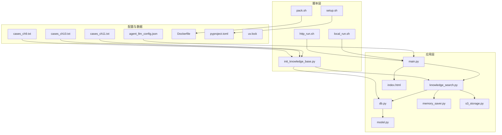
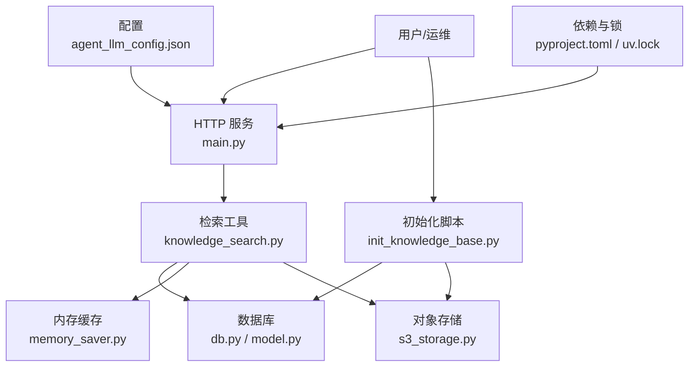
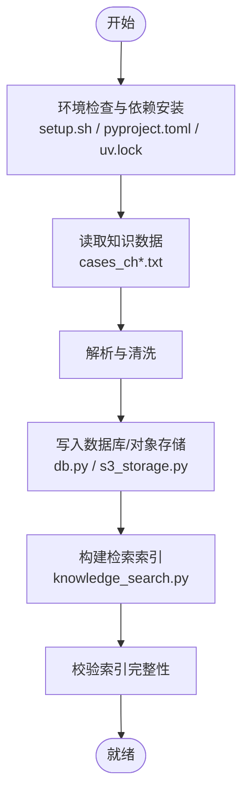
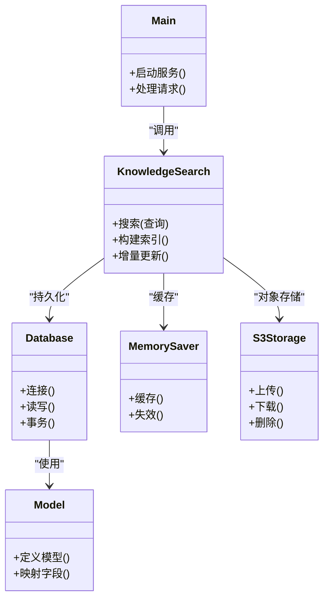

# 维护与操作

<cite>
**本文引用的文件**   
- [init_knowledge_base.py](file://scripts/init_knowledge_base.py)
- [load_env.py](file://scripts/load_env.py)
- [setup.sh](file://scripts/setup.sh)
- [http_run.sh](file://scripts/http_run.sh)
- [local_run.sh](file://scripts/local_run.sh)
- [pack.sh](file://scripts/pack.sh)
- [Dockerfile](file://Dockerfile)
- [pyproject.toml](file://pyproject.toml)
- [uv.lock](file://uv.lock)
- [agent_llm_config.json](file://config/agent_llm_config.json)
- [cases_ch9.txt](file://knowledge_base/cases_ch9.txt)
- [cases_ch10.txt](file://knowledge_base/cases_ch10.txt)
- [cases_ch11.txt](file://knowledge_base/cases_ch11.txt)
- [db.py](file://src/storage/database/db.py)
- [model.py](file://src/storage/database/shared/model.py)
- [memory_saver.py](file://src/storage/memory/memory_saver.py)
- [s3_storage.py](file://src/storage/s3/s3_storage.py)
- [knowledge_search.py](file://src/tools/knowledge_search.py)
- [main.py](file://src/main.py)
- [index.html](file://src/web/index.html)
- [start.ps1](file://start.ps1)
- [前置库安装.bat](file://前置库安装.bat)
- [启动.bat](file://启动.bat)
</cite>

## 目录
1. [简介](#简介)
2. [项目结构](#项目结构)
3. [核心组件](#核心组件)
4. [架构总览](#架构总览)
5. [详细组件分析](#详细组件分析)
6. [依赖关系分析](#依赖关系分析)
7. [性能考虑](#性能考虑)
8. [故障诊断指南](#故障诊断指南)
9. [结论](#结论)
10. [附录](#附录)

## 简介
本运维文档面向知识库的维护与操作，覆盖初始化流程、日常维护、故障诊断、备份恢复与迁移、自动化脚本与定时任务、容量规划与扩容、安全最佳实践与访问控制等主题。目标是帮助运维人员快速搭建、稳定运行并高效扩展知识库系统。

## 项目结构
仓库采用“脚本 + 源码 + 配置 + 数据”的分层组织方式：
- scripts：初始化、环境准备、打包与运行脚本
- src：核心业务逻辑（存储、工具、Web入口）
- config：运行时配置
- knowledge_base：示例知识数据
- Dockerfile：容器化构建
- pyproject.toml/uv.lock：Python 依赖管理

图表来源
- [init_knowledge_base.py](file://scripts/init_knowledge_base.py)
- [setup.sh](file://scripts/setup.sh)
- [http_run.sh](file://scripts/http_run.sh)
- [local_run.sh](file://scripts/local_run.sh)
- [pack.sh](file://scripts/pack.sh)
- [main.py](file://src/main.py)
- [knowledge_search.py](file://src/tools/knowledge_search.py)
- [db.py](file://src/storage/database/db.py)
- [model.py](file://src/storage/database/shared/model.py)
- [memory_saver.py](file://src/storage/memory/memory_saver.py)
- [s3_storage.py](file://src/storage/s3/s3_storage.py)
- [index.html](file://src/web/index.html)
- [agent_llm_config.json](file://config/agent_llm_config.json)
- [cases_ch9.txt](file://knowledge_base/cases_ch9.txt)
- [cases_ch10.txt](file://knowledge_base/cases_ch10.txt)
- [cases_ch11.txt](file://knowledge_base/cases_ch11.txt)
- [Dockerfile](file://Dockerfile)
- [pyproject.toml](file://pyproject.toml)
- [uv.lock](file://uv.lock)

章节来源
- [init_knowledge_base.py](file://scripts/init_knowledge_base.py)
- [setup.sh](file://scripts/setup.sh)
- [http_run.sh](file://scripts/http_run.sh)
- [local_run.sh](file://scripts/local_run.sh)
- [pack.sh](file://scripts/pack.sh)
- [main.py](file://src/main.py)
- [knowledge_search.py](file://src/tools/knowledge_search.py)
- [db.py](file://src/storage/database/db.py)
- [model.py](file://src/storage/database/shared/model.py)
- [memory_saver.py](file://src/storage/memory/memory_saver.py)
- [s3_storage.py](file://src/storage/s3/s3_storage.py)
- [index.html](file://src/web/index.html)
- [agent_llm_config.json](file://config/agent_llm_config.json)
- [cases_ch9.txt](file://knowledge_base/cases_ch9.txt)
- [cases_ch10.txt](file://knowledge_base/cases_ch10.txt)
- [cases_ch11.txt](file://knowledge_base/cases_ch11.txt)
- [Dockerfile](file://Dockerfile)
- [pyproject.toml](file://pyproject.toml)
- [uv.lock](file://uv.lock)

## 核心组件
- 初始化与导入
  - 初始化脚本负责环境准备、依赖安装、数据导入与索引构建。
  - 参考路径：[scripts/init_knowledge_base.py](file://scripts/init_knowledge_base.py)
- 运行与部署
  - HTTP 服务启动脚本、本地运行脚本、打包与容器化构建。
  - 参考路径：[scripts/http_run.sh](file://scripts/http_run.sh)、[scripts/local_run.sh](file://scripts/local_run.sh)、[scripts/pack.sh](file://scripts/pack.sh)、[Dockerfile](file://Dockerfile)
- 数据存储与检索
  - 数据库模型与连接、内存缓存、对象存储适配、检索工具。
  - 参考路径：[src/storage/database/db.py](file://src/storage/database/db.py)、[src/storage/database/shared/model.py](file://src/storage/database/shared/model.py)、[src/storage/memory/memory_saver.py](file://src/storage/memory/memory_saver.py)、[src/storage/s3/s3_storage.py](file://src/storage/s3/s3_storage.py)、[src/tools/knowledge_search.py](file://src/tools/knowledge_search.py)
- Web 与主入口
  - 主程序入口与前端页面。
  - 参考路径：[src/main.py](file://src/main.py)、[src/web/index.html](file://src/web/index.html)
- 配置与环境
  - LLM 相关配置、依赖清单与锁定文件。
  - 参考路径：[config/agent_llm_config.json](file://config/agent_llm_config.json)、[pyproject.toml](file://pyproject.toml)、[uv.lock](file://uv.lock)

章节来源
- [init_knowledge_base.py](file://scripts/init_knowledge_base.py)
- [http_run.sh](file://scripts/http_run.sh)
- [local_run.sh](file://scripts/local_run.sh)
- [pack.sh](file://scripts/pack.sh)
- [Dockerfile](file://Dockerfile)
- [db.py](file://src/storage/database/db.py)
- [model.py](file://src/storage/database/shared/model.py)
- [memory_saver.py](file://src/storage/memory/memory_saver.py)
- [s3_storage.py](file://src/storage/s3/s3_storage.py)
- [knowledge_search.py](file://src/tools/knowledge_search.py)
- [main.py](file://src/main.py)
- [index.html](file://src/web/index.html)
- [agent_llm_config.json](file://config/agent_llm_config.json)
- [pyproject.toml](file://pyproject.toml)
- [uv.lock](file://uv.lock)

## 架构总览
系统由“初始化与运行脚本”、“应用服务”、“存储层”和“配置与数据”组成。初始化阶段完成数据导入与索引构建；运行阶段通过 Web 接口提供检索能力；存储层支持本地数据库、内存缓存与对象存储；配置集中管理外部依赖参数。

图表来源
- [main.py](file://src/main.py)
- [knowledge_search.py](file://src/tools/knowledge_search.py)
- [db.py](file://src/storage/database/db.py)
- [model.py](file://src/storage/database/shared/model.py)
- [memory_saver.py](file://src/storage/memory/memory_saver.py)
- [s3_storage.py](file://src/storage/s3/s3_storage.py)
- [init_knowledge_base.py](file://scripts/init_knowledge_base.py)
- [agent_llm_config.json](file://config/agent_llm_config.json)
- [pyproject.toml](file://pyproject.toml)
- [uv.lock](file://uv.lock)

## 详细组件分析

### 初始化流程与环境准备
- 环境准备
  - 使用 setup 脚本进行基础环境检查与依赖安装。
  - 参考路径：[scripts/setup.sh](file://scripts/setup.sh)、[pyproject.toml](file://pyproject.toml)、[uv.lock](file://uv.lock)
- 数据导入
  - 将 knowledge_base 下的案例文本导入到存储层，生成结构化记录。
  - 参考路径：[scripts/init_knowledge_base.py](file://scripts/init_knowledge_base.py)、[knowledge_base/cases_ch9.txt](file://knowledge_base/cases_ch9.txt)、[knowledge_base/cases_ch10.txt](file://knowledge_base/cases_ch10.txt)、[knowledge_base/cases_ch11.txt](file://knowledge_base/cases_ch11.txt)
- 索引构建
  - 基于导入数据构建检索索引，供查询加速。
  - 参考路径：[scripts/init_knowledge_base.py](file://scripts/init_knowledge_base.py)、[src/tools/knowledge_search.py](file://src/tools/knowledge_search.py)
- 运行模式
  - 本地运行与 HTTP 服务启动脚本，便于开发与生产切换。
  - 参考路径：[scripts/local_run.sh](file://scripts/local_run.sh)、[scripts/http_run.sh](file://scripts/http_run.sh)

图表来源
- [setup.sh](file://scripts/setup.sh)
- [pyproject.toml](file://pyproject.toml)
- [uv.lock](file://uv.lock)
- [init_knowledge_base.py](file://scripts/init_knowledge_base.py)
- [cases_ch9.txt](file://knowledge_base/cases_ch9.txt)
- [cases_ch10.txt](file://knowledge_base/cases_ch10.txt)
- [cases_ch11.txt](file://knowledge_base/cases_ch11.txt)
- [db.py](file://src/storage/database/db.py)
- [s3_storage.py](file://src/storage/s3/s3_storage.py)
- [knowledge_search.py](file://src/tools/knowledge_search.py)

章节来源
- [setup.sh](file://scripts/setup.sh)
- [pyproject.toml](file://pyproject.toml)
- [uv.lock](file://uv.lock)
- [init_knowledge_base.py](file://scripts/init_knowledge_base.py)
- [cases_ch9.txt](file://knowledge_base/cases_ch9.txt)
- [cases_ch10.txt](file://knowledge_base/cases_ch10.txt)
- [cases_ch11.txt](file://knowledge_base/cases_ch11.txt)
- [db.py](file://src/storage/database/db.py)
- [s3_storage.py](file://src/storage/s3/s3_storage.py)
- [knowledge_search.py](file://src/tools/knowledge_search.py)

### 日常维护任务
- 数据更新
  - 增量导入新案例或更新现有条目，确保幂等与去重。
  - 参考路径：[scripts/init_knowledge_base.py](file://scripts/init_knowledge_base.py)
- 增量索引
  - 对新增数据进行增量索引构建，避免全量重建。
  - 参考路径：[scripts/init_knowledge_base.py](file://scripts/init_knowledge_base.py)、[src/tools/knowledge_search.py](file://src/tools/knowledge_search.py)
- 清理过期数据
  - 定期清理无效或过期条目，释放存储空间。
  - 参考路径：[scripts/init_knowledge_base.py](file://scripts/init_knowledge_base.py)
- 性能监控
  - 关注索引大小、查询延迟、存储占用与错误率。
  - 参考路径：[src/tools/knowledge_search.py](file://src/tools/knowledge_search.py)、[src/storage/database/db.py](file://src/storage/database/db.py)

章节来源
- [init_knowledge_base.py](file://scripts/init_knowledge_base.py)
- [knowledge_search.py](file://src/tools/knowledge_search.py)
- [db.py](file://src/storage/database/db.py)

### 备份恢复策略与数据迁移
- 备份
  - 数据库快照与对象存储版本化备份，结合打包脚本归档。
  - 参考路径：[scripts/pack.sh](file://scripts/pack.sh)、[src/storage/database/db.py](file://src/storage/database/db.py)、[src/storage/s3/s3_storage.py](file://src/storage/s3/s3_storage.py)
- 恢复
  - 从归档包恢复数据库与对象存储数据，重建索引。
  - 参考路径：[scripts/pack.sh](file://scripts/pack.sh)、[scripts/init_knowledge_base.py](file://scripts/init_knowledge_base.py)
- 迁移
  - 跨环境迁移时，优先导出结构化数据与索引元数据，再在新环境重建索引。
  - 参考路径：[src/storage/database/db.py](file://src/storage/database/db.py)、[src/tools/knowledge_search.py](file://src/tools/knowledge_search.py)

章节来源
- [pack.sh](file://scripts/pack.sh)
- [db.py](file://src/storage/database/db.py)
- [s3_storage.py](file://src/storage/s3/s3_storage.py)
- [init_knowledge_base.py](file://scripts/init_knowledge_base.py)
- [knowledge_search.py](file://src/tools/knowledge_search.py)

### 自动化维护脚本与定时任务
- 脚本说明
  - 初始化：[scripts/init_knowledge_base.py](file://scripts/init_knowledge_base.py)
  - 环境准备：[scripts/setup.sh](file://scripts/setup.sh)
  - 运行：[scripts/http_run.sh](file://scripts/http_run.sh)、[scripts/local_run.sh](file://scripts/local_run.sh)
  - 打包：[scripts/pack.sh](file://scripts/pack.sh)
- 定时任务建议
  - 每日增量导入与索引更新
  - 每周备份与清理
  - 每月容量评估与索引优化
- Windows 快捷方式
  - 参考路径：[start.ps1](file://start.ps1)、[前置库安装.bat](file://前置库安装.bat)、[启动.bat](file://启动.bat)

章节来源
- [init_knowledge_base.py](file://scripts/init_knowledge_base.py)
- [setup.sh](file://scripts/setup.sh)
- [http_run.sh](file://scripts/http_run.sh)
- [local_run.sh](file://scripts/local_run.sh)
- [pack.sh](file://scripts/pack.sh)
- [start.ps1](file://start.ps1)
- [前置库安装.bat](file://前置库安装.bat)
- [启动.bat](file://启动.bat)

### 容量规划与扩容指导
- 容量估算
  - 根据案例数量、平均长度与索引开销估算磁盘与内存需求。
- 扩容策略
  - 水平扩展：多实例共享对象存储与数据库
  - 垂直扩展：提升 CPU/内存以加速索引构建与查询
- 监控指标
  - 索引大小、查询延迟、吞吐、错误率、存储水位

章节来源
- [knowledge_search.py](file://src/tools/knowledge_search.py)
- [db.py](file://src/storage/database/db.py)
- [s3_storage.py](file://src/storage/s3/s3_storage.py)

### 安全最佳实践与访问控制
- 配置隔离
  - 敏感配置（如 LLM 密钥）通过配置文件与环境变量注入，避免硬编码。
  - 参考路径：[config/agent_llm_config.json](file://config/agent_llm_config.json)
- 最小权限
  - 为数据库与对象存储账户分配最小必要权限。
- 传输加密
  - 启用 HTTPS 与 TLS，限制端口暴露范围。
- 审计与日志
  - 开启访问日志与错误日志，保留周期符合合规要求。

章节来源
- [agent_llm_config.json](file://config/agent_llm_config.json)

## 依赖关系分析
- 应用与服务
  - main.py 作为入口，调用 knowledge_search.py 进行检索。
- 存储层
  - db.py 与 model.py 定义数据库模型与连接；memory_saver.py 提供内存缓存；s3_storage.py 对接对象存储。
- 配置与依赖
  - agent_llm_config.json 提供运行时配置；pyproject.toml 与 uv.lock 管理 Python 依赖。

图表来源
- [main.py](file://src/main.py)
- [knowledge_search.py](file://src/tools/knowledge_search.py)
- [db.py](file://src/storage/database/db.py)
- [model.py](file://src/storage/database/shared/model.py)
- [memory_saver.py](file://src/storage/memory/memory_saver.py)
- [s3_storage.py](file://src/storage/s3/s3_storage.py)

章节来源
- [main.py](file://src/main.py)
- [knowledge_search.py](file://src/tools/knowledge_search.py)
- [db.py](file://src/storage/database/db.py)
- [model.py](file://src/storage/database/shared/model.py)
- [memory_saver.py](file://src/storage/memory/memory_saver.py)
- [s3_storage.py](file://src/storage/s3/s3_storage.py)

## 性能考虑
- 索引策略
  - 增量索引优于全量重建；合理设置分片与批大小。
- 缓存设计
  - 热点查询结果缓存，设置合理的 TTL 与失效策略。
- 存储优化
  - 对象存储压缩与分块上传；数据库索引与分区。
- 监控告警
  - 建立关键指标看板与阈值告警，及时发现瓶颈。

章节来源
- [knowledge_search.py](file://src/tools/knowledge_search.py)
- [memory_saver.py](file://src/storage/memory/memory_saver.py)
- [db.py](file://src/storage/database/db.py)
- [s3_storage.py](file://src/storage/s3/s3_storage.py)

## 故障诊断指南
- 常见问题排查
  - 依赖缺失：检查 pyproject.toml 与 uv.lock，重新安装依赖。
  - 配置错误：核对 agent_llm_config.json 中的必填项与格式。
  - 存储不可用：验证数据库连接与对象存储凭证。
- 日志分析
  - 查看服务启动与错误日志，定位异常堆栈与上下文。
- 性能瓶颈定位
  - 分析索引构建耗时、查询延迟与存储 IO 峰值。
- 回滚与恢复
  - 使用打包脚本与备份集进行快速回滚。

章节来源
- [pyproject.toml](file://pyproject.toml)
- [uv.lock](file://uv.lock)
- [agent_llm_config.json](file://config/agent_llm_config.json)
- [db.py](file://src/storage/database/db.py)
- [s3_storage.py](file://src/storage/s3/s3_storage.py)
- [pack.sh](file://scripts/pack.sh)

## 结论
通过规范的初始化流程、完善的日常维护、可靠的备份恢复与科学的容量规划，可保障知识库系统的稳定与高效运行。结合自动化脚本与监控告警，能够显著降低运维成本并提升问题响应速度。

## 附录
- 快速启动
  - 本地运行：[scripts/local_run.sh](file://scripts/local_run.sh)
  - HTTP 服务：[scripts/http_run.sh](file://scripts/http_run.sh)
  - 容器构建：[Dockerfile](file://Dockerfile)
- 前端入口
  - 页面资源：[src/web/index.html](file://src/web/index.html)

章节来源
- [local_run.sh](file://scripts/local_run.sh)
- [http_run.sh](file://scripts/http_run.sh)
- [Dockerfile](file://Dockerfile)
- [index.html](file://src/web/index.html)