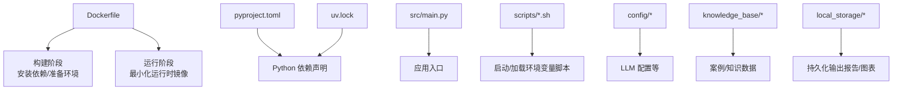
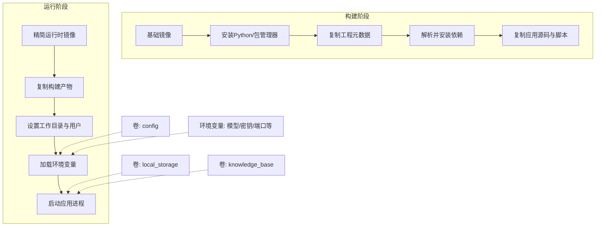
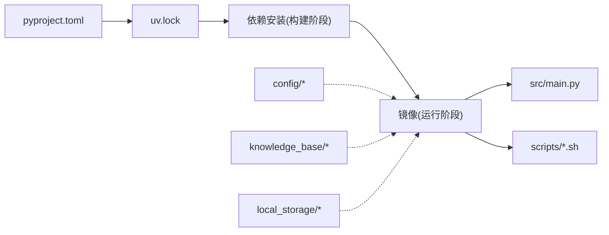

# Docker容器化部署

<cite>
**本文引用的文件**   
- [Dockerfile](file://Dockerfile)
- [pyproject.toml](file://pyproject.toml)
- [uv.lock](file://uv.lock)
- [src/main.py](file://src/main.py)
- [scripts/http_run.sh](file://scripts/http_run.sh)
- [scripts/local_run.sh](file://scripts/local_run.sh)
- [scripts/load_env.sh](file://scripts/load_env.sh)
- [config/agent_llm_config.json](file://config/agent_llm_config.json)
- [knowledge_base/cases_ch9.txt](file://knowledge_base/cases_ch9.txt)
- [local_storage/reports](file://local_storage/reports)
- [local_storage/charts](file://local_storage/charts)
</cite>

## 目录
1. [简介](#简介)
2. [项目结构](#项目结构)
3. [核心组件](#核心组件)
4. [架构总览](#架构总览)
5. [详细组件分析](#详细组件分析)
6. [依赖关系分析](#依赖关系分析)
7. [性能考虑](#性能考虑)
8. [故障排查指南](#故障排查指南)
9. [结论](#结论)
10. [附录](#附录)

## 简介
本指南面向“智能审计风险识别系统”的容器化部署，提供从镜像构建、运行参数与环境变量、编排与持久化、资源限制与健康检查、日志与监控、安全加固到版本管理与更新策略的完整说明。文档以仓库现有配置为基础，给出可操作的步骤与最佳实践，帮助读者在本地或生产环境中稳定运行该系统。

## 项目结构
仓库采用分层组织：应用源码位于 src，脚本位于 scripts，配置与知识库位于 config 与 knowledge_base，静态输出目录 local_storage 用于报告与图表等产物。根目录包含 Dockerfile 与 Python 工程元数据 pyproject.toml、uv.lock。

图示来源
- [Dockerfile](file://Dockerfile)
- [pyproject.toml](file://pyproject.toml)
- [uv.lock](file://uv.lock)
- [src/main.py](file://src/main.py)
- [scripts/http_run.sh](file://scripts/http_run.sh)
- [scripts/local_run.sh](file://scripts/local_run.sh)
- [scripts/load_env.sh](file://scripts/load_env.sh)
- [config/agent_llm_config.json](file://config/agent_llm_config.json)
- [knowledge_base/cases_ch9.txt](file://knowledge_base/cases_ch9.txt)
- [local_storage/reports](file://local_storage/reports)
- [local_storage/charts](file://local_storage/charts)

章节来源
- [Dockerfile](file://Dockerfile)
- [pyproject.toml](file://pyproject.toml)
- [uv.lock](file://uv.lock)
- [src/main.py](file://src/main.py)
- [scripts/http_run.sh](file://scripts/http_run.sh)
- [scripts/local_run.sh](file://scripts/local_run.sh)
- [scripts/load_env.sh](file://scripts/load_env.sh)
- [config/agent_llM_config.json](file://config/agent_llm_config.json)
- [knowledge_base/cases_ch9.txt](file://knowledge_base/cases_ch9.txt)
- [local_storage/reports](file://local_storage/reports)
- [local_storage/charts](file://local_storage/charts)

## 核心组件
- 镜像构建器：基于多阶段构建，分离依赖安装与运行环境，减小最终镜像体积并提升安全性。
- 应用入口：通过 Python 主程序启动服务，支持 HTTP 模式与本地运行模式。
- 配置与数据：外部化 LLM 配置、知识库与本地存储路径，便于挂载与替换。
- 启动脚本：封装环境变量加载与服务启动逻辑，统一容器内执行行为。

章节来源
- [Dockerfile](file://Dockerfile)
- [src/main.py](file://src/main.py)
- [scripts/http_run.sh](file://scripts/http_run.sh)
- [scripts/local_run.sh](file://scripts/local_run.sh)
- [scripts/load_env.sh](file://scripts/load_env.sh)
- [config/agent_llm_config.json](file://config/agent_llm_config.json)

## 架构总览
下图展示容器化后的关键组件与交互：镜像构建阶段负责依赖与工具链准备；运行阶段仅包含最小运行时与业务代码；通过卷挂载实现数据持久化；通过环境变量注入外部配置；可选地暴露端口对外提供服务。

图示来源
- [Dockerfile](file://Dockerfile)
- [scripts/load_env.sh](file://scripts/load_env.sh)
- [src/main.py](file://src/main.py)
- [config/agent_llm_config.json](file://config/agent_llm_config.json)
- [knowledge_base/cases_ch9.txt](file://knowledge_base/cases_ch9.txt)
- [local_storage/reports](file://local_storage/reports)
- [local_storage/charts](file://local_storage/charts)

## 详细组件分析

### 镜像构建与多阶段优化
- 构建阶段职责
  - 选择合适的基础镜像，安装 Python 及包管理工具。
  - 复制 pyproject.toml 与 uv.lock，优先缓存依赖层，加速重复构建。
  - 安装依赖后复制应用源码与脚本，完成构建产物。
- 运行阶段职责
  - 使用更小的运行时镜像，仅复制必要文件。
  - 创建非 root 用户，降低权限风险。
  - 设置工作目录、默认命令与入口点。
- 优化建议
  - 利用依赖层缓存，将依赖安装与应用代码复制分层。
  - 清理构建缓存与临时文件，减少镜像体积。
  - 使用 .dockerignore 排除无关文件（如测试、文档、IDE 配置）。

章节来源
- [Dockerfile](file://Dockerfile)
- [pyproject.toml](file://pyproject.toml)
- [uv.lock](file://uv.lock)

### 应用入口与运行模式
- 主程序入口
  - 应用通过 src/main.py 启动，支持不同运行模式（例如 HTTP 服务或本地批处理）。
- 启动脚本
  - http_run.sh：用于以 HTTP 模式启动服务，适合容器化对外暴露。
  - local_run.sh：用于本地运行模式，适合调试或离线任务。
  - load_env.sh：集中加载环境变量，确保容器内外一致。
- 推荐做法
  - 容器默认以 HTTP 模式运行，并通过环境变量控制端口与行为。
  - 通过 CMD/ENTRYPOINT 指定启动脚本，避免手动输入参数。

章节来源
- [src/main.py](file://src/main.py)
- [scripts/http_run.sh](file://scripts/http_run.sh)
- [scripts/local_run.sh](file://scripts/local_run.sh)
- [scripts/load_env.sh](file://scripts/load_env.sh)

### 配置与环境变量
- 配置文件
  - config/agent_llm_config.json：存放大模型相关配置（如端点、鉴权、参数等），建议通过卷挂载或环境变量覆盖。
- 环境变量
  - 常见变量包括：服务端口、模型端点、鉴权令牌、日志级别、知识库路径、输出目录等。
  - 建议在 load_env.sh 中统一读取与校验，缺失时给出明确错误提示。
- 最佳实践
  - 敏感信息通过环境变量注入，不写入镜像。
  - 为必填变量提供默认值与校验逻辑，避免运行时崩溃。

章节来源
- [config/agent_llm_config.json](file://config/agent_llm_config.json)
- [scripts/load_env.sh](file://scripts/load_env.sh)

### 数据持久化与共享
- 本地存储
  - local_storage/reports：审计报告输出目录。
  - local_storage/charts：可视化图表输出目录。
- 知识库
  - knowledge_base：存放案例与知识文本，可通过卷挂载到容器内固定路径。
- 持久化方案
  - 使用 Docker 卷或绑定挂载将上述目录映射到宿主机，确保重启不丢失数据。
  - 若需要跨容器共享，可将 reports/charts 作为共享卷暴露给其他服务（如报表导出、归档）。

章节来源
- [local_storage/reports](file://local_storage/reports)
- [local_storage/charts](file://local_storage/charts)
- [knowledge_base/cases_ch9.txt](file://knowledge_base/cases_ch9.txt)

### 健康检查与就绪探针
- 健康检查思路
  - 针对 HTTP 模式：对 /health 或 /ready 端点进行探测，返回成功状态码即视为健康。
  - 针对本地模式：可检测关键文件或进程存活状态。
- 实现建议
  - 在主程序中增加轻量健康接口，快速返回依赖可用性（如数据库、对象存储、外部 API）。
  - 在 Dockerfile 中定义 HEALTHCHECK，或在编排文件中配置探针。

章节来源
- [src/main.py](file://src/main.py)
- [scripts/http_run.sh](file://scripts/http_run.sh)

### 日志收集与监控
- 日志输出
  - 建议将日志输出至标准输出（stdout/stderr），由容器运行时统一采集。
  - 如需落盘，可将日志目录挂载到宿主机或外部存储。
- 监控指标
  - 暴露 Prometheus 指标端点（可选），或使用语言内置指标库上报。
  - 结合容器运行时指标（CPU/内存/网络）进行告警。
- 集成建议
  - 使用侧车容器或平台级日志聚合（如 Loki/ELK）收集与分析。
  - 使用分布式追踪（如 OpenTelemetry）串联请求链路。

章节来源
- [scripts/http_run.sh](file://scripts/http_run.sh)
- [src/main.py](file://src/main.py)

### 安全加固最佳实践
- 运行用户
  - 使用非 root 用户运行应用，最小化权限。
- 镜像安全
  - 定期扫描镜像漏洞，及时升级基础镜像与依赖。
  - 仅复制必要文件，移除构建期工具与调试信息。
- 配置安全
  - 敏感信息通过环境变量或密钥管理服务注入，避免硬编码。
  - 启用 HTTPS 与访问控制，限制对外暴露端口。
- 运行时安全
  - 只读根文件系统（必要时通过卷挂载写目录）。
  - 限制资源上限，防止资源耗尽。

章节来源
- [Dockerfile](file://Dockerfile)
- [scripts/load_env.sh](file://scripts/load_env.sh)

### 版本管理与更新策略
- 镜像标签
  - 使用语义化版本（如 v1.2.3）与 Git 提交哈希组合，保证可追溯。
- 构建流水线
  - 在 CI/CD 中自动构建镜像并推送至镜像仓库，生成制品清单。
- 灰度与回滚
  - 通过滚动更新与蓝绿发布策略逐步放量，失败时快速回滚。
- 依赖更新
  - 定期更新 uv.lock 与基础镜像，评估兼容性后再发布。

章节来源
- [uv.lock](file://uv.lock)
- [pyproject.toml](file://pyproject.toml)
- [Dockerfile](file://Dockerfile)

## 依赖关系分析
- 构建期依赖
  - Python 解释器与包管理器（由基础镜像提供）。
  - 项目依赖声明（pyproject.toml）与锁定文件（uv.lock）。
- 运行期依赖
  - 应用源码与脚本。
  - 外部配置与知识库数据（通过卷或环境变量注入）。
- 外部集成
  - 大模型服务（通过配置与网络访问）。
  - 对象存储（S3 兼容）与数据库（根据业务扩展）。

图示来源
- [pyproject.toml](file://pyproject.toml)
- [uv.lock](file://uv.lock)
- [Dockerfile](file://Dockerfile)
- [src/main.py](file://src/main.py)
- [scripts/http_run.sh](file://scripts/http_run.sh)
- [scripts/local_run.sh](file://scripts/local_run.sh)
- [scripts/load_env.sh](file://scripts/load_env.sh)
- [config/agent_llm_config.json](file://config/agent_llm_config.json)
- [knowledge_base/cases_ch9.txt](file://knowledge_base/cases_ch9.txt)
- [local_storage/reports](file://local_storage/reports)
- [local_storage/charts](file://local_storage/charts)

章节来源
- [pyproject.toml](file://pyproject.toml)
- [uv.lock](file://uv.lock)
- [Dockerfile](file://Dockerfile)
- [src/main.py](file://src/main.py)
- [scripts/http_run.sh](file://scripts/http_run.sh)
- [scripts/local_run.sh](file://scripts/local_run.sh)
- [scripts/load_env.sh](file://scripts/load_env.sh)
- [config/agent_llm_config.json](file://config/agent_llm_config.json)
- [knowledge_base/cases_ch9.txt](file://knowledge_base/cases_ch9.txt)
- [local_storage/reports](file://local_storage/reports)
- [local_storage/charts](file://local_storage/charts)

## 性能考虑
- 镜像体积
  - 多阶段构建与依赖层缓存显著减少镜像大小与构建时间。
- 启动速度
  - 预装依赖、懒加载模块、按需初始化外部连接。
- 资源限制
  - 为容器设置 CPU/内存上限，避免争用与抖动。
- 并发与水平扩展
  - 无状态服务设计，便于横向扩容；有状态数据通过外部存储解耦。

[本节为通用指导，无需特定文件引用]

## 故障排查指南
- 启动失败
  - 检查环境变量是否齐全且格式正确。
  - 查看容器日志定位异常堆栈。
- 端口冲突
  - 确认宿主端口未被占用，调整映射端口。
- 权限问题
  - 确认非 root 用户对输出目录具有写权限。
- 外部依赖不可达
  - 验证网络连通性与凭据配置。
- 健康检查失败
  - 检查健康端点实现与依赖可用性。

章节来源
- [scripts/load_env.sh](file://scripts/load_env.sh)
- [scripts/http_run.sh](file://scripts/http_run.sh)
- [src/main.py](file://src/main.py)

## 结论
通过多阶段构建、外部化配置与数据持久化、健康检查与安全加固，本系统可在容器环境中稳定运行并易于扩展。配合完善的日志与监控体系以及严格的版本管理策略，可实现高可用与可观测的生产部署。

[本节为总结性内容，无需特定文件引用]

## 附录

### 常用命令参考
- 构建镜像
  - 使用 Dockerfile 构建镜像，指定标签与上下文。
- 运行容器
  - 映射端口、挂载卷、注入环境变量，并以 HTTP 模式启动。
- 查看日志
  - 实时查看容器日志，过滤关键字段。
- 健康检查
  - 调用健康端点或查询容器状态。

[本节为操作指引，无需特定文件引用]