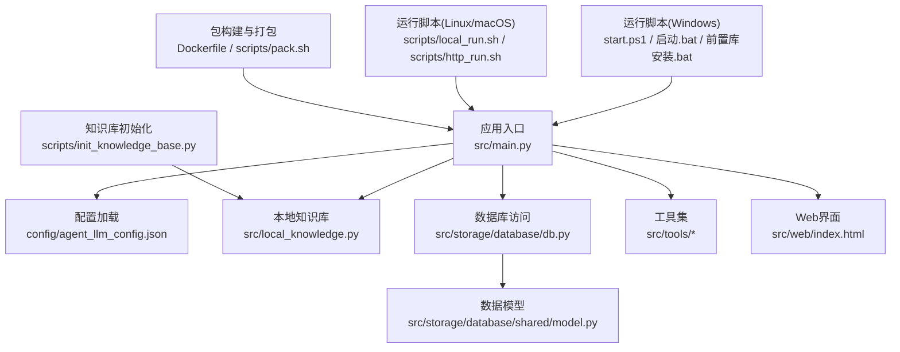
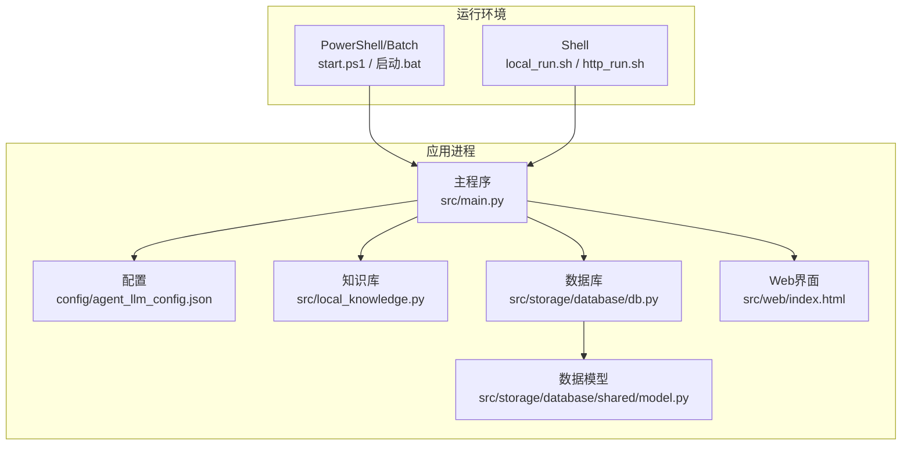
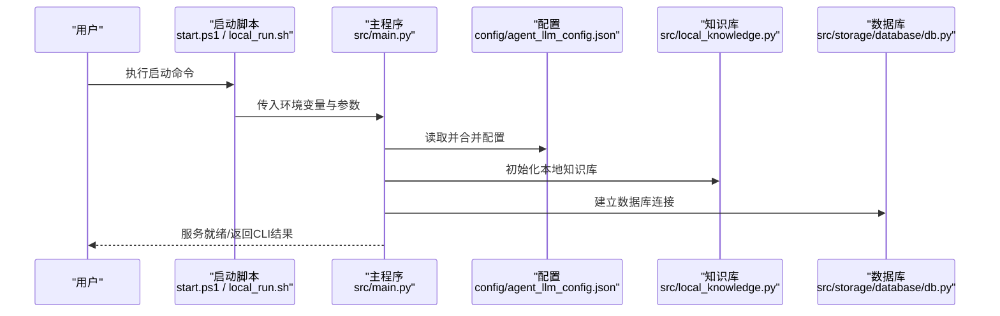
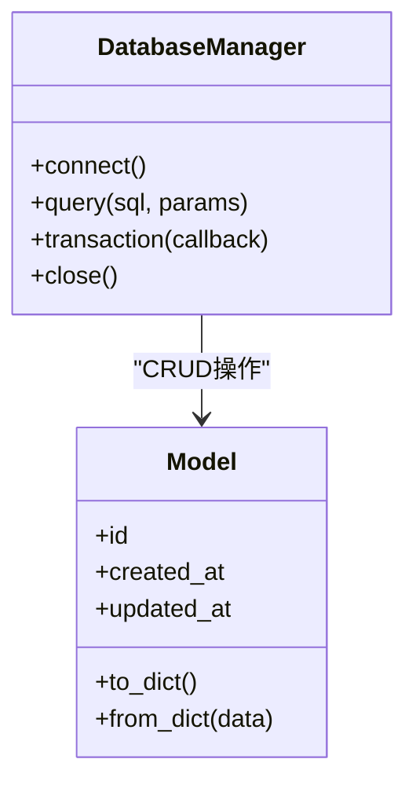
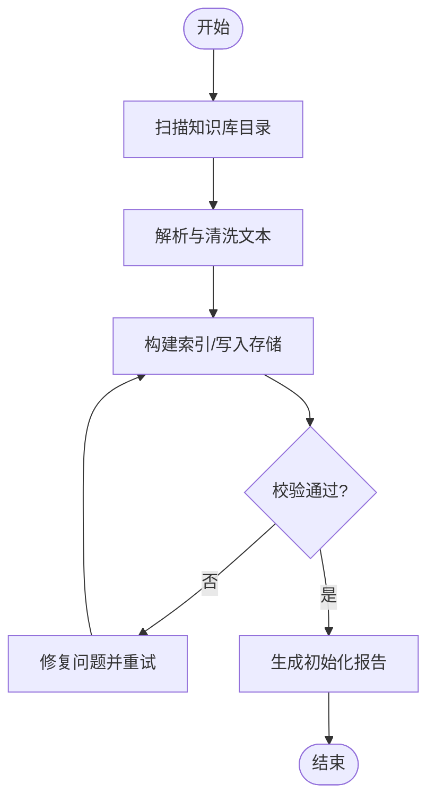
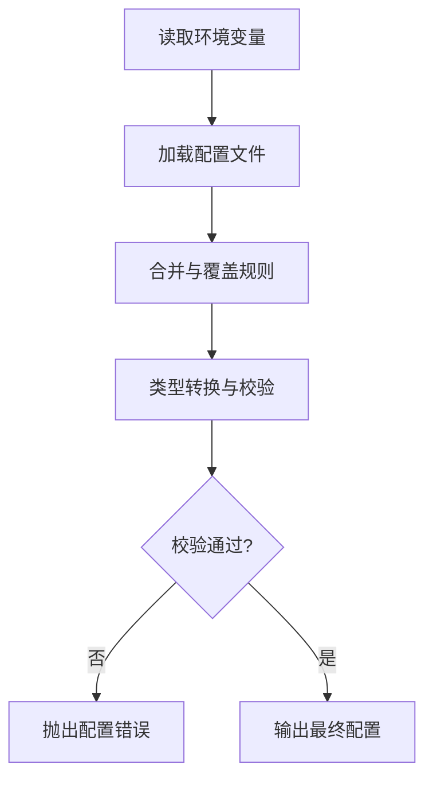
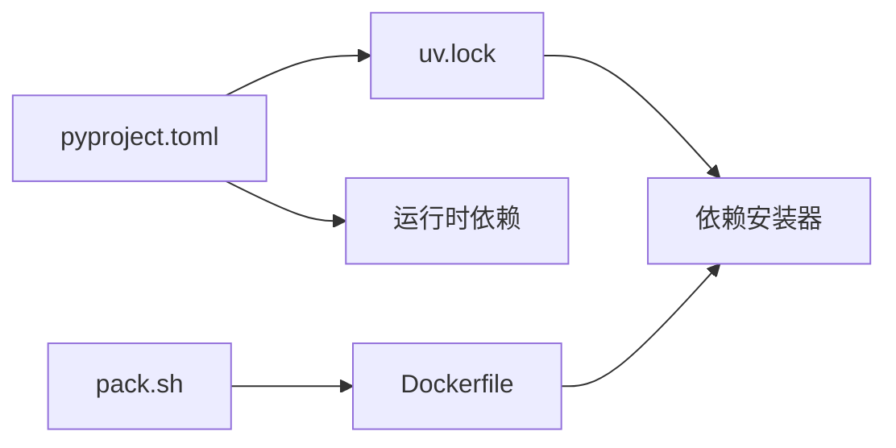

# 本地部署

<cite>
**本文引用的文件**   
- [pyproject.toml](file://pyproject.toml)
- [uv.lock](file://uv.lock)
- [Dockerfile](file://Dockerfile)
- [start.ps1](file://start.ps1)
- [前置库安装.bat](file://前置库安装.bat)
- [启动.bat](file://启动.bat)
- [scripts/setup.sh](file://scripts/setup.sh)
- [scripts/local_run.sh](file://scripts/local_run.sh)
- [scripts/http_run.sh](file://scripts/http_run.sh)
- [scripts/pack.sh](file://scripts/pack.sh)
- [scripts/init_knowledge_base.py](file://scripts/init_knowledge_base.py)
- [scripts/load_env.py](file://scripts/load_env.py)
- [scripts/load_env.sh](file://scripts/load_env.sh)
- [src/main.py](file://src/main.py)
- [src/local_knowledge.py](file://src/local_knowledge.py)
- [src/storage/database/db.py](file://src/storage/database/db.py)
- [src/storage/database/shared/model.py](file://src/storage/database/shared/model.py)
- [config/agent_llm_config.json](file://config/agent_llm_config.json)
- [knowledge_base/cases_ch9.txt](file://knowledge_base/cases_ch9.txt)
- [knowledge_base/cases_ch10.txt](file://knowledge_base/cases_ch10.txt)
- [knowledge_base/cases_ch11.txt](file://knowledge_base/cases_ch11.txt)
</cite>

## 目录
1. [简介](#简介)
2. [项目结构](#项目结构)
3. [核心组件](#核心组件)
4. [架构总览](#架构总览)
5. [详细组件分析](#详细组件分析)
6. [依赖分析](#依赖分析)
7. [性能考虑](#性能考虑)
8. [故障排查指南](#故障排查指南)
9. [结论](#结论)
10. [附录](#附录)

## 简介
本指南面向希望在本地快速部署“智能审计风险识别系统”的工程师与分析师，覆盖Windows与Linux/macOS环境下的安装、环境变量配置、数据库初始化、知识库准备、开发环境搭建（IDE、调试、热重载）、脚本使用以及常见问题排查。文档以仓库现有脚本与源码为依据，提供可操作的步骤与最佳实践建议。

## 项目结构
仓库采用分层组织：应用入口位于 src/main.py；存储层包含数据库、内存与对象存储；工具层提供计算、可视化、导出等能力；配置集中于 config；知识库数据位于 knowledge_base；跨平台启动脚本位于根目录与 scripts；构建与打包脚本包括 Dockerfile 与 pack.sh。

图表来源
- [src/main.py](file://src/main.py)
- [config/agent_llm_config.json](file://config/agent_llm_config.json)
- [src/local_knowledge.py](file://src/local_knowledge.py)
- [src/storage/database/db.py](file://src/storage/database/db.py)
- [src/storage/database/shared/model.py](file://src/storage/database/shared/model.py)
- [src/web/index.html](file://src/web/index.html)
- [start.ps1](file://start.ps1)
- [启动.bat](file://启动.bat)
- [前置库安装.bat](file://前置库安装.bat)
- [scripts/local_run.sh](file://scripts/local_run.sh)
- [scripts/http_run.sh](file://scripts/http_run.sh)
- [scripts/init_knowledge_base.py](file://scripts/init_knowledge_base.py)
- [Dockerfile](file://Dockerfile)
- [scripts/pack.sh](file://scripts/pack.sh)

章节来源
- [pyproject.toml](file://pyproject.toml)
- [uv.lock](file://uv.lock)
- [Dockerfile](file://Dockerfile)
- [start.ps1](file://start.ps1)
- [前置库安装.bat](file://前置库安装.bat)
- [启动.bat](file://启动.bat)
- [scripts/setup.sh](file://scripts/setup.sh)
- [scripts/local_run.sh](file://scripts/local_run.sh)
- [scripts/http_run.sh](file://scripts/http_run.sh)
- [scripts/pack.sh](file://scripts/pack.sh)
- [scripts/init_knowledge_base.py](file://scripts/init_knowledge_base.py)
- [scripts/load_env.py](file://scripts/load_env.py)
- [scripts/load_env.sh](file://scripts/load_env.sh)
- [src/main.py](file://src/main.py)
- [src/local_knowledge.py](file://src/local_knowledge.py)
- [src/storage/database/db.py](file://src/storage/database/db.py)
- [src/storage/database/shared/model.py](file://src/storage/database/shared/model.py)
- [config/agent_llm_config.json](file://config/agent_llm_config.json)
- [knowledge_base/cases_ch9.txt](file://knowledge_base/cases_ch9.txt)
- [knowledge_base/cases_ch10.txt](file://knowledge_base/cases_ch10.txt)
- [knowledge_base/cases_ch11.txt](file://knowledge_base/cases_ch11.txt)

## 核心组件
- 应用入口与生命周期管理：负责加载配置、初始化服务、注册路由与任务调度、优雅关闭。
- 配置中心：集中管理LLM代理参数、存储路径、日志级别等。
- 本地知识库：读取并索引知识文本，为检索与推理提供上下文。
- 存储层：
  - 数据库：持久化业务数据，提供连接池与事务支持。
  - 内存：会话与中间结果缓存。
  - 对象存储：报告与图表归档。
- 工具集：财务计算、风险评估、多年度对比、PDF导出、可视化等。
- Web界面：前端页面与服务端API交互。

章节来源
- [src/main.py](file://src/main.py)
- [config/agent_llm_config.json](file://config/agent_llm_config.json)
- [src/local_knowledge.py](file://src/local_knowledge.py)
- [src/storage/database/db.py](file://src/storage/database/db.py)
- [src/storage/database/shared/model.py](file://src/storage/database/shared/model.py)
- [src/web/index.html](file://src/web/index.html)

## 架构总览
下图展示本地部署时的主要组件交互：脚本负责环境与依赖准备，应用入口加载配置与知识库，通过存储层读写数据，并通过Web或CLI对外提供服务。

图表来源
- [start.ps1](file://start.ps1)
- [启动.bat](file://启动.bat)
- [scripts/local_run.sh](file://scripts/local_run.sh)
- [scripts/http_run.sh](file://scripts/http_run.sh)
- [src/main.py](file://src/main.py)
- [config/agent_llm_config.json](file://config/agent_llm_config.json)
- [src/local_knowledge.py](file://src/local_knowledge.py)
- [src/storage/database/db.py](file://src/storage/database/db.py)
- [src/storage/database/shared/model.py](file://src/storage/database/shared/model.py)
- [src/web/index.html](file://src/web/index.html)

## 详细组件分析

### 组件A：应用入口与启动流程
- 职责：解析命令行参数、加载配置、初始化日志、启动HTTP服务或CLI模式、注册路由与后台任务、处理信号量实现优雅退出。
- 关键流程：
  - 启动前检查：Python版本、必要环境变量、依赖是否就绪。
  - 配置加载：从配置文件与环境变量合并，优先级明确。
  - 资源初始化：数据库连接、知识库索引、缓存预热。
  - 服务暴露：监听端口、健康检查、指标上报。
  - 关闭流程：保存状态、释放连接、清理临时文件。

图表来源
- [start.ps1](file://start.ps1)
- [scripts/local_run.sh](file://scripts/local_run.sh)
- [src/main.py](file://src/main.py)
- [config/agent_llm_config.json](file://config/agent_llm_config.json)
- [src/local_knowledge.py](file://src/local_knowledge.py)
- [src/storage/database/db.py](file://src/storage/database/db.py)

章节来源
- [src/main.py](file://src/main.py)
- [config/agent_llm_config.json](file://config/agent_llm_config.json)
- [src/local_knowledge.py](file://src/local_knowledge.py)
- [src/storage/database/db.py](file://src/storage/database/db.py)

### 组件B：数据库与数据模型
- 职责：封装数据库连接、迁移、查询与事务；定义表结构与字段约束。
- 关键点：
  - 连接池与重试策略，避免瞬时失败导致崩溃。
  - 模型变更需配合迁移脚本，保证向后兼容。
  - 敏感信息（如密码）通过环境变量注入，不硬编码。

图表来源
- [src/storage/database/db.py](file://src/storage/database/db.py)
- [src/storage/database/shared/model.py](file://src/storage/database/shared/model.py)

章节来源
- [src/storage/database/db.py](file://src/storage/database/db.py)
- [src/storage/database/shared/model.py](file://src/storage/database/shared/model.py)

### 组件C：本地知识库初始化与数据准备
- 职责：将 knowledge_base 下的案例文本导入索引，供检索增强生成使用。
- 流程要点：
  - 扫描指定目录，按章节或标签分片。
  - 清洗与标准化文本，去除噪声。
  - 写入向量索引或关系型表，建立元数据映射。
  - 校验完整性与一致性，输出统计报告。

图表来源
- [scripts/init_knowledge_base.py](file://scripts/init_knowledge_base.py)
- [knowledge_base/cases_ch9.txt](file://knowledge_base/cases_ch9.txt)
- [knowledge_base/cases_ch10.txt](file://knowledge_base/cases_ch10.txt)
- [knowledge_base/cases_ch11.txt](file://knowledge_base/cases_ch11.txt)
- [src/local_knowledge.py](file://src/local_knowledge.py)

章节来源
- [scripts/init_knowledge_base.py](file://scripts/init_knowledge_base.py)
- [src/local_knowledge.py](file://src/local_knowledge.py)
- [knowledge_base/cases_ch9.txt](file://knowledge_base/cases_ch9.txt)
- [knowledge_base/cases_ch10.txt](file://knowledge_base/cases_ch10.txt)
- [knowledge_base/cases_ch11.txt](file://knowledge_base/cases_ch11.txt)

### 组件D：环境变量与配置加载
- 职责：统一加载与校验环境变量，提供默认值与类型转换。
- 关键点：
  - 优先级：显式参数 > 环境变量 > 配置文件 > 默认值。
  - 安全：对敏感字段进行脱敏与最小权限原则。
  - 可观测性：记录加载过程与异常，便于排障。

图表来源
- [scripts/load_env.py](file://scripts/load_env.py)
- [scripts/load_env.sh](file://scripts/load_env.sh)
- [config/agent_llm_config.json](file://config/agent_llm_config.json)

章节来源
- [scripts/load_env.py](file://scripts/load_env.py)
- [scripts/load_env.sh](file://scripts/load_env.sh)
- [config/agent_llm_config.json](file://config/agent_llm_config.json)

## 依赖分析
- Python依赖与版本锁定：
  - pyproject.toml 声明运行时依赖与可选依赖。
  - uv.lock 提供确定性构建与快速安装。
- 容器化：
  - Dockerfile 定义镜像构建步骤，固化依赖与系统包。
- 打包与分发：
  - scripts/pack.sh 用于构建发布包。

图表来源
- [pyproject.toml](file://pyproject.toml)
- [uv.lock](file://uv.lock)
- [Dockerfile](file://Dockerfile)
- [scripts/pack.sh](file://scripts/pack.sh)

章节来源
- [pyproject.toml](file://pyproject.toml)
- [uv.lock](file://uv.lock)
- [Dockerfile](file://Dockerfile)
- [scripts/pack.sh](file://scripts/pack.sh)

## 性能考虑
- 数据库连接池：合理设置最大连接数与空闲超时，避免连接风暴。
- 知识库索引：增量更新与分片索引，减少全量重建开销。
- 缓存策略：热点查询结果短期缓存，降低重复计算。
- 并发控制：限制并发请求与任务队列长度，防止过载。
- 日志与指标：采样与分级日志，避免I/O瓶颈。

[本节为通用指导，无需特定文件引用]

## 故障排查指南
- 依赖安装失败
  - 现象：pip/uv 安装报错或版本冲突。
  - 排查：确认Python版本与系统架构；查看 uv.lock 与 pyproject.toml 的兼容性；尝试在虚拟环境中安装。
  - 参考：[pyproject.toml](file://pyproject.toml), [uv.lock](file://uv.lock)
- 环境变量未生效
  - 现象：服务启动报缺少配置项。
  - 排查：检查 load_env 脚本执行顺序；确认 .env 或系统环境变量已正确导出；验证配置文件路径。
  - 参考：[scripts/load_env.py](file://scripts/load_env.py), [scripts/load_env.sh](file://scripts/load_env.sh), [config/agent_llm_config.json](file://config/agent_llm_config.json)
- 数据库连接失败
  - 现象：无法建立连接或认证失败。
  - 排查：核对连接字符串、用户名与密码；检查防火墙与端口；确认数据库服务状态。
  - 参考：[src/storage/database/db.py](file://src/storage/database/db.py)
- 知识库索引为空或损坏
  - 现象：检索不到任何结果或初始化报错。
  - 排查：检查 knowledge_base 目录权限与文件编码；重新运行初始化脚本；查看初始化报告。
  - 参考：[scripts/init_knowledge_base.py](file://scripts/init_knowledge_base.py), [knowledge_base/*.txt](file://knowledge_base/cases_ch9.txt)
- 启动脚本无响应
  - 现象：Windows PowerShell 或 Linux Shell 脚本执行后无输出。
  - 排查：确认脚本执行权限；检查日志输出位置；手动运行主程序定位错误。
  - 参考：[start.ps1](file://start.ps1), [启动.bat](file://启动.bat), [scripts/local_run.sh](file://scripts/local_run.sh)

章节来源
- [pyproject.toml](file://pyproject.toml)
- [uv.lock](file://uv.lock)
- [scripts/load_env.py](file://scripts/load_env.py)
- [scripts/load_env.sh](file://scripts/load_env.sh)
- [config/agent_llm_config.json](file://config/agent_llm_config.json)
- [src/storage/database/db.py](file://src/storage/database/db.py)
- [scripts/init_knowledge_base.py](file://scripts/init_knowledge_base.py)
- [knowledge_base/cases_ch9.txt](file://knowledge_base/cases_ch9.txt)
- [start.ps1](file://start.ps1)
- [启动.bat](file://启动.bat)
- [scripts/local_run.sh](file://scripts/local_run.sh)

## 结论
通过本指南，您可以在Windows与Linux/macOS环境下完成系统的本地部署，涵盖依赖安装、环境变量配置、数据库初始化、知识库准备、开发环境搭建与常见问题的排查。建议在生产前先在隔离环境充分验证，并结合监控与日志完善运维能力。

[本节为总结性内容，无需特定文件引用]

## 附录

### Windows 环境部署
- 前置条件
  - 安装Python（建议使用与 pyproject.toml 指定的版本）。
  - 安装uv或pip作为依赖管理器。
  - 确保PowerShell执行策略允许运行脚本。
- 安装依赖
  - 使用批处理脚本一键安装依赖。
  - 参考：[前置库安装.bat](file://前置库安装.bat)
- 启动服务
  - 使用PowerShell或批处理脚本启动。
  - 参考：[start.ps1](file://start.ps1), [启动.bat](file://启动.bat)
- 环境变量
  - 可在系统或用户环境变量中设置，或通过load_env脚本加载。
  - 参考：[scripts/load_env.py](file://scripts/load_env.py)

章节来源
- [前置库安装.bat](file://前置库安装.bat)
- [start.ps1](file://start.ps1)
- [启动.bat](file://启动.bat)
- [scripts/load_env.py](file://scripts/load_env.py)

### Linux/macOS 环境部署
- 前置条件
  - 安装Python与uv（或pip）。
  - 授予脚本执行权限。
- 安装依赖
  - 使用setup脚本初始化环境。
  - 参考：[scripts/setup.sh](file://scripts/setup.sh)
- 启动服务
  - 本地模式：[scripts/local_run.sh](file://scripts/local_run.sh)
  - HTTP模式：[scripts/http_run.sh](file://scripts/http_run.sh)
- 环境变量
  - 使用Shell版load_env脚本加载。
  - 参考：[scripts/load_env.sh](file://scripts/load_env.sh)

章节来源
- [scripts/setup.sh](file://scripts/setup.sh)
- [scripts/local_run.sh](file://scripts/local_run.sh)
- [scripts/http_run.sh](file://scripts/http_run.sh)
- [scripts/load_env.sh](file://scripts/load_env.sh)

### 开发环境搭建
- IDE配置
  - 选择与 pyproject.toml 一致的Python解释器。
  - 启用自动依赖解析与linting。
- 调试设置
  - 配置断点与日志级别，便于追踪调用链。
  - 使用环境变量切换调试模式。
- 热重载
  - 在开发模式下启用文件监听与自动重启。
  - 注意：生产环境禁用热重载以保证稳定性。

[本节为通用指导，无需特定文件引用]

### 知识库初始化与数据准备
- 准备数据
  - 将案例文本放入 knowledge_base 目录，保持命名规范与编码一致。
  - 参考：[knowledge_base/cases_ch9.txt](file://knowledge_base/cases_ch9.txt), [knowledge_base/cases_ch10.txt](file://knowledge_base/cases_ch10.txt), [knowledge_base/cases_ch11.txt](file://knowledge_base/cases_ch11.txt)
- 执行初始化
  - 运行初始化脚本，生成索引与统计报告。
  - 参考：[scripts/init_knowledge_base.py](file://scripts/init_knowledge_base.py)
- 验证结果
  - 检查索引大小与条目数量，确认检索可用。

章节来源
- [scripts/init_knowledge_base.py](file://scripts/init_knowledge_base.py)
- [knowledge_base/cases_ch9.txt](file://knowledge_base/cases_ch9.txt)
- [knowledge_base/cases_ch10.txt](file://knowledge_base/cases_ch10.txt)
- [knowledge_base/cases_ch11.txt](file://knowledge_base/cases_ch11.txt)

### 常用脚本说明
- 环境准备
  - setup.sh：创建虚拟环境、安装依赖、初始化基础目录。
  - 参考：[scripts/setup.sh](file://scripts/setup.sh)
- 运行服务
  - local_run.sh：本地CLI模式运行。
  - http_run.sh：HTTP服务模式运行。
  - 参考：[scripts/local_run.sh](file://scripts/local_run.sh), [scripts/http_run.sh](file://scripts/http_run.sh)
- 打包发布
  - pack.sh：构建发布包与镜像。
  - 参考：[scripts/pack.sh](file://scripts/pack.sh)
- 配置加载
  - load_env.py / load_env.sh：统一加载环境变量与配置。
  - 参考：[scripts/load_env.py](file://scripts/load_env.py), [scripts/load_env.sh](file://scripts/load_env.sh)

章节来源
- [scripts/setup.sh](file://scripts/setup.sh)
- [scripts/local_run.sh](file://scripts/local_run.sh)
- [scripts/http_run.sh](file://scripts/http_run.sh)
- [scripts/pack.sh](file://scripts/pack.sh)
- [scripts/load_env.py](file://scripts/load_env.py)
- [scripts/load_env.sh](file://scripts/load_env.sh)

### 容器化部署（可选）
- 构建镜像
  - 基于 Dockerfile 构建本地镜像。
  - 参考：[Dockerfile](file://Dockerfile)
- 运行容器
  - 挂载配置与数据目录，注入环境变量。
  - 暴露端口并设置健康检查。

章节来源
- [Dockerfile](file://Dockerfile)