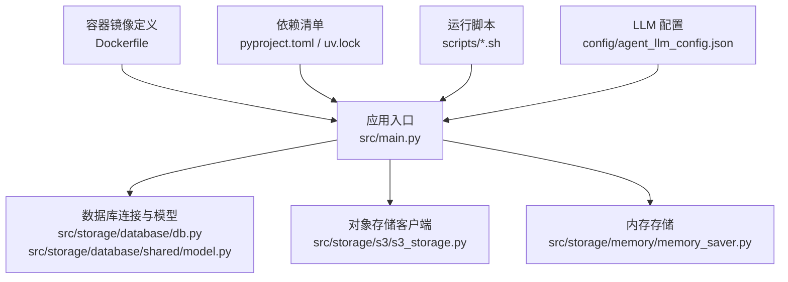
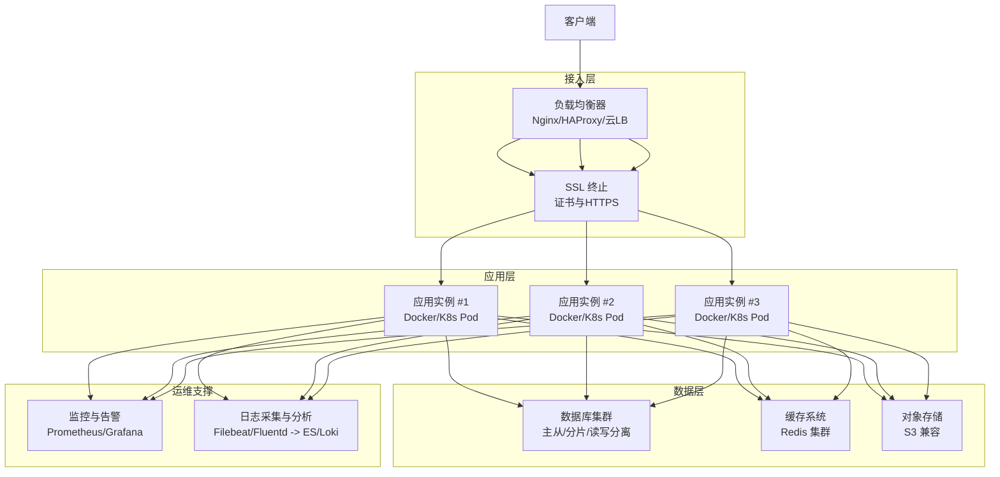
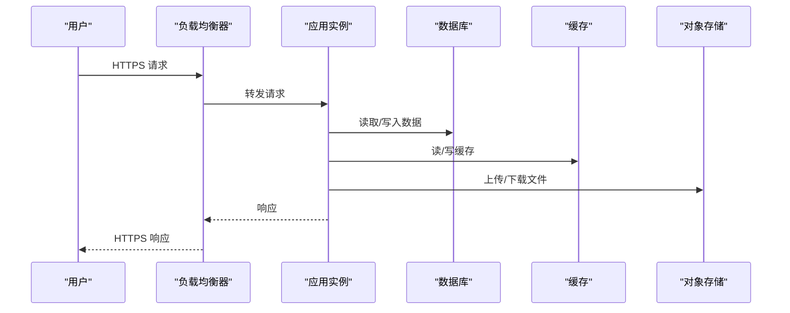
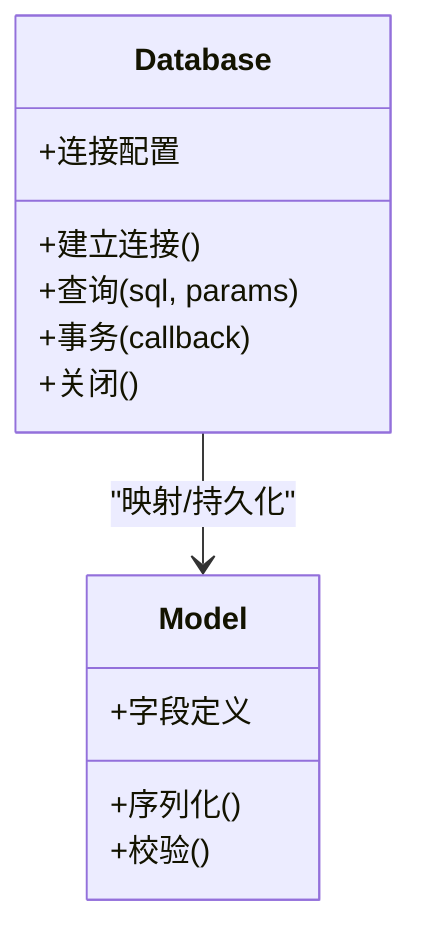
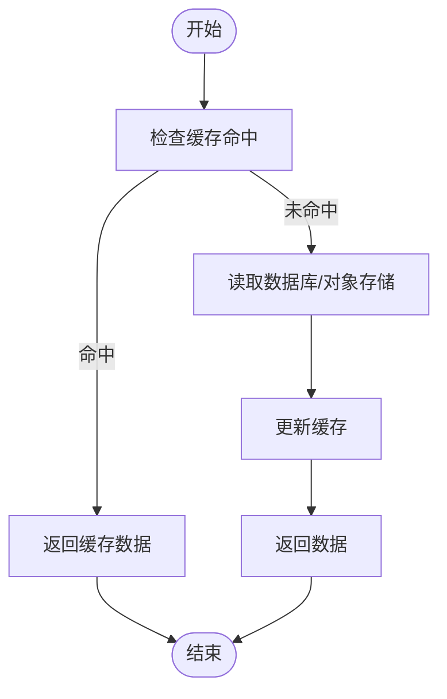
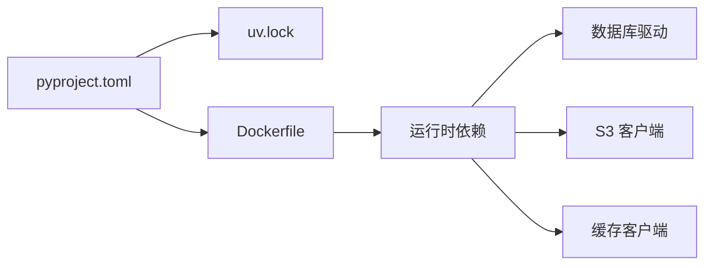

# 生产环境部署

<cite>
**本文引用的文件**   
- [Dockerfile](file://Dockerfile)
- [pyproject.toml](file://pyproject.toml)
- [uv.lock](file://uv.lock)
- [src/main.py](file://src/main.py)
- [src/storage/database/db.py](file://src/storage/database/db.py)
- [src/storage/database/shared/model.py](file://src/storage/database/shared/model.py)
- [src/storage/s3/s3_storage.py](file://src/storage/s3/s3_storage.py)
- [src/storage/memory/memory_saver.py](file://src/storage/memory/memory_saver.py)
- [scripts/http_run.sh](file://scripts/http_run.sh)
- [scripts/local_run.sh](file://scripts/local_run.sh)
- [scripts/setup.sh](file://scripts/setup.sh)
- [config/agent_llm_config.json](file://config/agent_llm_config.json)
</cite>

## 目录
1. [简介](#简介)
2. [项目结构](#项目结构)
3. [核心组件](#核心组件)
4. [架构总览](#架构总览)
5. [详细组件分析](#详细组件分析)
6. [依赖分析](#依赖分析)
7. [性能考虑](#性能考虑)
8. [故障排查指南](#故障排查指南)
9. [结论](#结论)
10. [附录](#附录)

## 简介
本指南面向“智能审计风险识别系统”的生产环境部署，覆盖硬件与软件要求、负载均衡与高可用、数据库与缓存、HTTPS 与证书、监控告警、日志收集与分析、性能调优、备份与灾难恢复、安全加固与访问控制等关键主题。文档基于仓库中的实际代码与脚本进行说明，确保可落地执行。

## 项目结构
仓库采用分层组织：应用入口、存储层（数据库、对象存储、内存）、工具与业务逻辑、配置与脚本、容器化构建文件等。关键路径如下：
- 应用入口与启动：src/main.py
- 数据持久化：src/storage/database/db.py、src/storage/database/shared/model.py
- 对象存储：src/storage/s3/s3_storage.py
- 内存存储：src/storage/memory/memory_saver.py
- 运行脚本：scripts/http_run.sh、scripts/local_run.sh、scripts/setup.sh
- 容器镜像：Dockerfile
- 依赖声明：pyproject.toml、uv.lock
- 运行时配置：config/agent_llm_config.json

图表来源
- [src/main.py](file://src/main.py)
- [src/storage/database/db.py](file://src/storage/database/db.py)
- [src/storage/database/shared/model.py](file://src/storage/database/shared/model.py)
- [src/storage/s3/s3_storage.py](file://src/storage/s3/s3_storage.py)
- [src/storage/memory/memory_saver.py](file://src/storage/memory/memory_saver.py)
- [Dockerfile](file://Dockerfile)
- [pyproject.toml](file://pyproject.toml)
- [uv.lock](file://uv.lock)
- [scripts/http_run.sh](file://scripts/http_run.sh)
- [scripts/local_run.sh](file://scripts/local_run.sh)
- [scripts/setup.sh](file://scripts/setup.sh)
- [config/agent_llm_config.json](file://config/agent_llm_config.json)

章节来源
- [Dockerfile](file://Dockerfile)
- [pyproject.toml](file://pyproject.toml)
- [uv.lock](file://uv.lock)
- [src/main.py](file://src/main.py)
- [src/storage/database/db.py](file://src/storage/database/db.py)
- [src/storage/database/shared/model.py](file://src/storage/database/shared/model.py)
- [src/storage/s3/s3_storage.py](file://src/storage/s3/s3_storage.py)
- [src/storage/memory/memory_saver.py](file://src/storage/memory/memory_saver.py)
- [scripts/http_run.sh](file://scripts/http_run.sh)
- [scripts/local_run.sh](file://scripts/local_run.sh)
- [scripts/setup.sh](file://scripts/setup.sh)
- [config/agent_llm_config.json](file://config/agent_llm_config.json)

## 核心组件
- 应用入口与进程管理
  - 通过脚本 http_run.sh 或 local_run.sh 启动服务进程；setup.sh 用于初始化环境与依赖。
  - Dockerfile 定义了容器镜像的构建流程，便于在 Kubernetes 或编排平台中部署。
- 数据存储
  - 关系型数据库：db.py 负责连接与基础操作，model.py 定义共享数据模型。
  - 对象存储：s3_storage.py 提供 S3 兼容的对象存取能力，适合报告、附件、归档等。
  - 内存存储：memory_saver.py 提供轻量级会话/中间结果缓存，适用于无状态节点内的短期缓存。
- 外部配置
  - agent_llm_config.json 存放大模型相关配置项，支持按环境注入不同参数。

章节来源
- [scripts/http_run.sh](file://scripts/http_run.sh)
- [scripts/local_run.sh](file://scripts/local_run.sh)
- [scripts/setup.sh](file://scripts/setup.sh)
- [Dockerfile](file://Dockerfile)
- [src/storage/database/db.py](file://src/storage/database/db.py)
- [src/storage/database/shared/model.py](file://src/storage/database/shared/model.py)
- [src/storage/s3/s3_storage.py](file://src/storage/s3/s3_storage.py)
- [src/storage/memory/memory_saver.py](file://src/storage/memory/memory_saver.py)
- [config/agent_llm_config.json](file://config/agent_llm_config.json)

## 架构总览
生产环境推荐采用“前端网关 + 多实例应用 + 数据库集群 + 对象存储 + 缓存 + 监控日志”的分层架构。

图表来源
- [Dockerfile](file://Dockerfile)
- [src/main.py](file://src/main.py)
- [src/storage/database/db.py](file://src/storage/database/db.py)
- [src/storage/s3/s3_storage.py](file://src/storage/s3/s3_storage.py)
- [src/storage/memory/memory_saver.py](file://src/storage/memory/memory_saver.py)

## 详细组件分析

### 应用进程与启动流程
- 启动方式
  - 使用 http_run.sh 启动 HTTP 服务进程；local_run.sh 用于本地调试；setup.sh 完成环境准备与依赖安装。
- 容器化
  - Dockerfile 定义基础镜像、依赖安装、工作目录与启动命令，便于在多节点环境中快速复制与扩缩容。
- 进程模型
  - 建议以多进程或多线程模式运行，结合反向代理实现水平扩展；每个实例无状态化，会话与中间结果落盘或进入缓存。

图表来源
- [scripts/http_run.sh](file://scripts/http_run.sh)
- [scripts/local_run.sh](file://scripts/local_run.sh)
- [Dockerfile](file://Dockerfile)
- [src/storage/database/db.py](file://src/storage/database/db.py)
- [src/storage/s3/s3_storage.py](file://src/storage/s3/s3_storage.py)
- [src/storage/memory/memory_saver.py](file://src/storage/memory/memory_saver.py)

章节来源
- [scripts/http_run.sh](file://scripts/http_run.sh)
- [scripts/local_run.sh](file://scripts/local_run.sh)
- [scripts/setup.sh](file://scripts/setup.sh)
- [Dockerfile](file://Dockerfile)

### 数据库与数据模型
- 连接与模型
  - db.py 负责数据库连接与基础操作；shared/model.py 定义共享数据模型，供上层业务复用。
- 集群与高可用
  - 建议采用主从复制与读写分离，必要时引入分库分表；连接池参数需根据并发与延迟目标调优。
- 事务与一致性
  - 对审计关键路径启用事务，保证强一致；非关键路径可使用最终一致策略提升吞吐。

图表来源
- [src/storage/database/db.py](file://src/storage/database/db.py)
- [src/storage/database/shared/model.py](file://src/storage/database/shared/model.py)

章节来源
- [src/storage/database/db.py](file://src/storage/database/db.py)
- [src/storage/database/shared/model.py](file://src/storage/database/shared/model.py)

### 对象存储与缓存
- 对象存储（S3）
  - s3_storage.py 封装上传、下载、列表与删除等操作；适合存放审计报告、附件与历史归档。
- 缓存（内存）
  - memory_saver.py 提供进程内缓存，适合短生命周期数据；跨实例共享建议使用 Redis 集群。
- 一致性策略
  - 热点数据优先走缓存，回源到对象存储或数据库；设置合理的过期时间与失效策略。

图表来源
- [src/storage/s3/s3_storage.py](file://src/storage/s3/s3_storage.py)
- [src/storage/memory/memory_saver.py](file://src/storage/memory/memory_saver.py)

章节来源
- [src/storage/s3/s3_storage.py](file://src/storage/s3/s3_storage.py)
- [src/storage/memory/memory_saver.py](file://src/storage/memory/memory_saver.py)

### 配置与环境变量
- LLM 配置
  - config/agent_llm_config.json 集中管理大模型相关参数，建议在容器中通过环境变量或配置中心注入。
- 运行时配置
  - 数据库连接串、对象存储凭据、缓存地址等应通过环境变量或密钥管理服务注入，避免硬编码。

章节来源
- [config/agent_llm_config.json](file://config/agent_llm_config.json)

## 依赖分析
- 语言与包管理
  - pyproject.toml 声明项目依赖与版本约束；uv.lock 锁定具体版本，确保构建可重复。
- 容器构建
  - Dockerfile 基于基础镜像安装依赖并打包应用，建议启用多阶段构建以减少镜像体积。
- 外部依赖
  - 数据库驱动、S3 SDK、缓存客户端等均在依赖清单中体现，升级时需同步验证兼容性。

图表来源
- [pyproject.toml](file://pyproject.toml)
- [uv.lock](file://uv.lock)
- [Dockerfile](file://Dockerfile)

章节来源
- [pyproject.toml](file://pyproject.toml)
- [uv.lock](file://uv.lock)
- [Dockerfile](file://Dockerfile)

## 性能考虑
- 应用层
  - 水平扩展：增加应用实例数量，配合负载均衡器分发流量。
  - 连接池：为数据库与缓存配置合适的连接池大小，避免过多上下文切换。
  - 异步处理：将耗时任务（如报告生成）放入队列异步执行，缩短请求时延。
- 数据层
  - 数据库：开启读写分离与索引优化；对高频查询建立覆盖索引。
  - 缓存：合理设置 TTL 与容量上限，避免缓存穿透与雪崩。
- I/O 与网络
  - 对象存储：启用压缩与分块传输；就近区域部署以降低延迟。
  - 网络：启用 TCP 快速打开与拥塞控制优化；限制单实例最大并发。

[本节为通用指导，不直接分析具体文件]

## 故障排查指南
- 启动失败
  - 检查 http_run.sh 与 setup.sh 的执行权限与依赖是否完整；确认 Dockerfile 构建产物是否存在。
- 数据库连接异常
  - 核对 db.py 的连接参数与网络可达性；查看慢查询与锁等待。
- 对象存储错误
  - 校验 s3_storage.py 的凭据与桶权限；检查网络出口与代理配置。
- 缓存不可用
  - 确认 memory_saver.py 的内存占用与溢出策略；若迁移至 Redis，检查集群连通性与认证。
- 日志与指标
  - 统一输出结构化日志；暴露健康检查端点与关键指标，便于监控与自愈。

章节来源
- [scripts/http_run.sh](file://scripts/http_run.sh)
- [scripts/setup.sh](file://scripts/setup.sh)
- [Dockerfile](file://Dockerfile)
- [src/storage/database/db.py](file://src/storage/database/db.py)
- [src/storage/s3/s3_storage.py](file://src/storage/s3/s3_storage.py)
- [src/storage/memory/memory_saver.py](file://src/storage/memory/memory_saver.py)

## 结论
通过容器化与多实例部署、数据库集群与缓存体系、HTTPS 与安全加固、监控日志与自动化运维，本系统可在生产环境稳定运行并具备高可用与可扩展能力。建议持续完善指标与告警、定期演练备份与恢复，并遵循最小权限原则进行访问控制。

[本节为总结性内容，不直接分析具体文件]

## 附录

### 生产环境硬件与软件要求
- 硬件建议
  - CPU：每实例 4–8 核（视并发与计算负载调整）
  - 内存：每实例 8–16 GB（含缓存与堆内存）
  - 磁盘：SSD，至少 100 GB（应用与日志），对象存储独立
  - 网络：低延迟、高带宽，支持多可用区
- 软件依赖
  - 操作系统：主流 Linux 发行版（内核较新）
  - 运行时：Python 对应版本（见 pyproject.toml）
  - 容器：Docker 或 Kubernetes
  - 数据库：MySQL/PostgreSQL（依据 db.py 驱动选择）
  - 缓存：Redis（可选，替代内存缓存）
  - 对象存储：S3 兼容服务
  - 反向代理：Nginx/HAProxy/云负载均衡

章节来源
- [pyproject.toml](file://pyproject.toml)
- [Dockerfile](file://Dockerfile)
- [src/storage/database/db.py](file://src/storage/database/db.py)
- [src/storage/s3/s3_storage.py](file://src/storage/s3/s3_storage.py)
- [src/storage/memory/memory_saver.py](file://src/storage/memory/memory_saver.py)

### 负载均衡与高可用配置
- 负载均衡
  - 使用 Nginx/HAProxy 或云 LB 做七层转发，配置健康检查与权重。
- 高可用
  - 应用多副本部署，无状态化；数据库主从/多活；缓存集群化。
- 自动扩缩容
  - 基于 CPU/内存/自定义指标触发扩缩容；滚动更新保障零停机。

[本节为通用指导，不直接分析具体文件]

### 数据库集群与缓存部署方案
- 数据库
  - 主从复制、只读副本、连接池与超时参数调优；定期全量与增量备份。
- 缓存
  - 进程内缓存用于热数据加速；跨实例共享使用 Redis 集群，配置持久化与哨兵/集群模式。

章节来源
- [src/storage/database/db.py](file://src/storage/database/db.py)
- [src/storage/memory/memory_saver.py](file://src/storage/memory/memory_saver.py)

### SSL 证书与 HTTPS 访问
- 证书获取与管理
  - 使用 Let’s Encrypt 或企业 CA 签发证书；通过配置中心或密钥管理服务注入。
- 反向代理终止
  - 在 Nginx/云 LB 上配置证书与 TLS 协议版本、加密套件与 HSTS。
- 应用内监听
  - 应用仅监听内网端口，由前置代理处理 HTTPS。

[本节为通用指导，不直接分析具体文件]

### 监控告警系统集成
- 指标采集
  - 暴露应用指标（QPS、延迟、错误率、资源使用）；数据库与缓存提供内置指标。
- 可视化与告警
  - Prometheus + Grafana 展示；阈值告警推送至邮件/IM/工单系统。
- 健康检查
  - 提供 /health 与 /ready 端点，供负载均衡与健康检查使用。

[本节为通用指导，不直接分析具体文件]

### 日志收集与分析平台
- 日志格式
  - 统一 JSON 结构化日志，包含请求 ID、时间戳、级别、模块与关键参数。
- 采集与聚合
  - Filebeat/Fluentd 采集容器标准输出与文件日志，汇聚至 Elasticsearch 或 Loki。
- 检索与告警
  - 基于关键字与指标规则创建告警；保留策略与冷热分层降低成本。

[本节为通用指导，不直接分析具体文件]

### 性能调优与资源优化参数
- 应用
  - 进程数与线程数：根据 CPU 核数与 IO 特性调整；限制单实例最大并发。
  - 连接池：数据库与缓存连接池大小与空闲回收策略。
  - 超时与重试：合理设置读写超时与幂等重试。
- 数据层
  - 数据库：缓冲池、索引、查询计划优化；慢查询日志与定期统计。
  - 缓存：命中率监控、淘汰策略与容量规划。
- I/O
  - 对象存储：分块上传、压缩与 CDN 加速；本地磁盘预留空间与 IOPS 保障。

[本节为通用指导，不直接分析具体文件]

### 灾难恢复与备份策略
- 备份范围
  - 数据库全量与增量；对象存储快照与版本控制；配置文件与密钥安全存储。
- 恢复演练
  - 定期演练恢复流程，验证 RTO/RPO 目标；记录恢复步骤与回滚方案。
- 多可用区
  - 跨 AZ 部署应用与数据副本；故障自动切换与数据一致性校验。

[本节为通用指导，不直接分析具体文件]

### 安全加固与访问控制
- 最小权限
  - 数据库、对象存储与缓存均启用鉴权与白名单；仅开放必要端口。
- 网络安全
  - 使用 VPC 与子网隔离；入站/出站 ACL 与防火墙策略。
- 密钥管理
  - 使用 KMS 或 Vault 管理敏感信息；容器镜像扫描与漏洞修复。
- 审计与合规
  - 开启访问日志与操作审计；定期安全评估与渗透测试。

[本节为通用指导，不直接分析具体文件]