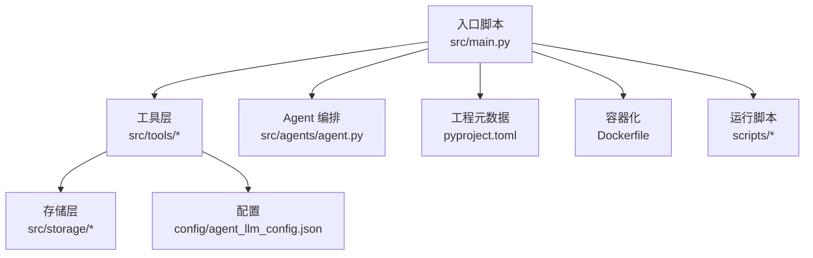
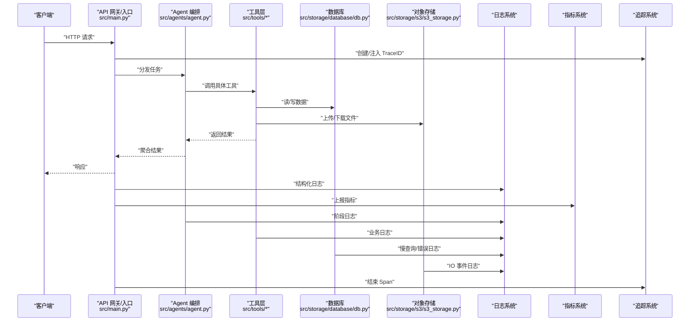
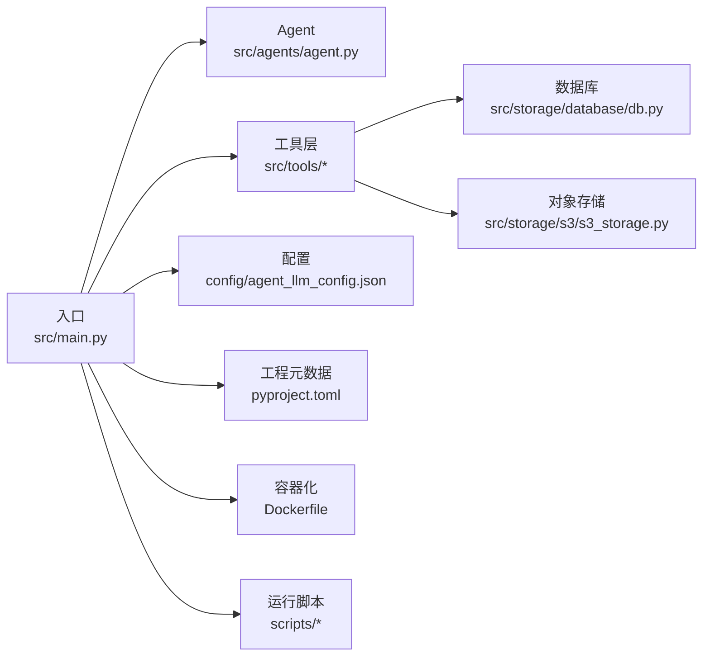

# 监控与日志

<cite>
**本文引用的文件**   
- [src/main.py](file://src/main.py)
- [config/agent_llm_config.json](file://config/agent_llm_config.json)
- [pyproject.toml](file://pyproject.toml)
- [Dockerfile](file://Dockerfile)
- [scripts/http_run.sh](file://scripts/http_run.sh)
- [scripts/local_run.sh](file://scripts/local_run.sh)
- [scripts/load_env.sh](file://scripts/load_env.sh)
- [src/storage/database/db.py](file://src/storage/database/db.py)
- [src/storage/s3/s3_storage.py](file://src/storage/s3/s3_storage.py)
- [src/tools/batch_processor.py](file://src/tools/batch_processor.py)
- [src/tools/risk_scorer.py](file://src/tools/risk_scorer.py)
- [src/tools/knowledge_search.py](file://src/tools/knowledge_search.py)
- [src/tools/financial_calculator.py](file://src/tools/financial_calculator.py)
- [src/tools/pdf_export.py](file://src/tools/pdf_export.py)
- [src/tools/multi_year_comparison.py](file://src/tools/multi_year_comparison.py)
- [src/tools/visualizer.py](file://src/tools/visualizer.py)
- [src/agents/agent.py](file://src/agents/agent.py)
- [src/utils/file/file.py](file://src/utils/file/file.py)
- [src/utils/filename.py](file://src/utils/filename.py)
</cite>

## 目录
1. [简介](#简介)
2. [项目结构](#项目结构)
3. [核心组件](#核心组件)
4. [架构总览](#架构总览)
5. [详细组件分析](#详细组件分析)
6. [依赖分析](#依赖分析)
7. [性能考虑](#性能考虑)
8. [故障排查指南](#故障排查指南)
9. [结论](#结论)
10. [附录](#附录)

## 简介
本指南面向智能审计风险识别系统的运维与研发人员，提供一套完整的监控与日志管理方案。内容覆盖应用性能监控（APM）配置、关键指标采集与分析、结构化日志规范、错误追踪与异常上报、健康检查与状态监控、日志轮转与存储策略、告警规则与通知机制、分布式追踪与链路跟踪集成，以及监控仪表板搭建与可视化展示。目标是帮助团队快速落地可观测性体系，提升系统稳定性与问题定位效率。

## 项目结构
本项目采用分层模块化组织：入口脚本负责服务启动与生命周期；工具层实现业务处理；存储层对接数据库与对象存储；配置集中于 JSON 与工程元数据；脚本用于运行与环境加载。为便于接入监控与日志，建议在各模块中统一使用结构化日志与指标埋点，并通过环境变量注入运行时参数。

图表来源
- [src/main.py](file://src/main.py)
- [config/agent_llm_config.json](file://config/agent_llm_config.json)
- [pyproject.toml](file://pyproject.toml)
- [Dockerfile](file://Dockerfile)
- [scripts/http_run.sh](file://scripts/http_run.sh)
- [scripts/local_run.sh](file://scripts/local_run.sh)
- [scripts/load_env.sh](file://scripts/load_env.sh)

章节来源
- [src/main.py](file://src/main.py)
- [config/agent_llm_config.json](file://config/agent_llm_config.json)
- [pyproject.toml](file://pyproject.toml)
- [Dockerfile](file://Dockerfile)
- [scripts/http_run.sh](file://scripts/http_run.sh)
- [scripts/local_run.sh](file://scripts/local_run.sh)
- [scripts/load_env.sh](file://scripts/load_env.sh)

## 核心组件
本节聚焦与监控和日志密切相关的核心位置与职责，明确埋点与日志落点。

- 入口与服务生命周期
  - 入口脚本负责初始化配置、启动服务、注册中间件与路由、优雅关闭等。建议在进程启动时完成日志器与指标收集器的初始化，并在退出钩子中刷新缓冲与释放资源。
  - 参考路径：[src/main.py](file://src/main.py)

- 工具层（业务处理）
  - 批量处理、评分、知识检索、财务计算、PDF导出、多年对比、可视化等工具类方法应输出结构化日志并记录关键指标（耗时、输入规模、结果摘要）。
  - 参考路径：
    - [src/tools/batch_processor.py](file://src/tools/batch_processor.py)
    - [src/tools/risk_scorer.py](file://src/tools/risk_scorer.py)
    - [src/tools/knowledge_search.py](file://src/tools/knowledge_search.py)
    - [src/tools/financial_calculator.py](file://src/tools/financial_calculator.py)
    - [src/tools/pdf_export.py](file://src/tools/pdf_export.py)
    - [src/tools/multi_year_comparison.py](file://src/tools/multi_year_comparison.py)
    - [src/tools/visualizer.py](file://src/tools/visualizer.py)

- Agent 编排
  - Agent 作为流程编排中心，应在节点切换、任务调度、外部调用处记录链路标识与阶段耗时，便于链路追踪与性能分析。
  - 参考路径：[src/agents/agent.py](file://src/agents/agent.py)

- 存储层
  - 数据库与对象存储的读写操作需记录成功/失败、耗时、重试次数与错误码，便于容量与可用性监控。
  - 参考路径：
    - [src/storage/database/db.py](file://src/storage/database/db.py)
    - [src/storage/s3/s3_storage.py](file://src/storage/s3/s3_storage.py)

- 配置与环境
  - 通过配置文件与环境变量注入日志级别、采样率、指标标签、追踪端点等。
  - 参考路径：
    - [config/agent_llm_config.json](file://config/agent_llm_config.json)
    - [pyproject.toml](file://pyproject.toml)
    - [scripts/load_env.sh](file://scripts/load_env.sh)

章节来源
- [src/main.py](file://src/main.py)
- [src/tools/batch_processor.py](file://src/tools/batch_processor.py)
- [src/tools/risk_scorer.py](file://src/tools/risk_scorer.py)
- [src/tools/knowledge_search.py](file://src/tools/knowledge_search.py)
- [src/tools/financial_calculator.py](file://src/tools/financial_calculator.py)
- [src/tools/pdf_export.py](file://src/tools/pdf_export.py)
- [src/tools/multi_year_comparison.py](file://src/tools/multi_year_comparison.py)
- [src/tools/visualizer.py](file://src/tools/visualizer.py)
- [src/agents/agent.py](file://src/agents/agent.py)
- [src/storage/database/db.py](file://src/storage/database/db.py)
- [src/storage/s3/s3_storage.py](file://src/storage/s3/s3_storage.py)
- [config/agent_llm_config.json](file://config/agent_llm_config.json)
- [pyproject.toml](file://pyproject.toml)
- [scripts/load_env.sh](file://scripts/load_env.sh)

## 架构总览
下图展示了从请求进入、Agent 编排、工具执行到存储访问的全链路，以及监控与日志在各个环节的接入点。

图表来源
- [src/main.py](file://src/main.py)
- [src/agents/agent.py](file://src/agents/agent.py)
- [src/tools/batch_processor.py](file://src/tools/batch_processor.py)
- [src/tools/risk_scorer.py](file://src/tools/risk_scorer.py)
- [src/tools/knowledge_search.py](file://src/tools/knowledge_search.py)
- [src/tools/financial_calculator.py](file://src/tools/financial_calculator.py)
- [src/tools/pdf_export.py](file://src/tools/pdf_export.py)
- [src/tools/multi_year_comparison.py](file://src/tools/multi_year_comparison.py)
- [src/tools/visualizer.py](file://src/tools/visualizer.py)
- [src/storage/database/db.py](file://src/storage/database/db.py)
- [src/storage/s3/s3_storage.py](file://src/storage/s3/s3_storage.py)

## 详细组件分析

### 应用性能监控（APM）与关键指标
- 指标分类
  - 业务指标：请求量、成功率、P95/P99 延迟、批处理吞吐、评分分布、知识库命中率、导出成功率。
  - 系统指标：CPU、内存、GC、磁盘 IO、网络 IO、线程池/协程池利用率。
  - 存储指标：数据库连接数、慢查询数、事务回滚、对象存储请求延迟与错误率。
- 采集方式
  - 语言级自动埋点：对 HTTP 框架、数据库驱动、对象存储 SDK 启用自动指标采集。
  - 自定义埋点：在 Agent 节点切换、工具方法入口/出口、存储读写前后记录耗时与维度标签。
- 关键标签
  - 环境、版本、实例 ID、租户/项目、模型/工具名、数据库表/桶名、错误类型。
- 采样与降采样
  - 高 QPS 场景下对长尾指标进行动态采样，保留错误与慢请求全量。
- 参考埋点位置
  - 入口与中间件：[src/main.py](file://src/main.py)
  - Agent 阶段：[src/agents/agent.py](file://src/agents/agent.py)
  - 工具方法：各 [src/tools/*.py](file://src/tools/)
  - 存储 I/O：[src/storage/database/db.py](file://src/storage/database/db.py)、[src/storage/s3/s3_storage.py](file://src/storage/s3/s3_storage.py)

章节来源
- [src/main.py](file://src/main.py)
- [src/agents/agent.py](file://src/agents/agent.py)
- [src/tools/batch_processor.py](file://src/tools/batch_processor.py)
- [src/tools/risk_scorer.py](file://src/tools/risk_scorer.py)
- [src/tools/knowledge_search.py](file://src/tools/knowledge_search.py)
- [src/tools/financial_calculator.py](file://src/tools/financial_calculator.py)
- [src/tools/pdf_export.py](file://src/tools/pdf_export.py)
- [src/tools/multi_year_comparison.py](file://src/tools/multi_year_comparison.py)
- [src/tools/visualizer.py](file://src/tools/visualizer.py)
- [src/storage/database/db.py](file://src/storage/database/db.py)
- [src/storage/s3/s3_storage.py](file://src/storage/s3/s3_storage.py)

### 结构化日志规范与输出格式
- 字段约定
  - 时间戳、级别、消息、TraceID、SpanID、实例 ID、模块/函数、用户/租户、输入摘要、耗时、状态码、错误码、堆栈片段。
- 输出目标
  - 标准输出（stdout/stderr），由容器或进程管理器统一收集至集中式日志平台。
- 安全与合规
  - 脱敏敏感信息（账号、密钥、PII），避免将完整请求体写入日志。
- 示例字段清单（以键值形式）
  - ts、level、msg、trace_id、span_id、instance、module、tenant、input_hash、duration_ms、status、error_code、stack_trace
- 参考落点
  - 入口与中间件：[src/main.py](file://src/main.py)
  - 工具与存储：各 [src/tools/*.py](file://src/tools/)、[src/storage/database/db.py](file://src/storage/database/db.py)、[src/storage/s3/s3_storage.py](file://src/storage/s3/s3_storage.py)

章节来源
- [src/main.py](file://src/main.py)
- [src/tools/batch_processor.py](file://src/tools/batch_processor.py)
- [src/tools/risk_scorer.py](file://src/tools/risk_scorer.py)
- [src/tools/knowledge_search.py](file://src/tools/knowledge_search.py)
- [src/tools/financial_calculator.py](file://src/tools/financial_calculator.py)
- [src/tools/pdf_export.py](file://src/tools/pdf_export.py)
- [src/tools/multi_year_comparison.py](file://src/tools/multi_year_comparison.py)
- [src/tools/visualizer.py](file://src/tools/visualizer.py)
- [src/storage/database/db.py](file://src/storage/database/db.py)
- [src/storage/s3/s3_storage.py](file://src/storage/s3/s3_storage.py)

### 错误追踪与异常上报
- 全局异常捕获
  - 在入口层统一捕获未处理异常，记录结构化错误日志并上报错误追踪平台。
- 上下文传播
  - 确保 TraceID/SpanID 跨线程/协程传递，以便关联错误与链路。
- 错误分级
  - 按影响面与可恢复性划分等级，决定是否触发告警与重试。
- 参考位置
  - 入口与中间件：[src/main.py](file://src/main.py)
  - 工具与存储：各 [src/tools/*.py](file://src/tools/)、[src/storage/database/db.py](file://src/storage/database/db.py)、[src/storage/s3/s3_storage.py](file://src/storage/s3/s3_storage.py)

章节来源
- [src/main.py](file://src/main.py)
- [src/tools/batch_processor.py](file://src/tools/batch_processor.py)
- [src/tools/risk_scorer.py](file://src/tools/risk_scorer.py)
- [src/tools/knowledge_search.py](file://src/tools/knowledge_search.py)
- [src/tools/financial_calculator.py](file://src/tools/financial_calculator.py)
- [src/tools/pdf_export.py](file://src/tools/pdf_export.py)
- [src/tools/multi_year_comparison.py](file://src/tools/multi_year_comparison.py)
- [src/tools/visualizer.py](file://src/tools/visualizer.py)
- [src/storage/database/db.py](file://src/storage/database/db.py)
- [src/storage/s3/s3_storage.py](file://src/storage/s3/s3_storage.py)

### 健康检查与状态监控
- 健康检查端点
  - /healthz：进程存活；/readyz：依赖就绪（数据库、对象存储、外部服务）。
- 探针语义
  - Liveness：进程崩溃重启；Readiness：流量摘除；Startup：冷启动完成。
- 依赖探测
  - 数据库连通性与最小查询；对象存储桶可达性；外部 API 心跳。
- 参考位置
  - 入口与中间件：[src/main.py](file://src/main.py)

章节来源
- [src/main.py](file://src/main.py)

### 日志轮转与存储管理
- 本地轮转
  - 基于大小/时间的轮转策略，保留 N 天，压缩归档，清理过期文件。
- 集中式收集
  - 容器环境下采集 stdout/stderr，转发至日志平台；非容器使用日志采集器。
- 存储策略
  - 热数据短期保留，冷数据长期归档；按环境/模块分索引或分桶。
- 参考位置
  - 运行脚本与环境加载：
    - [scripts/http_run.sh](file://scripts/http_run.sh)
    - [scripts/local_run.sh](file://scripts/local_run.sh)
    - [scripts/load_env.sh](file://scripts/load_env.sh)
  - 容器镜像构建：[Dockerfile](file://Dockerfile)

章节来源
- [scripts/http_run.sh](file://scripts/http_run.sh)
- [scripts/local_run.sh](file://scripts/local_run.sh)
- [scripts/load_env.sh](file://scripts/load_env.sh)
- [Dockerfile](file://Dockerfile)

### 告警规则与通知机制
- 指标告警
  - 错误率突增、P99 延迟超阈值、吞吐骤降、存储错误率升高、连接池耗尽。
- 日志告警
  - 特定错误关键字、重复错误模式、慢查询数量、权限拒绝。
- 通知渠道
  - 邮件、IM、短信、电话；按严重级别路由。
- 降噪与抑制
  - 去重窗口、静默期、维护窗口、依赖级联告警抑制。
- 参考位置
  - 入口与中间件：[src/main.py](file://src/main.py)
  - 工具与存储：各 [src/tools/*.py](file://src/tools/)、[src/storage/database/db.py](file://src/storage/database/db.py)、[src/storage/s3/s3_storage.py](file://src/storage/s3/s3_storage.py)

章节来源
- [src/main.py](file://src/main.py)
- [src/tools/batch_processor.py](file://src/tools/batch_processor.py)
- [src/tools/risk_scorer.py](file://src/tools/risk_scorer.py)
- [src/tools/knowledge_search.py](file://src/tools/knowledge_search.py)
- [src/tools/financial_calculator.py](file://src/tools/financial_calculator.py)
- [src/tools/pdf_export.py](file://src/tools/pdf_export.py)
- [src/tools/multi_year_comparison.py](file://src/tools/multi_year_comparison.py)
- [src/tools/visualizer.py](file://src/tools/visualizer.py)
- [src/storage/database/db.py](file://src/storage/database/db.py)
- [src/storage/s3/s3_storage.py](file://src/storage/s3/s3_storage.py)

### 分布式追踪与链路跟踪
- 链路标识
  - 每个请求生成唯一 TraceID，跨服务/组件传播；Span 标记阶段边界。
- 采样策略
  - 默认低采样率，错误与慢请求全采样，支持动态调整。
- 集成点
  - HTTP 入站/出站、Agent 节点、工具方法、数据库与对象存储调用。
- 参考位置
  - 入口与中间件：[src/main.py](file://src/main.py)
  - Agent 编排：[src/agents/agent.py](file://src/agents/agent.py)
  - 工具与存储：各 [src/tools/*.py](file://src/tools/)、[src/storage/database/db.py](file://src/storage/database/db.py)、[src/storage/s3/s3_storage.py](file://src/storage/s3/s3_storage.py)

章节来源
- [src/main.py](file://src/main.py)
- [src/agents/agent.py](file://src/agents/agent.py)
- [src/tools/batch_processor.py](file://src/tools/batch_processor.py)
- [src/tools/risk_scorer.py](file://src/tools/risk_scorer.py)
- [src/tools/knowledge_search.py](file://src/tools/knowledge_search.py)
- [src/tools/financial_calculator.py](file://src/tools/financial_calculator.py)
- [src/tools/pdf_export.py](file://src/tools/pdf_export.py)
- [src/tools/multi_year_comparison.py](file://src/tools/multi_year_comparison.py)
- [src/tools/visualizer.py](file://src/tools/visualizer.py)
- [src/storage/database/db.py](file://src/storage/database/db.py)
- [src/storage/s3/s3_storage.py](file://src/storage/s3/s3_storage.py)

### 监控仪表板与可视化
- 概览面板
  - 请求量、成功率、P95/P99、错误率、活跃实例、资源使用。
- 业务面板
  - 批处理吞吐、评分分布、知识库命中率、导出成功率、多年对比耗时。
- 存储面板
  - 数据库连接、慢查询、对象存储请求延迟与错误率。
- 链路面板
  - 热点链路、TopN 慢接口、错误链路聚合。
- 数据来源
  - 指标系统、日志平台、追踪后端。

## 依赖分析
下图展示与监控和日志相关的关键依赖关系，包括入口、Agent、工具、存储与配置/运行脚本。

图表来源
- [src/main.py](file://src/main.py)
- [src/agents/agent.py](file://src/agents/agent.py)
- [src/tools/batch_processor.py](file://src/tools/batch_processor.py)
- [src/tools/risk_scorer.py](file://src/tools/risk_scorer.py)
- [src/tools/knowledge_search.py](file://src/tools/knowledge_search.py)
- [src/tools/financial_calculator.py](file://src/tools/financial_calculator.py)
- [src/tools/pdf_export.py](file://src/tools/pdf_export.py)
- [src/tools/multi_year_comparison.py](file://src/tools/multi_year_comparison.py)
- [src/tools/visualizer.py](file://src/tools/visualizer.py)
- [src/storage/database/db.py](file://src/storage/database/db.py)
- [src/storage/s3/s3_storage.py](file://src/storage/s3/s3_storage.py)
- [config/agent_llm_config.json](file://config/agent_llm_config.json)
- [pyproject.toml](file://pyproject.toml)
- [Dockerfile](file://Dockerfile)
- [scripts/http_run.sh](file://scripts/http_run.sh)
- [scripts/local_run.sh](file://scripts/local_run.sh)
- [scripts/load_env.sh](file://scripts/load_env.sh)

章节来源
- [src/main.py](file://src/main.py)
- [src/agents/agent.py](file://src/agents/agent.py)
- [src/tools/batch_processor.py](file://src/tools/batch_processor.py)
- [src/tools/risk_scorer.py](file://src/tools/risk_scorer.py)
- [src/tools/knowledge_search.py](file://src/tools/knowledge_search.py)
- [src/tools/financial_calculator.py](file://src/tools/financial_calculator.py)
- [src/tools/pdf_export.py](file://src/tools/pdf_export.py)
- [src/tools/multi_year_comparison.py](file://src/tools/multi_year_comparison.py)
- [src/tools/visualizer.py](file://src/tools/visualizer.py)
- [src/storage/database/db.py](file://src/storage/database/db.py)
- [src/storage/s3/s3_storage.py](file://src/storage/s3/s3_storage.py)
- [config/agent_llm_config.json](file://config/agent_llm_config.json)
- [pyproject.toml](file://pyproject.toml)
- [Dockerfile](file://Dockerfile)
- [scripts/http_run.sh](file://scripts/http_run.sh)
- [scripts/local_run.sh](file://scripts/local_run.sh)
- [scripts/load_env.sh](file://scripts/load_env.sh)

## 性能考虑
- 指标开销控制
  - 合理设置采样率与聚合粒度，避免高频打点导致额外延迟。
- 日志异步化
  - 使用异步队列与批量写入，降低同步 I/O 对主流程的影响。
- 存储优化
  - 数据库连接池调优、对象存储并发度与重试退避策略。
- 缓存与降级
  - 热点数据缓存、依赖不可用时的降级与熔断。
- 容量规划
  - 根据峰值 QPS 与 P99 目标评估 CPU/内存/带宽与存储容量。

## 故障排查指南
- 快速定位
  - 通过 TraceID 串联日志、指标与链路，缩小范围。
- 常见问题
  - 端口占用、依赖不可达、证书/权限错误、磁盘满、OOM。
- 诊断步骤
  - 查看健康检查与依赖探针状态；核对最近变更；复现最小用例；抓取快照与样本请求。
- 参考位置
  - 入口与中间件：[src/main.py](file://src/main.py)
  - 工具与存储：各 [src/tools/*.py](file://src/tools/)、[src/storage/database/db.py](file://src/storage/database/db.py)、[src/storage/s3/s3_storage.py](file://src/storage/s3/s3_storage.py)

章节来源
- [src/main.py](file://src/main.py)
- [src/tools/batch_processor.py](file://src/tools/batch_processor.py)
- [src/tools/risk_scorer.py](file://src/tools/risk_scorer.py)
- [src/tools/knowledge_search.py](file://src/tools/knowledge_search.py)
- [src/tools/financial_calculator.py](file://src/tools/financial_calculator.py)
- [src/tools/pdf_export.py](file://src/tools/pdf_export.py)
- [src/tools/multi_year_comparison.py](file://src/tools/multi_year_comparison.py)
- [src/tools/visualizer.py](file://src/tools/visualizer.py)
- [src/storage/database/db.py](file://src/storage/database/db.py)
- [src/storage/s3/s3_storage.py](file://src/storage/s3/s3_storage.py)

## 结论
通过在入口、Agent、工具与存储层统一接入结构化日志、指标与追踪，配合健康检查、告警与仪表板，可构建端到端的可观测性体系。建议优先落地健康检查与基础指标，再逐步完善链路追踪与高级告警，持续迭代以提升稳定性与排障效率。

## 附录
- 环境变量与配置项建议
  - 日志级别、采样率、指标标签、追踪端点、告警通道等，可通过配置文件与环境变量注入。
  - 参考路径：
    - [config/agent_llm_config.json](file://config/agent_llm_config.json)
    - [pyproject.toml](file://pyproject.toml)
    - [scripts/load_env.sh](file://scripts/load_env.sh)
- 辅助工具
  - 文件与文件名处理工具可用于日志与报告命名规范化。
  - 参考路径：
    - [src/utils/file/file.py](file://src/utils/file/file.py)
    - [src/utils/filename.py](file://src/utils/filename.py)