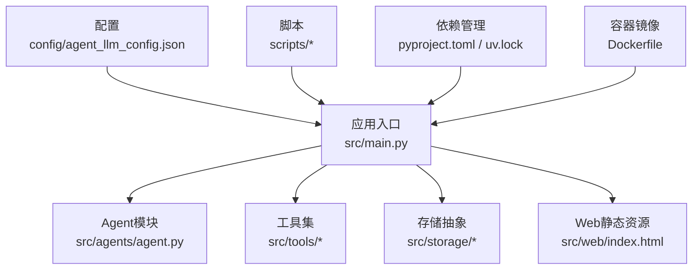
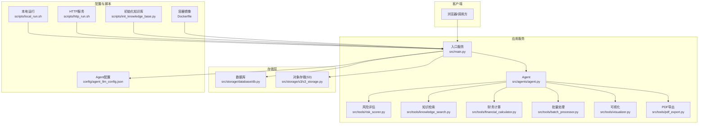
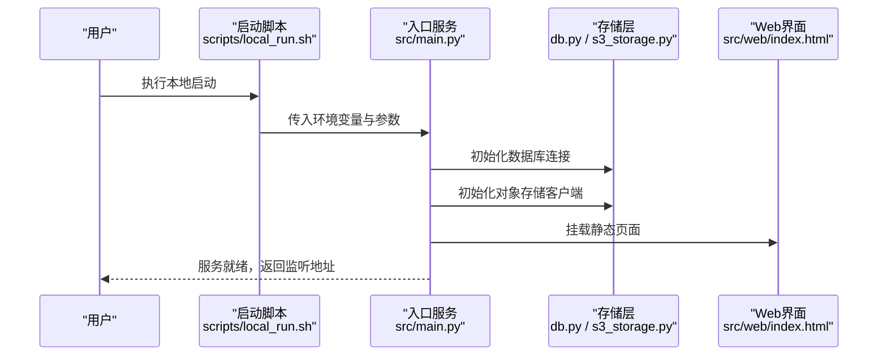
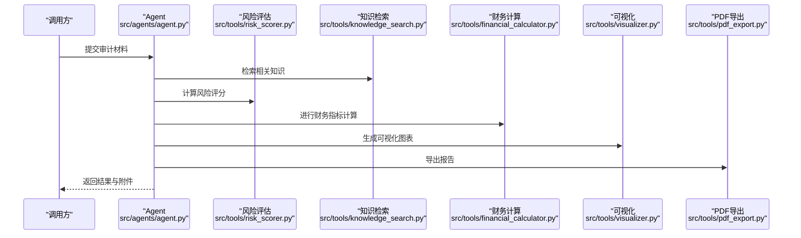
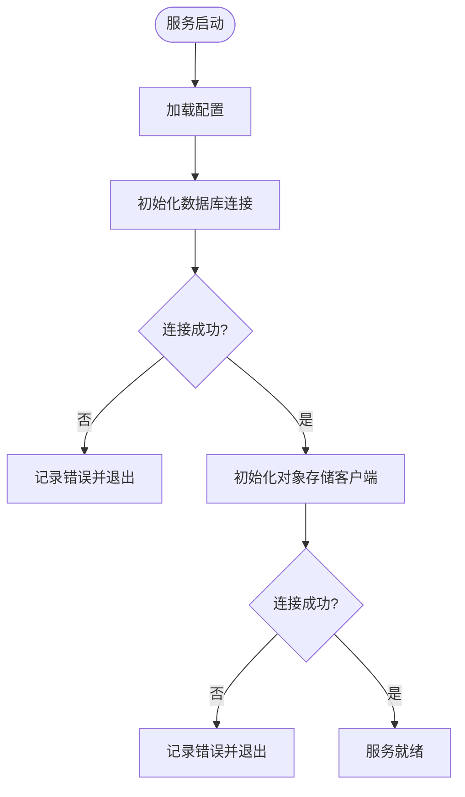
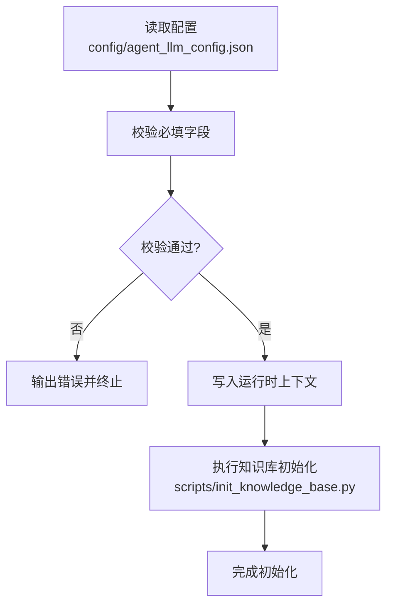
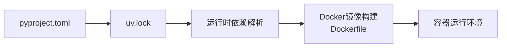

# 部署指南

<cite>
**本文引用的文件**   
- [Dockerfile](file://Dockerfile)
- [pyproject.toml](file://pyproject.toml)
- [uv.lock](file://uv.lock)
- [src/main.py](file://src/main.py)
- [scripts/local_run.sh](file://scripts/local_run.sh)
- [scripts/http_run.sh](file://scripts/http_run.sh)
- [scripts/setup.sh](file://scripts/setup.sh)
- [scripts/init_knowledge_base.py](file://scripts/init_knowledge_base.py)
- [config/agent_llm_config.json](file://config/agent_llm_config.json)
- [src/storage/database/db.py](file://src/storage/database/db.py)
- [src/storage/s3/s3_storage.py](file://src/storage/s3/s3_storage.py)
- [src/tools/risk_scorer.py](file://src/tools/risk_scorer.py)
- [src/tools/knowledge_search.py](file://src/tools/knowledge_search.py)
- [src/tools/pdf_export.py](file://src/tools/pdf_export.py)
- [src/tools/financial_calculator.py](file://src/tools/financial_calculator.py)
- [src/tools/batch_processor.py](file://src/tools/batch_processor.py)
- [src/tools/visualizer.py](file://src/tools/visualizer.py)
- [src/agents/agent.py](file://src/agents/agent.py)
- [src/web/index.html](file://src/web/index.html)
- [start.ps1](file://start.ps1)
- [启动.bat](file://启动.bat)
- [前置库安装.bat](file://前置库安装.bat)
</cite>

## 目录
1. [简介](#简介)
2. [项目结构](#项目结构)
3. [核心组件](#核心组件)
4. [架构总览](#架构总览)
5. [详细组件分析](#详细组件分析)
6. [依赖分析](#依赖分析)
7. [性能考虑](#性能考虑)
8. [故障排查指南](#故障排查指南)
9. [结论](#结论)
10. [附录](#附录)

## 简介
本指南面向运维与开发团队，提供智能审计风险识别系统的完整部署方案，覆盖本地开发、容器化（Docker）以及生产环境部署。文档包含镜像构建与编排、硬件与软件依赖、负载均衡与高可用、灾难恢复、监控与日志、性能调优、安全加固、自动化脚本与CI/CD集成，以及运维排障与维护手册。

## 项目结构
仓库采用分层组织：应用入口、工具与存储抽象、配置与脚本、前端静态页面等。关键目录与职责如下：
- src：应用源码，包括主入口、Agent、工具集、存储抽象、Web静态资源
- scripts：运行与初始化脚本（本地、HTTP服务、知识库初始化、环境准备）
- config：运行时配置（如LLM Agent配置）
- assets：基准数据或示例数据
- local_storage / src/local_storage：本地持久化产物（图表、报告）
- tests：测试与评估脚本
- Dockerfile：容器镜像定义
- pyproject.toml / uv.lock：Python依赖与锁定文件
- Windows快捷脚本：便于Windows本地快速启动

**图示来源**
- [src/main.py](file://src/main.py)
- [src/agents/agent.py](file://src/agents/agent.py)
- [src/tools/risk_scorer.py](file://src/tools/risk_scorer.py)
- [src/storage/database/db.py](file://src/storage/database/db.py)
- [src/storage/s3/s3_storage.py](file://src/storage/s3/s3_storage.py)
- [config/agent_llm_config.json](file://config/agent_llm_config.json)
- [scripts/local_run.sh](file://scripts/local_run.sh)
- [scripts/http_run.sh](file://scripts/http_run.sh)
- [Dockerfile](file://Dockerfile)
- [pyproject.toml](file://pyproject.toml)
- [uv.lock](file://uv.lock)

**章节来源**
- [Dockerfile](file://Dockerfile)
- [pyproject.toml](file://pyproject.toml)
- [uv.lock](file://uv.lock)
- [src/main.py](file://src/main.py)
- [scripts/local_run.sh](file://scripts/local_run.sh)
- [scripts/http_run.sh](file://scripts/http_run.sh)
- [scripts/setup.sh](file://scripts/setup.sh)
- [scripts/init_knowledge_base.py](file://scripts/init_knowledge_base.py)
- [config/agent_llm_config.json](file://config/agent_llm_config.json)

## 核心组件
- 应用入口与路由：负责启动服务、加载配置、挂载工具与存储后端、暴露接口与静态页面
- Agent与工具链：调用风险评估、知识检索、财务计算、批量处理、可视化与PDF导出等能力
- 存储层：数据库持久化与对象存储（S3）抽象，支持本地与云存储切换
- 配置中心：LLM Agent相关参数与外部服务接入点
- 脚本与自动化：本地运行、HTTP服务、知识库初始化与环境准备

**章节来源**
- [src/main.py](file://src/main.py)
- [src/agents/agent.py](file://src/agents/agent.py)
- [src/tools/risk_scorer.py](file://src/tools/risk_scorer.py)
- [src/tools/knowledge_search.py](file://src/tools/knowledge_search.py)
- [src/tools/financial_calculator.py](file://src/tools/financial_calculator.py)
- [src/tools/batch_processor.py](file://src/tools/batch_processor.py)
- [src/tools/visualizer.py](file://src/tools/visualizer.py)
- [src/tools/pdf_export.py](file://src/tools/pdf_export.py)
- [src/storage/database/db.py](file://src/storage/database/db.py)
- [src/storage/s3/s3_storage.py](file://src/storage/s3/s3_storage.py)
- [config/agent_llm_config.json](file://config/agent_llm_config.json)

## 架构总览
系统采用“入口服务 + 工具链 + 存储抽象”的模块化架构，通过配置驱动外部依赖（如LLM、数据库、对象存储），并以脚本与容器化方式统一交付。

**图示来源**
- [src/main.py](file://src/main.py)
- [src/agents/agent.py](file://src/agents/agent.py)
- [src/tools/risk_scorer.py](file://src/tools/risk_scorer.py)
- [src/tools/knowledge_search.py](file://src/tools/knowledge_search.py)
- [src/tools/financial_calculator.py](file://src/tools/financial_calculator.py)
- [src/tools/batch_processor.py](file://src/tools/batch_processor.py)
- [src/tools/visualizer.py](file://src/tools/visualizer.py)
- [src/tools/pdf_export.py](file://src/tools/pdf_export.py)
- [src/storage/database/db.py](file://src/storage/database/db.py)
- [src/storage/s3/s3_storage.py](file://src/storage/s3/s3_storage.py)
- [config/agent_llm_config.json](file://config/agent_llm_config.json)
- [scripts/local_run.sh](file://scripts/local_run.sh)
- [scripts/http_run.sh](file://scripts/http_run.sh)
- [scripts/init_knowledge_base.py](file://scripts/init_knowledge_base.py)
- [Dockerfile](file://Dockerfile)

## 详细组件分析

### 入口服务与启动流程
- 功能要点
  - 加载配置（Agent LLM配置）
  - 初始化存储后端（数据库与对象存储）
  - 注册工具与路由
  - 启动HTTP服务并监听端口
- 启动路径
  - 本地脚本：scripts/local_run.sh、scripts/http_run.sh
  - 容器镜像：Dockerfile中定义的启动命令
  - Windows快捷：start.ps1、启动.bat、前置库安装.bat

**图示来源**
- [scripts/local_run.sh](file://scripts/local_run.sh)
- [scripts/http_run.sh](file://scripts/http_run.sh)
- [src/main.py](file://src/main.py)
- [src/storage/database/db.py](file://src/storage/database/db.py)
- [src/storage/s3/s3_storage.py](file://src/storage/s3/s3_storage.py)
- [src/web/index.html](file://src/web/index.html)

**章节来源**
- [scripts/local_run.sh](file://scripts/local_run.sh)
- [scripts/http_run.sh](file://scripts/http_run.sh)
- [src/main.py](file://src/main.py)
- [src/storage/database/db.py](file://src/storage/database/db.py)
- [src/storage/s3/s3_storage.py](file://src/storage/s3/s3_storage.py)
- [src/web/index.html](file://src/web/index.html)
- [start.ps1](file://start.ps1)
- [启动.bat](file://启动.bat)
- [前置库安装.bat](file://前置库安装.bat)

### Agent与工具链
- Agent协调各工具完成审计风险识别任务，包括：
  - 风险评估：src/tools/risk_scorer.py
  - 知识检索：src/tools/knowledge_search.py
  - 财务计算：src/tools/financial_calculator.py
  - 批量处理：src/tools/batch_processor.py
  - 可视化：src/tools/visualizer.py
  - PDF导出：src/tools/pdf_export.py
- 典型调用序列

**图示来源**
- [src/agents/agent.py](file://src/agents/agent.py)
- [src/tools/risk_scorer.py](file://src/tools/risk_scorer.py)
- [src/tools/knowledge_search.py](file://src/tools/knowledge_search.py)
- [src/tools/financial_calculator.py](file://src/tools/financial_calculator.py)
- [src/tools/visualizer.py](file://src/tools/visualizer.py)
- [src/tools/pdf_export.py](file://src/tools/pdf_export.py)

**章节来源**
- [src/agents/agent.py](file://src/agents/agent.py)
- [src/tools/risk_scorer.py](file://src/tools/risk_scorer.py)
- [src/tools/knowledge_search.py](file://src/tools/knowledge_search.py)
- [src/tools/financial_calculator.py](file://src/tools/financial_calculator.py)
- [src/tools/batch_processor.py](file://src/tools/batch_processor.py)
- [src/tools/visualizer.py](file://src/tools/visualizer.py)
- [src/tools/pdf_export.py](file://src/tools/pdf_export.py)

### 存储层（数据库与对象存储）
- 数据库持久化：用于结构化数据存储与查询
- 对象存储（S3）：用于非结构化数据（报告、图表、附件）
- 初始化与连接策略由入口服务在启动时完成

**图示来源**
- [src/storage/database/db.py](file://src/storage/database/db.py)
- [src/storage/s3/s3_storage.py](file://src/storage/s3/s3_storage.py)
- [src/main.py](file://src/main.py)

**章节来源**
- [src/storage/database/db.py](file://src/storage/database/db.py)
- [src/storage/s3/s3_storage.py](file://src/storage/s3/s3_storage.py)
- [src/main.py](file://src/main.py)

### 配置与知识库初始化
- 配置项：Agent LLM相关参数（端点、密钥、模型选择等）
- 知识库初始化：scripts/init_knowledge_base.py用于导入案例与规则
- 建议将敏感配置通过环境变量注入，避免硬编码

**图示来源**
- [config/agent_llm_config.json](file://config/agent_llm_config.json)
- [scripts/init_knowledge_base.py](file://scripts/init_knowledge_base.py)

**章节来源**
- [config/agent_llm_config.json](file://config/agent_llm_config.json)
- [scripts/init_knowledge_base.py](file://scripts/init_knowledge_base.py)

## 依赖分析
- Python依赖与版本锁定：pyproject.toml与uv.lock
- 容器镜像构建：Dockerfile基于官方Python镜像，复制代码与依赖，设置工作目录与启动命令
- 平台差异：提供Windows快捷脚本以简化本地体验

**图示来源**
- [pyproject.toml](file://pyproject.toml)
- [uv.lock](file://uv.lock)
- [Dockerfile](file://Dockerfile)

**章节来源**
- [pyproject.toml](file://pyproject.toml)
- [uv.lock](file://uv.lock)
- [Dockerfile](file://Dockerfile)

## 性能考虑
- 并发与线程池：根据CPU核数调整并发度，避免I/O阻塞导致吞吐下降
- 缓存策略：对频繁访问的知识检索结果进行缓存，降低外部依赖压力
- 批处理优化：批量处理任务分片执行，控制内存占用与超时时间
- 存储读写：对象存储使用分块上传与压缩；数据库连接池大小按负载调优
- 资源限制：为容器设置CPU与内存上限，防止资源争用
- 网络与超时：合理设置外部API与存储连接的超时与重试策略

[本节为通用指导，不直接分析具体文件]

## 故障排查指南
- 启动失败
  - 检查配置文件是否完整且可访问
  - 确认数据库与对象存储连接参数正确
  - 查看服务日志定位异常堆栈
- 知识库初始化失败
  - 验证输入数据格式与权限
  - 检查初始化脚本执行环境与依赖
- 工具调用异常
  - 核对外部服务（如LLM）可用性
  - 检查网络连通性与认证信息
- 性能问题
  - 观察CPU、内存、磁盘IO与网络带宽
  - 分析慢查询与长耗时任务，优化批处理与缓存

**章节来源**
- [scripts/setup.sh](file://scripts/setup.sh)
- [scripts/init_knowledge_base.py](file://scripts/init_knowledge_base.py)
- [src/main.py](file://src/main.py)
- [src/storage/database/db.py](file://src/storage/database/db.py)
- [src/storage/s3/s3_storage.py](file://src/storage/s3/s3_storage.py)

## 结论
本指南提供了从本地到生产的多环境部署方案，涵盖容器化、编排、依赖管理、监控日志、性能与安全、自动化与CI/CD、以及运维排障。建议在生产环境严格实施最小权限、加密传输、访问控制与备份恢复策略，并通过持续集成确保发布质量与一致性。

[本节为总结性内容，不直接分析具体文件]

## 附录

### 一、本地开发环境部署
- 前置条件
  - Python环境（建议使用与uv.lock一致的版本）
  - 数据库与对象存储可用
  - 配置文件中填写必要的外部服务参数
- 步骤
  - 安装依赖：参考pyproject.toml与uv.lock
  - 初始化知识库：执行scripts/init_knowledge_base.py
  - 启动服务：使用scripts/local_run.sh或scripts/http_run.sh
  - 访问Web界面：打开src/web/index.html或通过服务提供的地址访问
- Windows快捷方式
  - 使用start.ps1、启动.bat、前置库安装.bat快速搭建

**章节来源**
- [pyproject.toml](file://pyproject.toml)
- [uv.lock](file://uv.lock)
- [scripts/init_knowledge_base.py](file://scripts/init_knowledge_base.py)
- [scripts/local_run.sh](file://scripts/local_run.sh)
- [scripts/http_run.sh](file://scripts/http_run.sh)
- [src/web/index.html](file://src/web/index.html)
- [start.ps1](file://start.ps1)
- [启动.bat](file://启动.bat)
- [前置库安装.bat](file://前置库安装.bat)

### 二、Docker容器化部署
- 镜像构建
  - 使用Dockerfile构建镜像，确保依赖与启动命令正确
- 容器运行
  - 映射端口、挂载配置与数据卷
  - 通过环境变量注入敏感配置
- 健康检查与重启策略
  - 配置健康检查探针
  - 设置自动重启策略

**章节来源**
- [Dockerfile](file://Dockerfile)
- [src/main.py](file://src/main.py)
- [config/agent_llm_config.json](file://config/agent_llm_config.json)

### 三、生产环境部署
- 硬件要求
  - CPU：根据并发与批处理规模规划
  - 内存：保证Agent与工具链稳定运行
  - 存储：数据库与对象存储空间预留
  - 网络：低延迟访问外部服务
- 软件依赖
  - 操作系统与运行时版本
  - 数据库与对象存储版本兼容
  - 证书与加密套件
- 部署拓扑
  - 多实例部署配合负载均衡
  - 独立数据库与对象存储集群
  - 配置中心与密钥管理服务

[本节为通用指导，不直接分析具体文件]

### 四、负载均衡与高可用
- 负载均衡
  - 使用反向代理或服务网格分发请求
  - 配置会话保持与健康检查
- 高可用
  - 多副本部署与滚动更新
  - 数据库主从与自动故障转移
  - 对象存储跨区域复制
- 灾难恢复
  - 定期快照与异地备份
  - 恢复演练与RTO/RPO目标

[本节为通用指导，不直接分析具体文件]

### 五、监控与日志收集
- 指标采集
  - 服务健康、QPS、延迟、错误率
  - 资源使用（CPU、内存、磁盘、网络）
- 日志收集
  - 结构化日志输出
  - 集中式日志平台（如ELK/Loki）
- 告警策略
  - 阈值与趋势告警
  - 通知渠道（邮件、IM、短信）

[本节为通用指导，不直接分析具体文件]

### 六、性能调优与资源优化
- 并发与线程池调优
- 缓存与批处理优化
- 存储读写优化（连接池、分块、压缩）
- 容器资源限制与调度策略

[本节为通用指导，不直接分析具体文件]

### 七、安全加固与访问控制
- 最小权限原则
- 传输加密（TLS）与证书管理
- 身份认证与授权（RBAC）
- 密钥管理与轮换
- 审计日志与合规

[本节为通用指导，不直接分析具体文件]

### 八、自动化脚本与CI/CD集成
- 自动化脚本
  - setup.sh：环境准备与依赖安装
  - init_knowledge_base.py：知识库初始化
  - local_run.sh / http_run.sh：本地与HTTP服务启动
- CI/CD流水线
  - 代码检查与单元测试
  - 镜像构建与推送
  - 灰度发布与回滚策略

**章节来源**
- [scripts/setup.sh](file://scripts/setup.sh)
- [scripts/init_knowledge_base.py](file://scripts/init_knowledge_base.py)
- [scripts/local_run.sh](file://scripts/local_run.sh)
- [scripts/http_run.sh](file://scripts/http_run.sh)
- [Dockerfile](file://Dockerfile)

### 九、运维维护操作手册
- 日常巡检
  - 服务状态、资源使用、错误日志
- 变更管理
  - 配置变更审批与回滚
  - 版本升级与兼容性验证
- 故障响应
  - 分级响应与SLA
  - 根因分析与改进措施

[本节为通用指导，不直接分析具体文件]