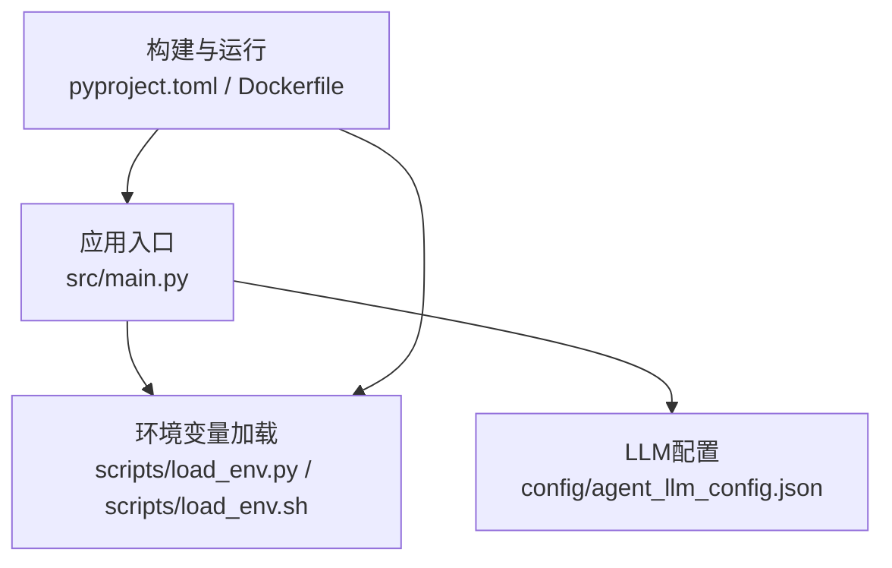
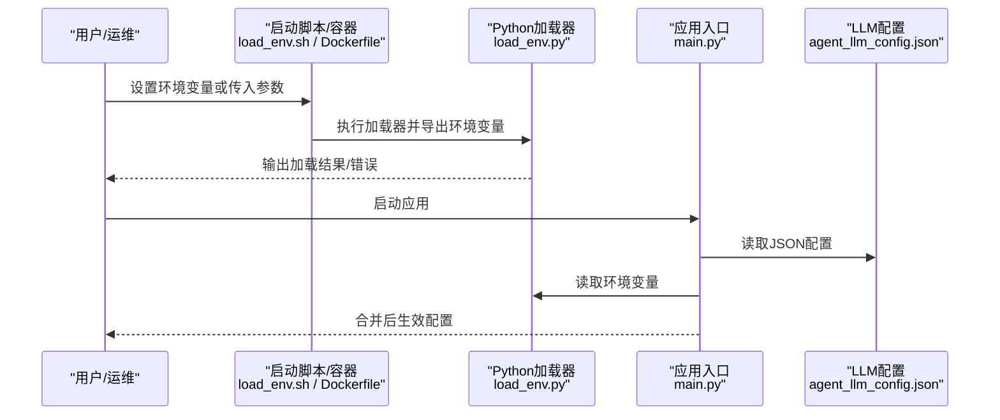
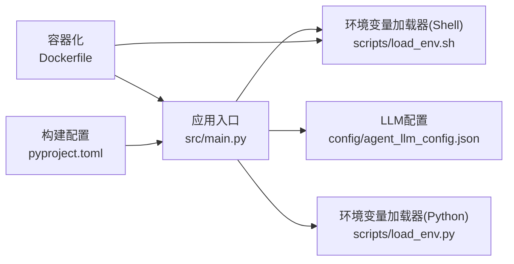
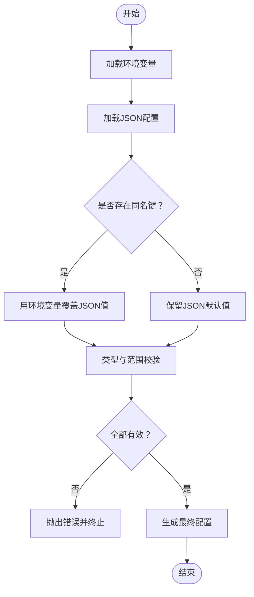

# 配置管理

<cite>
**本文引用的文件**   
- [config/agent_llm_config.json](file://config/agent_llm_config.json)
- [scripts/load_env.py](file://scripts/load_env.py)
- [scripts/load_env.sh](file://scripts/load_env.sh)
- [src/main.py](file://src/main.py)
- [pyproject.toml](file://pyproject.toml)
- [Dockerfile](file://Dockerfile)
</cite>

## 目录
1. [简介](#简介)
2. [项目结构](#项目结构)
3. [核心组件](#核心组件)
4. [架构总览](#架构总览)
5. [详细组件分析](#详细组件分析)
6. [依赖关系分析](#依赖关系分析)
7. [性能与可扩展性](#性能与可扩展性)
8. [故障排查指南](#故障排查指南)
9. [结论](#结论)
10. [附录](#附录)

## 简介
本文件为智能审计风险识别系统的“配置管理”专项文档，聚焦以下目标：
- 说明所有配置文件的作用与格式（LLM模型配置、环境变量、系统参数）
- 解释关键配置项含义、默认值与使用场景
- 提供开发、测试、生产环境的差异化配置示例
- 明确配置加载优先级与覆盖规则
- 描述敏感信息加密存储与安全最佳实践
- 给出配置验证机制与错误提示建议
- 提供自动化脚本与工具使用方法
- 面向运维的配置监控与变更管理指导

## 项目结构
与配置相关的核心位置如下：
- 应用级配置：config/agent_llm_config.json（LLM相关配置）
- 环境加载脚本：scripts/load_env.py、scripts/load_env.sh（环境变量注入）
- 入口程序：src/main.py（启动时读取配置）
- 构建与运行：pyproject.toml、Dockerfile（容器化与环境变量传递）

图表来源
- [src/main.py](file://src/main.py)
- [config/agent_llm_config.json](file://config/agent_llm_config.json)
- [scripts/load_env.py](file://scripts/load_env.py)
- [scripts/load_env.sh](file://scripts/load_env.sh)
- [pyproject.toml](file://pyproject.toml)
- [Dockerfile](file://Dockerfile)

章节来源
- [config/agent_llm_config.json](file://config/agent_llm_config.json)
- [scripts/load_env.py](file://scripts/load_env.py)
- [scripts/load_env.sh](file://scripts/load_env.sh)
- [src/main.py](file://src/main.py)
- [pyproject.toml](file://pyproject.toml)
- [Dockerfile](file://Dockerfile)

## 核心组件
本节从“配置对象—加载器—运行时”的角度梳理配置体系。

- LLM模型配置（JSON）
  - 作用：集中管理大语言模型接入参数（如模型标识、调用端点、鉴权令牌、超时、重试等）。
  - 格式：JSON键值对；建议包含顶层命名空间以区分不同模型或用途。
  - 典型字段（示例字段名，具体以实际文件为准）：
    - model: 模型名称或标识
    - provider: 提供商或服务类型
    - endpoint: API端点地址
    - api_key: 访问密钥
    - timeout: 请求超时秒数
    - max_retries: 最大重试次数
    - temperature/top_p/max_tokens: 生成控制参数
  - 校验建议：必填字段存在性检查、URL格式校验、数值范围校验、密钥非空校验。

- 环境变量加载器（Python/Shell）
  - 作用：将外部环境变量注入到进程环境或转换为应用可读取的字典。
  - 行为要点：
    - 支持从标准环境变量读取
    - 可选从.env文件或指定路径加载
    - 提供布尔、数字、列表等类型的转换能力
    - 失败时给出清晰错误提示并中止启动（或回退到默认值）
  - 安全建议：避免在日志中打印敏感值；提供掩码输出。

- 应用入口（main.py）
  - 作用：启动时加载配置、初始化子系统、暴露服务。
  - 配置消费方式：
    - 优先读取环境变量
    - 其次读取JSON配置文件
    - 最后使用内置默认值
  - 错误处理：配置缺失或非法时快速失败，返回明确错误码与消息。

章节来源
- [config/agent_llm_config.json](file://config/agent_llm_config.json)
- [scripts/load_env.py](file://scripts/load_env.py)
- [scripts/load_env.sh](file://scripts/load_env.sh)
- [src/main.py](file://src/main.py)

## 架构总览
下图展示配置在系统中的流转与优先级。

图表来源
- [scripts/load_env.sh](file://scripts/load_env.sh)
- [scripts/load_env.py](file://scripts/load_env.py)
- [src/main.py](file://src/main.py)
- [config/agent_llm_config.json](file://config/agent_llm_config.json)
- [Dockerfile](file://Dockerfile)

## 详细组件分析

### LLM模型配置（JSON）
- 文件位置：config/agent_llm_config.json
- 适用场景：统一维护多模型或多实例的接入参数，便于切换与灰度发布。
- 推荐结构（概念示意）：
  - 顶层命名空间（如 llm、models、default 等）
  - 每个模型对象包含：provider、model、endpoint、api_key、timeout、max_retries、temperature、top_p、max_tokens 等
- 校验清单：
  - 必填字段：provider、model、endpoint、api_key
  - URL格式：endpoint需为合法HTTP(S) URL
  - 数值范围：timeout>0、max_retries>=0、temperature∈[0,2]、top_p∈(0,1]、max_tokens>0
  - 密钥长度与字符集：根据提供商要求校验
- 覆盖策略：
  - 若同时存在同名环境变量，则环境变量优先覆盖JSON中的对应字段
  - 未提供的字段保持JSON默认值

章节来源
- [config/agent_llm_config.json](file://config/agent_llm_config.json)

### 环境变量加载器（Python）
- 文件位置：scripts/load_env.py
- 功能要点：
  - 从标准环境变量读取配置
  - 可选从.env文件加载（若存在）
  - 提供类型转换（字符串、布尔、整数、浮点数、列表）
  - 遇到缺失或非法值时返回结构化错误信息
- 使用建议：
  - 在容器或CI中通过命令行参数注入
  - 本地开发可通过.env文件简化输入
  - 在日志中对敏感字段进行掩码处理

章节来源
- [scripts/load_env.py](file://scripts/load_env.py)

### 环境变量加载器（Shell）
- 文件位置：scripts/load_env.sh
- 功能要点：
  - 在Linux/macOS环境下预置环境变量
  - 支持从.env文件source
  - 作为容器或系统服务的启动前置步骤
- 使用建议：
  - 在Dockerfile中COPY .env并RUN source该脚本
  - 在Kubernetes中通过ConfigMap/Secret注入

章节来源
- [scripts/load_env.sh](file://scripts/load_env.sh)

### 应用入口（main.py）
- 文件位置：src/main.py
- 职责：
  - 加载JSON配置与环境变量
  - 合并与校验配置
  - 初始化子系统（如LLM客户端、存储、工具链）
  - 启动Web服务或CLI命令
- 配置优先级（从高到低）：
  1) 环境变量（含容器注入）
  2) JSON配置文件
  3) 代码内默认值
- 错误处理：
  - 配置缺失：记录错误并退出，附带字段名与期望类型
  - 校验失败：返回具体原因（如“超时必须为正整数”）
  - 网络不可达：重试策略与熔断提示

章节来源
- [src/main.py](file://src/main.py)

### 构建与运行（pyproject.toml / Dockerfile）
- pyproject.toml：定义依赖与可能的元数据，便于在容器或CI中安装依赖。
- Dockerfile：
  - 复制源码与配置文件
  - 安装依赖
  - 通过ENV或--env-file注入环境变量
  - 设置健康检查与资源限制

章节来源
- [pyproject.toml](file://pyproject.toml)
- [Dockerfile](file://Dockerfile)

## 依赖关系分析
配置相关模块之间的依赖关系如下：

图表来源
- [src/main.py](file://src/main.py)
- [config/agent_llm_config.json](file://config/agent_llm_config.json)
- [scripts/load_env.py](file://scripts/load_env.py)
- [scripts/load_env.sh](file://scripts/load_env.sh)
- [Dockerfile](file://Dockerfile)
- [pyproject.toml](file://pyproject.toml)

## 性能与可扩展性
- 配置加载性能
  - JSON体积控制在合理范围（建议<10KB），避免启动耗时过长
  - 环境变量数量适中，避免过多键值导致解析开销
- 可扩展性
  - 采用分层命名空间（如 llm.default、llm.prod）便于按环境隔离
  - 支持动态重载（热更新）需谨慎实现，确保线程安全与幂等
- 容错与降级
  - 关键配置缺失时快速失败，避免半可用状态
  - 对网络类配置增加重试与超时保护

## 故障排查指南
- 常见问题与定位
  - 启动即报错：检查环境变量是否注入成功、JSON是否语法正确
  - 连接失败：核对endpoint、api_key、超时与重试参数
  - 权限问题：确认密钥与证书路径、端口占用、防火墙策略
- 诊断步骤
  - 打印加载后的最终配置（对敏感字段掩码）
  - 单独校验JSON与单个环境变量
  - 在最小环境中复现（仅保留必要依赖）
- 日志与指标
  - 记录配置加载耗时、失败原因分类计数
  - 对外部依赖可用性打点（连通性、延迟、错误率）

## 结论
通过“环境变量优先 + JSON兜底 + 严格校验”的配置策略，系统在可移植性、安全性与可观测性之间取得平衡。建议在CI/CD中引入配置校验与静态扫描，结合容器编排平台实现集中化的配置管理与版本控制。

## 附录

### 配置项参考（概念表）
以下为常见配置项类别与说明（具体字段以实际文件为准）：
- 通用
  - APP_ENV: 运行环境（development/testing/production）
  - LOG_LEVEL: 日志级别（DEBUG/INFO/WARNING/ERROR）
  - PORT: 服务监听端口
- LLM模型
  - LLM_PROVIDER: 提供商
  - LLM_MODEL: 模型标识
  - LLM_ENDPOINT: API端点
  - LLM_API_KEY: 访问密钥
  - LLM_TIMEOUT: 请求超时（秒）
  - LLM_MAX_RETRIES: 最大重试次数
  - LLM_TEMPERATURE: 温度参数
  - LLM_TOP_P: Top-P采样
  - LLM_MAX_TOKENS: 最大生成长度

### 环境差异示例（概念）
- 开发环境
  - 启用调试日志、较短超时、较低并发
  - 使用沙箱或测试密钥
- 测试环境
  - 固定随机种子、开启更多断言与覆盖率
  - 使用限流与Mock后端
- 生产环境
  - 关闭调试日志、提高超时与重试上限
  - 使用高可用端点、强密码与最小权限原则

### 加载优先级与覆盖规则（流程）

### 敏感信息加密与安全最佳实践
- 存储
  - 使用密钥管理服务（KMS/Secrets Manager）或操作系统凭据存储
  - 容器中使用Secret挂载而非明文写入镜像
- 传输
  - 强制HTTPS，校验证书
  - 避免在URL中携带密钥
- 使用
  - 仅在内存中持有密钥，不持久化到磁盘
  - 日志中掩码敏感字段
- 轮换
  - 支持在线轮换与热更新（谨慎实现）

### 配置验证机制与错误提示（建议）
- 必填字段检查
- 类型与范围校验（正数、区间、枚举）
- 格式校验（URL、邮箱、正则）
- 外部可达性探测（DNS、TCP握手）
- 错误提示应包含：字段名、期望类型、当前值（脱敏）、修复建议

### 自动化脚本与工具使用方法
- 本地开发
  - 使用Shell脚本预置环境变量，再启动应用
- 容器化
  - 在Dockerfile中通过ENV或--env-file注入
  - 在编排平台（K8s）中使用ConfigMap/Secret
- CI/CD
  - 在流水线中执行配置校验脚本
  - 生成配置快照与差异报告

### 运维监控与变更管理
- 监控
  - 配置加载耗时、失败率
  - 外部依赖健康度（延迟、错误率）
- 告警
  - 配置校验失败、密钥过期、连接异常
- 变更管理
  - 配置纳入版本控制，变更需评审
  - 灰度发布与回滚策略
  - 定期审计敏感配置访问与使用