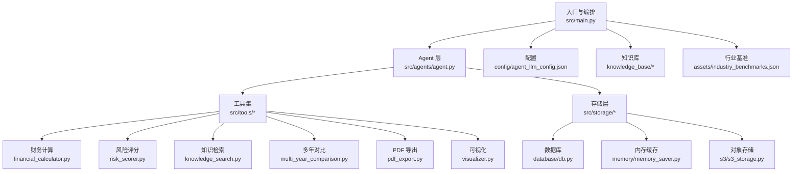
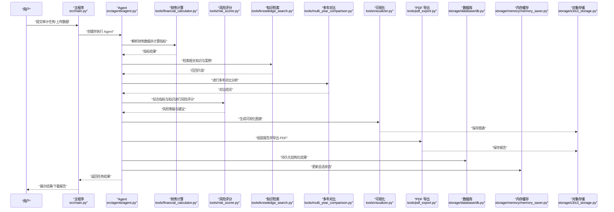
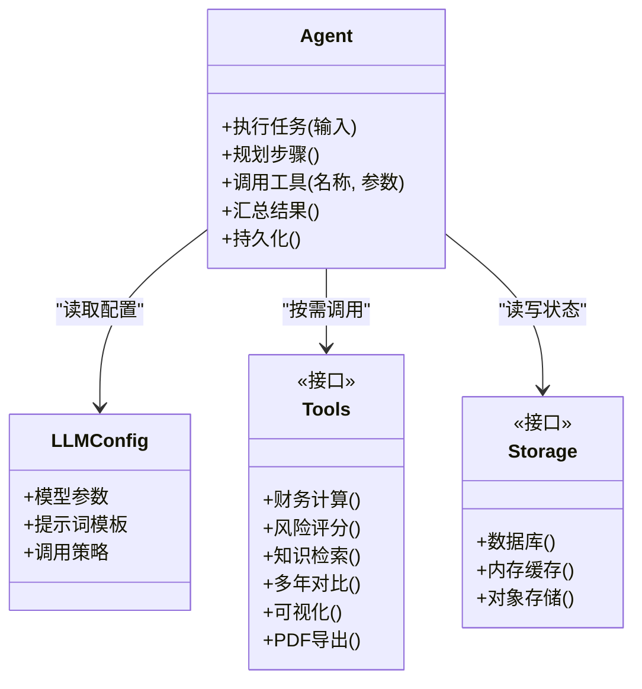
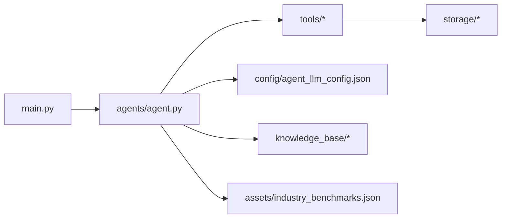

# 项目概述

<cite>
**本文引用的文件**   
- [src/main.py](file://src/main.py)
- [src/agents/agent.py](file://src/agents/agent.py)
- [config/agent_llm_config.json](file://config/agent_llm_config.json)
- [src/tools/financial_calculator.py](file://src/tools/financial_calculator.py)
- [src/tools/risk_scorer.py](file://src/tools/risk_scorer.py)
- [src/tools/knowledge_search.py](file://src/tools/knowledge_search.py)
- [src/tools/multi_year_comparison.py](file://src/tools/multi_year_comparison.py)
- [src/tools/pdf_export.py](file://src/tools/pdf_export.py)
- [src/tools/visualizer.py](file://src/tools/visualizer.py)
- [src/storage/database/db.py](file://src/storage/database/db.py)
- [src/storage/memory/memory_saver.py](file://src/storage/memory/memory_saver.py)
- [src/storage/s3/s3_storage.py](file://src/storage/s3/s3_storage.py)
- [assets/industry_benchmarks.json](file://assets/industry_benchmarks.json)
- [knowledge_base/cases_ch9.txt](file://knowledge_base/cases_ch9.txt)
- [knowledge_base/cases_ch10.txt](file://knowledge_base/cases_ch10.txt)
- [knowledge_base/cases_ch11.txt](file://knowledge_base/cases_ch11.txt)
- [scripts/init_knowledge_base.py](file://scripts/init_knowledge_base.py)
- [scripts/load_env.py](file://scripts/load_env.py)
- [pyproject.toml](file://pyproject.toml)
- [Dockerfile](file://Dockerfile)
- [start.ps1](file://start.ps1)
- [启动.bat](file://启动.bat)
- [前置库安装.bat](file://前置库安装.bat)
</cite>

## 目录
1. [简介](#简介)
2. [项目结构](#项目结构)
3. [核心组件](#核心组件)
4. [架构总览](#架构总览)
5. [详细组件分析](#详细组件分析)
6. [依赖关系分析](#依赖关系分析)
7. [性能与可扩展性](#性能与可扩展性)
8. [故障排查指南](#故障排查指南)
9. [结论](#结论)
10. [附录：快速开始](#附录快速开始)

## 简介
本项目为“智能审计风险识别系统”，面向财务审计场景，结合大语言模型（LLM）与领域知识，实现自动化审计分析。系统围绕以下目标展开：
- 自动化解析财务数据与文档，提取关键指标与异常线索
- 基于规则与模型的风险评分与异常检测
- 多年度对比与行业基准比对，辅助审计判断
- 生成可视化图表与可导出报告，支撑审计工作流
- 提供可扩展的存储与工具能力，适配本地与云端部署

系统采用模块化设计，将“Agent 编排”“工具调用”“数据存储”“可视化与导出”解耦，便于替换 LLM 后端、扩展新工具与接入不同存储后端。

## 项目结构
仓库采用按功能分层与按模块组织相结合的结构：
- src：核心代码，包含入口、Agent、工具、存储、Web 页面等
- config：运行时配置（如 LLM 参数）
- knowledge_base：案例与知识库文本
- assets：静态资源（如行业基准）
- scripts：初始化与环境脚本
- tests：测试与评估
- Dockerfile、启动脚本：容器化与一键启动

图示来源
- [src/main.py](file://src/main.py)
- [src/agents/agent.py](file://src/agents/agent.py)
- [src/tools/financial_calculator.py](file://src/tools/financial_calculator.py)
- [src/tools/risk_scorer.py](file://src/tools/risk_scorer.py)
- [src/tools/knowledge_search.py](file://src/tools/knowledge_search.py)
- [src/tools/multi_year_comparison.py](file://src/tools/multi_year_comparison.py)
- [src/tools/pdf_export.py](file://src/tools/pdf_export.py)
- [src/tools/visualizer.py](file://src/tools/visualizer.py)
- [src/storage/database/db.py](file://src/storage/database/db.py)
- [src/storage/memory/memory_saver.py](file://src/storage/memory/memory_saver.py)
- [src/storage/s3/s3_storage.py](file://src/storage/s3/s3_storage.py)
- [config/agent_llm_config.json](file://config/agent_llm_config.json)
- [assets/industry_benchmarks.json](file://assets/industry_benchmarks.json)
- [knowledge_base/cases_ch9.txt](file://knowledge_base/cases_ch9.txt)
- [knowledge_base/cases_ch10.txt](file://knowledge_base/cases_ch10.txt)
- [knowledge_base/cases_ch11.txt](file://knowledge_base/cases_ch11.txt)

章节来源
- [src/main.py](file://src/main.py)
- [src/agents/agent.py](file://src/agents/agent.py)
- [config/agent_llm_config.json](file://config/agent_llm_config.json)
- [assets/industry_benchmarks.json](file://assets/industry_benchmarks.json)
- [knowledge_base/cases_ch9.txt](file://knowledge_base/cases_ch9.txt)
- [knowledge_base/cases_ch10.txt](file://knowledge_base/cases_ch10.txt)
- [knowledge_base/cases_ch11.txt](file://knowledge_base/cases_ch11.txt)

## 核心组件
- Agent 编排：负责调度 LLM 与工具，串联“数据解析—指标计算—风险评分—报告生成”的主流程
- 工具集：
  - 财务计算：标准化财务比率与趋势指标
  - 风险评分：融合规则与模型输出，给出风险等级与建议
  - 知识检索：从知识库中召回相关案例与规范
  - 多年对比：跨期指标对比与差异解释
  - PDF 导出：将分析与结论打包为审计级报告
  - 可视化：生成图表用于报告与交互界面
- 存储层：
  - 数据库：持久化结构化结果与元数据
  - 内存缓存：会话级中间结果与临时状态
  - 对象存储：非结构化产物（图表、报告）归档
- 配置与资源：
  - LLM 配置：模型、提示词模板、调用参数
  - 知识库与行业基准：支持领域知识与基准线比对

章节来源
- [src/agents/agent.py](file://src/agents/agent.py)
- [src/tools/financial_calculator.py](file://src/tools/financial_calculator.py)
- [src/tools/risk_scorer.py](file://src/tools/risk_scorer.py)
- [src/tools/knowledge_search.py](file://src/tools/knowledge_search.py)
- [src/tools/multi_year_comparison.py](file://src/tools/multi_year_comparison.py)
- [src/tools/pdf_export.py](file://src/tools/pdf_export.py)
- [src/tools/visualizer.py](file://src/tools/visualizer.py)
- [src/storage/database/db.py](file://src/storage/database/db.py)
- [src/storage/memory/memory_saver.py](file://src/storage/memory/memory_saver.py)
- [src/storage/s3/s3_storage.py](file://src/storage/s3/s3_storage.py)
- [config/agent_llm_config.json](file://config/agent_llm_config.json)
- [assets/industry_benchmarks.json](file://assets/industry_benchmarks.json)

## 架构总览
系统以“Agent + 工具 + 存储”为核心，配合配置与知识库驱动。典型调用链如下：

图示来源
- [src/main.py](file://src/main.py)
- [src/agents/agent.py](file://src/agents/agent.py)
- [src/tools/financial_calculator.py](file://src/tools/financial_calculator.py)
- [src/tools/risk_scorer.py](file://src/tools/risk_scorer.py)
- [src/tools/knowledge_search.py](file://src/tools/knowledge_search.py)
- [src/tools/multi_year_comparison.py](file://src/tools/multi_year_comparison.py)
- [src/tools/visualizer.py](file://src/tools/visualizer.py)
- [src/tools/pdf_export.py](file://src/tools/pdf_export.py)
- [src/storage/database/db.py](file://src/storage/database/db.py)
- [src/storage/memory/memory_saver.py](file://src/storage/memory/memory_saver.py)
- [src/storage/s3/s3_storage.py](file://src/storage/s3/s3_storage.py)

## 详细组件分析

### Agent 编排与 LLM 集成
- 职责：接收任务输入，规划步骤，协调工具调用，汇总结果并落盘
- 关键点：
  - 通过配置加载 LLM 参数与提示词模板
  - 在关键节点写入内存缓存，支持中断恢复与调试
  - 对工具返回进行校验与归一化，保证下游一致性

图示来源
- [src/agents/agent.py](file://src/agents/agent.py)
- [config/agent_llm_config.json](file://config/agent_llm_config.json)
- [src/tools/financial_calculator.py](file://src/tools/financial_calculator.py)
- [src/tools/risk_scorer.py](file://src/tools/risk_scorer.py)
- [src/tools/knowledge_search.py](file://src/tools/knowledge_search.py)
- [src/tools/multi_year_comparison.py](file://src/tools/multi_year_comparison.py)
- [src/tools/visualizer.py](file://src/tools/visualizer.py)
- [src/tools/pdf_export.py](file://src/tools/pdf_export.py)
- [src/storage/database/db.py](file://src/storage/database/db.py)
- [src/storage/memory/memory_saver.py](file://src/storage/memory/memory_saver.py)
- [src/storage/s3/s3_storage.py](file://src/storage/s3/s3_storage.py)

章节来源
- [src/agents/agent.py](file://src/agents/agent.py)
- [config/agent_llm_config.json](file://config/agent_llm_config.json)

### 财务计算与指标体系
- 能力：标准化财务比率、趋势与波动性指标，统一口径与单位
- 输入：财务报表或结构化数据
- 输出：指标字典、时间序列、质量校验结果
- 建议：对缺失值与异常值进行标注，供后续风险评分参考

章节来源
- [src/tools/financial_calculator.py](file://src/tools/financial_calculator.py)

### 风险评分与异常检测
- 能力：融合指标阈值、历史分布与 LLM 语义理解，输出风险等级与原因摘要
- 输入：指标结果、知识召回、对比结论
- 输出：风险等级、关键风险点、改进建议
- 注意：评分权重与阈值可通过配置或外部策略调整

章节来源
- [src/tools/risk_scorer.py](file://src/tools/risk_scorer.py)

### 知识检索与案例匹配
- 能力：从知识库中召回与当前企业/行业相关的案例与规范
- 输入：企业特征、问题描述、关键词
- 输出：相关片段、相似度、引用来源
- 维护：通过初始化脚本批量导入案例文本

章节来源
- [src/tools/knowledge_search.py](file://src/tools/knowledge_search.py)
- [knowledge_base/cases_ch9.txt](file://knowledge_base/cases_ch9.txt)
- [knowledge_base/cases_ch10.txt](file://knowledge_base/cases_ch10.txt)
- [knowledge_base/cases_ch11.txt](file://knowledge_base/cases_ch11.txt)
- [scripts/init_knowledge_base.py](file://scripts/init_knowledge_base.py)

### 多年对比与行业基准
- 能力：跨年度指标对比、同比/环比变化、显著性标记；与行业基准对齐
- 输入：多期指标、行业基准文件
- 输出：对比结论、偏离度、风险提示
- 基准：来自资产中的行业基准 JSON

章节来源
- [src/tools/multi_year_comparison.py](file://src/tools/multi_year_comparison.py)
- [assets/industry_benchmarks.json](file://assets/industry_benchmarks.json)

### 可视化与报告导出
- 可视化：生成趋势图、雷达图、对比柱状图等，便于报告呈现
- 导出：将分析过程、结论与建议整合为 PDF，归档至对象存储
- 使用：在 Agent 流程末尾自动触发，也可独立调用

章节来源
- [src/tools/visualizer.py](file://src/tools/visualizer.py)
- [src/tools/pdf_export.py](file://src/tools/pdf_export.py)
- [src/storage/s3/s3_storage.py](file://src/storage/s3/s3_storage.py)

### 存储与持久化
- 数据库：保存结构化结果、任务元数据与审计轨迹
- 内存缓存：会话级中间态、重试与回滚上下文
- 对象存储：图表、报告等非结构化产物归档与分享

章节来源
- [src/storage/database/db.py](file://src/storage/database/db.py)
- [src/storage/memory/memory_saver.py](file://src/storage/memory/memory_saver.py)
- [src/storage/s3/s3_storage.py](file://src/storage/s3/s3_storage.py)

## 依赖关系分析
- 模块内聚：工具按职责拆分，Agent 作为编排中心，降低耦合
- 外部依赖：
  - LLM 服务：通过配置文件注入，支持热切换
  - 存储后端：数据库、内存、对象存储均可替换
  - 资源文件：行业基准与知识库文本由脚本初始化
- 潜在循环：各工具仅被 Agent 调用，彼此不互相导入，避免环依赖

图示来源
- [src/main.py](file://src/main.py)
- [src/agents/agent.py](file://src/agents/agent.py)
- [src/tools/financial_calculator.py](file://src/tools/financial_calculator.py)
- [src/tools/risk_scorer.py](file://src/tools/risk_scorer.py)
- [src/tools/knowledge_search.py](file://src/tools/knowledge_search.py)
- [src/tools/multi_year_comparison.py](file://src/tools/multi_year_comparison.py)
- [src/tools/pdf_export.py](file://src/tools/pdf_export.py)
- [src/tools/visualizer.py](file://src/tools/visualizer.py)
- [src/storage/database/db.py](file://src/storage/database/db.py)
- [src/storage/memory/memory_saver.py](file://src/storage/memory/memory_saver.py)
- [src/storage/s3/s3_storage.py](file://src/storage/s3/s3_storage.py)
- [config/agent_llm_config.json](file://config/agent_llm_config.json)
- [assets/industry_benchmarks.json](file://assets/industry_benchmarks.json)
- [knowledge_base/cases_ch9.txt](file://knowledge_base/cases_ch9.txt)
- [knowledge_base/cases_ch10.txt](file://knowledge_base/cases_ch10.txt)
- [knowledge_base/cases_ch11.txt](file://knowledge_base/cases_ch11.txt)

## 性能与可扩展性
- 并行与批处理：对多年度或多企业数据可采用批处理模式，减少重复计算
- 缓存策略：对稳定指标与知识召回结果做缓存，降低 LLM 与外部服务调用成本
- 异步与限流：对外部 LLM 与对象存储调用增加超时与重试控制
- 可扩展点：
  - 新增工具：遵循工具接口约定，注册到 Agent 调度器
  - 新存储后端：实现统一接口即可替换
  - 新基准与知识库：通过脚本增量更新

[本节为通用指导，无需源码引用]

## 故障排查指南
- LLM 调用失败：检查配置项、网络连通性与密钥；查看 Agent 日志与重试次数
- 指标计算异常：核对输入字段与单位；关注缺失值与异常值标记
- 知识检索无结果：确认知识库已初始化；检查检索关键词与企业标签
- 报告导出失败：检查对象存储权限与路径；确认可视化产物是否生成
- 存储写入错误：验证数据库连接与表结构；检查对象存储桶与访问策略

章节来源
- [src/agents/agent.py](file://src/agents/agent.py)
- [src/tools/financial_calculator.py](file://src/tools/financial_calculator.py)
- [src/tools/knowledge_search.py](file://src/tools/knowledge_search.py)
- [src/tools/pdf_export.py](file://src/tools/pdf_export.py)
- [src/storage/database/db.py](file://src/storage/database/db.py)
- [src/storage/s3/s3_storage.py](file://src/storage/s3/s3_storage.py)

## 结论
本系统以“Agent 编排 + 工具化能力 + 可插拔存储”为核心，结合 LLM 的语义理解与领域知识库，形成端到端的审计风险识别流水线。通过清晰的模块边界与配置化策略，既满足初学者快速上手，也为有经验的开发者提供了深度定制空间。

[本节为总结性内容，无需源码引用]

## 附录：快速开始

- 环境要求
  - Python 运行环境与包管理（参见 pyproject.toml）
  - 可选：Docker 环境（参见 Dockerfile）
  - 外部依赖：LLM 服务、数据库与对象存储（按实际部署配置）

- 安装与初始化
  - 安装依赖：使用项目提供的批处理脚本或包管理器安装
  - 初始化知识库：运行知识库初始化脚本，导入案例文本
  - 准备配置：编辑 LLM 配置与存储连接信息

- 启动方式
  - Windows 快捷启动：双击启动脚本
  - PowerShell 启动：使用提供的启动脚本
  - Docker 启动：构建镜像并运行容器

- 基本使用示例
  - 提交审计任务：上传财务数据或选择样例数据集
  - 查看结果：在 Web 界面查看指标、风险评分与可视化
  - 下载报告：下载 PDF 审计报告并归档

章节来源
- [pyproject.toml](file://pyproject.toml)
- [Dockerfile](file://Dockerfile)
- [scripts/init_knowledge_base.py](file://scripts/init_knowledge_base.py)
- [scripts/load_env.py](file://scripts/load_env.py)
- [start.ps1](file://start.ps1)
- [启动.bat](file://启动.bat)
- [前置库安装.bat](file://前置库安装.bat)