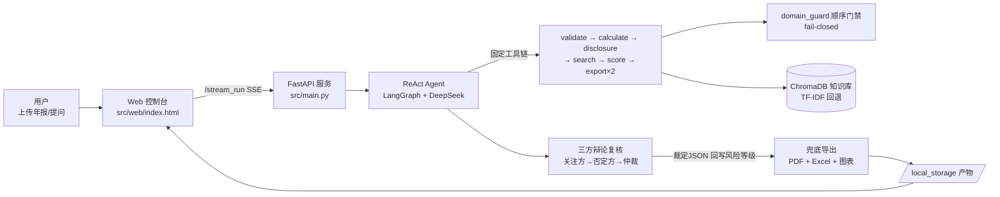

# 上市公司年报风险智能识别系统

> **版本：v5.3 GA（`pyproject.toml` version = 5.3.0）｜ 865 个单元测试**
> 2026年北京市大学生数智会计创新应用竞赛 · 智能审计赛道参赛项目

## 📌 项目简介
本系统是基于 Multi-Agent 架构的上市公司年报审计风险智能识别平台。用户上传年报 PDF 或输入公司名称，系统自动完成财务指标计算、法规检索、风险识别与评估，并生成结构化的 PDF 审计报告和 Excel 审计底稿。

## 🏗️ 技术架构
- **LLM**: DeepSeek-V4（全链路 deepseek-v4-flash 速度优先，OpenAI 兼容协议；config 可切 v4-pro 提升推理深度）
- **Agent 框架**: LangGraph（ReAct 模式） + LangChain
- **知识库**: ChromaDB 向量语义检索（内置审计准则、证监会法规、典型案例；不可用时自动回退 TF-IDF）
- **Web 后端**: FastAPI + SSE 流式输出
- **前端界面**: 原生 HTML（暗色主题，支持实时思考动画）
- **数据处理**: pandas / numpy / matplotlib
- **报告导出**: reportlab（PDF） / openpyxl（Excel）

### 架构图



## 🚀 核心功能
1. **PDF 年报解析**：自动提取上市公司年报全文文本。
2. **财务指标计算**：16 项核心指标 + 3 项扩展 + 2 项条件（单次最多 21 条），含毛利率、资产负债率、存贷双高等。
3. **三大勾稽校验**：资产负债表平衡、现金流勾稽、未分配利润一致性。
4. **法规知识库检索**：ChromaDB 向量语义检索审计准则和处罚案例（RAG，TF-IDF 自动回退）。
5. **五大风险维度识别**：财务风险、关联交易、信披合规、持续经营、监管处罚。
6. **思维链推理（CoT）**：每条风险识别前输出「观察→推理→验证→结论」推理过程。
7. **三方辩论复核**：风险关注方 → 风险否定方 → 裁判仲裁三方制衡；仲裁【裁定JSON】自动回写风险等级（白名单校验，保留 original_level 可追溯）。
8. **可视化图表**：自动生成风险热力图、财务雷达图、多年趋势图。
9. **报告一键导出**：PDF 风险报告 + Excel 审计底稿（均含 AI 生成免责声明）。
10. **多公司批量分析**：支持线程池并行处理与行业横向对比。
11. **量化效果评估**：22 个合成用例 + 5 个盲测用例，分别输出 Precision/Recall/F1 与基线对比。
12. **多用户登录与分析历史**：PBKDF2 加盐口令 + 会话令牌，每个用户拥有独立的分析历史（公司/评分/报告文件可回溯）；游客模式不影响分析，仅不保存历史。
13. **报告身份确定性兜底**：封面公司名、股票代码、报告期、行业、审计意见由正则确定性识别（`src/utils/report_identity.py`），后端三处互补兜底（已有非空值优先、绝不覆盖），避免产物名退化为「未知公司」与中期模型误判。
14. **现金流与报表字段回填**：按资产/负债/利润/现金流四段做表内上下文回填（实测 63 个字段），并处理 `59(f)` 式附注引用，消除现金流数据“未获取”。

## 🛠️ 快速启动

### 环境要求
- Windows 10/11
- Python 3.10 及以上版本
- VC++ 运行库（项目目录已附带 `VC_redist.x64.exe`）

### 一键启动（推荐）
1. 双击 `前置库安装.bat`（首次运行，自动配置环境和依赖）
2. 双击 `启动.bat`（后续日常运行）
3. 浏览器将自动打开 http://localhost:5000

### 手动复现（开发者/评委）
```bash
# 1. 安装 uv 包管理器（若未安装）
pip install uv

# 2. 一键同步全部依赖（基于 pyproject.toml + uv.lock）
uv sync --locked

# 3. 配置环境变量（复制模板并填入真实 API Key）
cp .env.example .env
# 编辑 .env，将 OPENAI_API_KEY 替换为真实的 DeepSeek API Key

# 4. 启动服务
uv run python src/main.py -m http -p 5000
```

### 效果评估复现
```bash
# 工具模式评估（<1秒，22 合成用例 + 5 盲测用例）
uv run python tests/evaluation_report.py --mode tool

# Agent 全链路评估（约 3 分钟，需 API Key）
uv run python tests/evaluation_report.py --mode agent
```

### 手动启动（开发者模式）
```bash
# 1. 同步依赖
uv sync --locked

# 2. 配置环境变量（复制 .env.example 为 .env 并填入你的 API Key）
cp .env.example .env

# 3. 启动服务
powershell -File start.ps1 -Mode web
```
## 📂 项目结构
projects/
├── src/
│   ├── agents/agent.py            # Agent 构建 + 预处理预跑 + 报告身份兜底 + 三方辩论复核（仲裁回写）
│   ├── tools/                     # 16 个核心分析工具
│   │   ├── financial_calculator.py   # 16 项核心指标（+3 扩展 / +2 条件，单次最多 21 条）
│   │   ├── data_validator.py         # 三大勾稽校验
│   │   ├── knowledge_search.py       # 法规知识库检索（RAG）
│   │   ├── pdf_parser.py             # PDF 年报解析
│   │   ├── visualizer.py             # 三种可视化图表生成
│   │   ├── pdf_export.py             # PDF 风险报告导出
│   │   ├── excel_export.py           # Excel 审计底稿导出
│   │   ├── multi_year_comparison.py  # 多年财务对比分析
│   │   └── batch_processor.py        # 多公司批量分析
│   ├── storage/                   # 存储层（SQLite/S3/内存；含用户认证与分析历史 user_service）
│   ├── utils/（含 report_identity.py）   # 报告身份确定性识别（公司名/股票代码/报告期/行业/审计意见）
│   ├── web/index.html             # Web 可视化交互界面
│   ├── maintenance.py             # 运行时资源定期回收（检查点/产物/日志/临时文件）
│   └── main.py                    # FastAPI 服务入口
├── tests/                         # 测试与效果评估（56 个 test_*.py，865 个用例）
│   ├── test_financial_calculator.py  # 财务指标计算工具测试
│   ├── test_data_validator.py        # 数据校验工具测试
│   ├── evaluation_report.py          # 量化效果评估脚本（F1/Precision/Recall）
│   └── evaluation_results.json       # 评估结果数据
├── scripts/                       # 打包 / 验收 / 评估 / 运维脚本
│   ├── maintenance_cli.py         # 运行时资源回收 CLI（默认 dry-run）
│   ├── pack_source.py             # 源码交付包打包
│   └── check_audit_release.py     # 发布前离线验收
├── docs/                          # 技术报告 / 项目计划书 / 源代码与 API 文档
├── config/
│   └── agent_llm_config.json      # LLM 配置 + 系统提示词（含思维链推理）
├── knowledge_base/                # 审计法规知识库（txt，来源见 DATA_SOURCES.md）
├── assets/                        # 字体文件、行业基准值配置
├── samples/                       # 示例产物（图表示例，纳入版本库，见 samples/README.md）
├── start.ps1                      # PowerShell 启动脚本
├── .env.example                   # 环境变量模板
├── DATA_SOURCES.md                # 知识库数据来源声明
└── pyproject.toml                 # 项目依赖与元数据配置

> 运行期产物不纳入版本库：生成的图表/报告（`local_storage/`、`src/local_storage/`）、
> 日志（`*.log`）、向量库（`.chroma_db/`）、检查点（`checkpoints.sqlite`）均已在 `.gitignore` 中忽略，
> 应用启动/运行时会自动创建对应目录（无需手动建立）。需展示的图表示例请放入版本化的 `samples/` 目录。

## 📊 效果评估

运行量化评估脚本查看系统性能指标：
```bash
uv run python tests/evaluation_report.py
```

评估结果摘要（数据来源 `tests/evaluation_results.json`，重跑评估后以该文件为准）：
- 工具评估集（22 个合成用例）：Precision **1.000**，Recall **0.975**，F1 **0.983**；正常用例误报 **0/2**
- 盲测集（5 个公开处罚案例/对照用例）：Precision **1.000**，Recall **0.875**，F1 **0.917**；正常对照正确 **1/1**
- 相对简单规则基线的召回率提升：**+89.8 个百分点**

> 以上是本地确定性工具评估，不代表真实公司的审计结论。零样本 LLM 基线默认不执行，
> 只有命令行显式追加 `--include-zero-shot` 时才会发起外部模型请求。

> Precision 与 Recall 分别从误报/漏报两个方向独立统计（Precision 分母为系统实际告警数，
> Recall 分母为标注风险数），盲测集与合成集分开报告，避免循环验证。

运行单元测试：
```bash
uv run pytest tests/ -v
```


## 🧹 运行时资源定期回收

系统长期运行或反复演示后，Agent 检查点、历史产物、轮转日志与临时文件会持续膨胀。
`src/maintenance.py` 提供**默认开启、默认保守、可关闭**的定期回收，覆盖四类对象：

| 对象 | 策略 |
|---|---|
| `checkpoints.sqlite` | **仅当体积超过阈值（默认 512MB）**才回收；保留最近 N 个线程（默认 50）；可选 `VACUUM` |
| `local_storage/<批次>/` | 按批次目录时间与保留天数回收；**至少保留 10 个批次** |
| `app.log.*` | 删除超过保留天数的轮转备份，**不删除当前 `app.log`** |
| 项目根 `.tmp_*` | 删除超过保留天数的临时文件/目录；`.tmp_pytest` 在保护名单 |

> 服务启动后后台协程先等待 5~60 秒再执行首次回收，避免与首屏请求争抢 IO；
> 任意单节失败只记录到报告 `errors`，**不阻断服务**。

### 手动执行（默认 dry-run，只预览不删除）

```bash
# 预览（默认即 dry-run）
python scripts/maintenance_cli.py --dry-run

# 真正执行：四个分区全部回收
python scripts/maintenance_cli.py --apply

# 只回收指定分区
python scripts/maintenance_cli.py --apply --sections checkpoints,artifacts,logs,temp

# 机器可读输出（便于接入监控）
python scripts/maintenance_cli.py --json

# 指定项目根目录
python scripts/maintenance_cli.py --project-dir /path/to/project
```

退出码：正常 `0`；报告中存在 `errors` → `1`；未知分区名 → `2`。

### 只读状态查询

```bash
curl http://localhost:5000/api/maintenance/status
```

该接口**只读**返回最近一次回收报告副本（`GET /api/maintenance/status`），不会触发回收。

### 环境变量

| 变量 | 默认值 | 说明 |
|---|---|---|
| `MAINTENANCE_ENABLED` | `true` | 是否开启后台定期回收；`false` 完全停用 |
| `MAINTENANCE_INTERVAL_HOURS` | `24` | 回收周期（小时） |
| `MAINTENANCE_DRY_RUN` | `false` | 只预览不删除（上线初期建议先设 `true` 观察） |
| `MAINTENANCE_CHECKPOINT_MAX_MB` | `512` | 检查点库超过该体积才回收 |
| `MAINTENANCE_CHECKPOINT_KEEP_THREADS` | `50` | 保留最近 N 个线程 |
| `MAINTENANCE_CHECKPOINT_VACUUM` | `true` | 回收后是否 `VACUUM` 收缩文件 |
| `MAINTENANCE_ARTIFACT_RETENTION_DAYS` | `30` | 产物批次保留天数 |
| `MAINTENANCE_ARTIFACT_MIN_BATCHES` | `10` | 产物批次最少保留个数 |
| `MAINTENANCE_LOG_RETENTION_DAYS` | `14` | 轮转日志保留天数 |
| `MAINTENANCE_TEMP_RETENTION_DAYS` | `7` | `.tmp_*` 临时文件保留天数 |

## 📚 文档索引

| 文档 | 路径 | 内容 |
|---|---|---|
| 技术报告 | `docs/技术报告.md` | 代码实现原理与框架、前后端实现、API 调用、非平凡逻辑、算法与部署 |
| 项目计划书 | `docs/项目计划书.md` | 项目框架、预期目标、拟解决的问题、落地可行性与效果评估 |
| Python 源代码文档 | `docs/Python源代码文档.md` | 按模块的公开类/函数用途、入参、出参 |
| 源代码清单 | `docs/源代码清单.txt` | `src/` `scripts/` `tests/` 全部 Python 文件、行数与职责 |
| API 接口清单 | `docs/API接口清单.txt` | 21 个路由 + 17 项工具链 + 16 个 LLM 工具 + SSE 事件 |
| 环境变量与常量 | `docs/环境变量与常量.txt` | 全部环境变量与关键算法常量（阈值、权重、模型参数） |
| 快速上手 | `快速上手.txt` | 面向评委的零门槛操作说明 |
| 数据来源 | `DATA_SOURCES.md` | 知识库语料来源与授权说明 |
| 财务公式 | `docs/financial_formulas.md` | 指标公式与口径细节 |

## 📦 部署包与校验

源码交付包和服务器部署包均位于 `dist/`；服务器部署包由 `scripts/pack.sh` 按历史方式生成。命名规则为 `audit-ai_v5.3GA_<kind>_<时间戳>.<扩展名>`：

| 包 | 文件 | 用途 | SHA-256 |
|---|---|---|---|
| 源码交付包（v5.3） | `dist/audit-ai_v5.3GA_src_20260919_153457.zip` | 竞赛提交与审阅（白名单打包，已排除密钥与运行产物） | `C0765B8916139BC4F1A3C75A39DFF252CABC5853BB465B35AF44C8208D912FD2` |
| 服务器部署包（v5.3） | `dist/audit-ai_v5.3GA_20260919_153457.tar.gz` | Linux 服务器 / 容器部署（解包后 `bash scripts/setup.sh`） | `B4459D2B82F37C89FC8DDA03C64A6E6380FCB1B841E425F7B565CFF1A02769DD` |
| 源码交付包 | `dist/audit-ai_v5.0GA_src_20260912_161342.zip` | 竞赛提交与审阅（白名单打包，已排除密钥与运行产物） | `9A6D695F8DD29B9661238EF3C5DD6F2B28C9C152539DCC515C3AB5BDBF9B13E3` |
| 服务器部署包 | `dist/audit-ai_v5.0GA_server_20260912_161344.tar.gz` | Linux 服务器 / 容器部署（解包后 `bash scripts/setup.sh`） | `592600D4B2B96EC61EB6618315A91CD437FABA47A92C8FAC16AC52DF79826233` |

> `dist/` 下历史包仅供演进对比。**历史解包目录内可能存在带真实 API Key 的 `.env`**，不得整目录打包或上传；若曾暴露请立即在服务商后台吊销该 Key。
> 表格中的 `v5.0GA` 文件为历史包，保留原文件名与哈希，不代表当前发布版本。
> 两份新包均已断言不含 `.env` / `*.db` / `checkpoints.sqlite` / `.tmp_*` / 运行产物（reports、charts）。
> 由于交付包内也有一份 README，包内记录的哈希必然滞后一次打包；**权威校验值以 `dist/SHA256SUMS.txt` 为准**（`sha256sum -c` 可直接核对）。

### 重新打包

```bash
# 源码交付包
python scripts/pack_source.py

# 服务器部署包（Linux / Git Bash）
bash scripts/pack.sh
```

### 运行时资源归零（演示前建议）

```bash
python scripts/maintenance_cli.py --dry-run   # 预览将被回收的检查点/产物/日志/临时文件
python scripts/maintenance_cli.py --apply     # 真正执行
```

## ⚠️ 免责声明
本系统分析结果由 AI 辅助生成，仅供审计参考与风险提示，不构成最终审计意见或投资建议。
