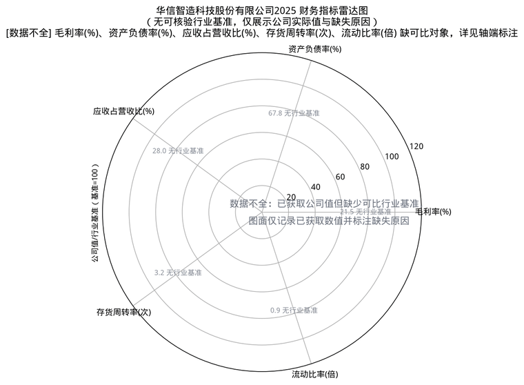
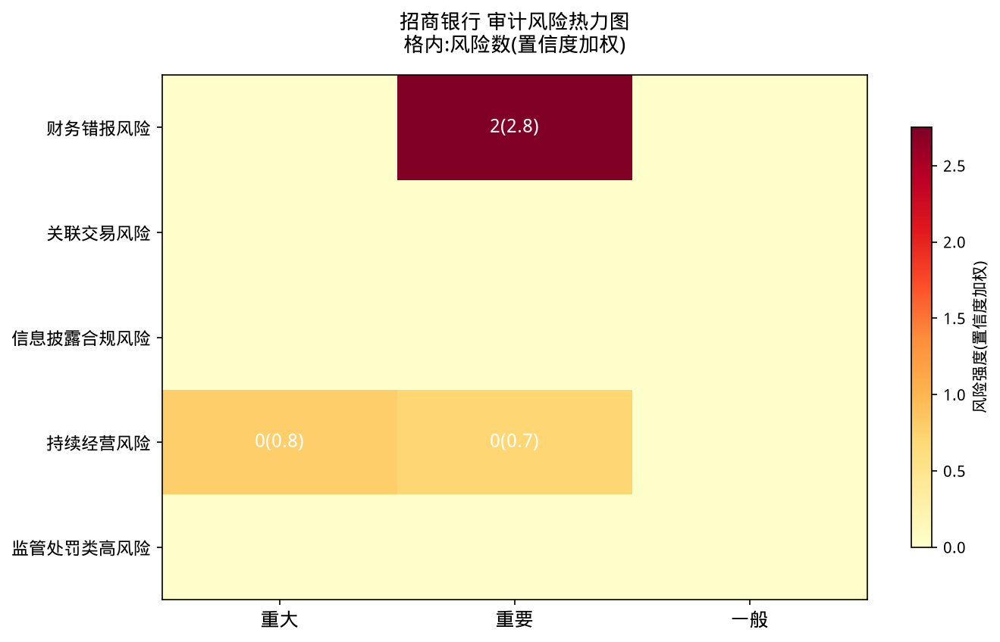
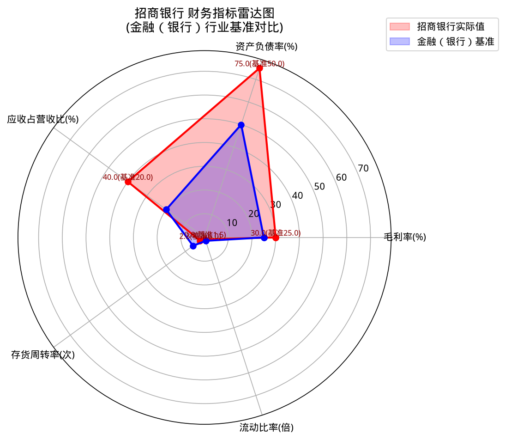
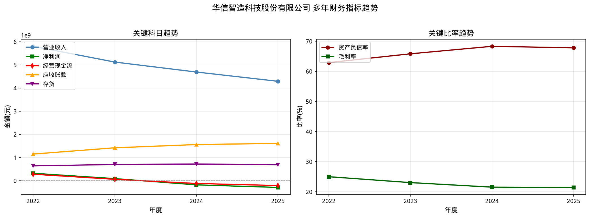
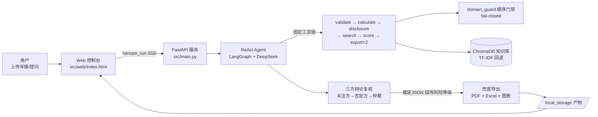

# 上市公司年报风险智能识别系统

<div align="center">


[](LICENSE)


**2026 年北京市大学生数智会计创新应用竞赛 · 智能审计赛道参赛项目**

</div>

## 📌 项目简介

本系统是基于 Multi-Agent 架构的上市公司年报审计风险智能识别平台。用户上传年报 PDF 或输入公司名称，系统自动完成财务指标计算、法规检索、风险识别与评估，并生成结构化的 PDF 审计报告和 Excel 审计底稿。

## ✨ 核心功能

1. **PDF 年报解析**：自动提取上市公司年报全文文本。
2. **财务指标计算**：16 项核心指标 + 3 项扩展 + 2 项条件（单次最多 21 条），含毛利率、资产负债率、存贷双高等。
3. **三大勾稽校验**：资产负债表平衡、现金流勾稽、未分配利润一致性。
4. **法规知识库检索**：ChromaDB 向量语义检索审计准则和处罚案例（RAG，TF-IDF 自动回退）。
5. **五大风险维度识别**：财务风险、关联交易、信披合规、持续经营、监管处罚。
6. **思维链推理（CoT）**：每条风险识别前输出「观察→推理→验证→结论」推理过程。
7. **三方辩论复核**：风险关注方 → 风险否定方 → 裁判仲裁三方制衡；仲裁【裁定JSON】自动回写风险等级（白名单校验，保留 original_level 可追溯）。
8. **可视化图表**：自动生成风险热力图、财务雷达图、多年趋势图。
9. **报告一键导出**：PDF 风险报告 + Excel 审计底稿（均含 AI 生成免责声明）。
10. **多公司批量分析**：支持线程池并行处理与行业横向对比。
11. **量化效果评估**：22 个合成用例 + 5 个盲测用例，分别输出 Precision/Recall/F1 与基线对比。
12. **多用户登录与分析历史**：PBKDF2 加盐口令 + 会话令牌，每个用户拥有独立的分析历史（公司/评分/报告文件可回溯）；游客模式不影响分析，仅不保存历史。
13. **报告身份确定性兜底**：封面公司名、股票代码、报告期、行业、审计意见由正则确定性识别（`src/utils/report_identity.py`），后端三处互补兜底（已有非空值优先、绝不覆盖），避免产物名退化为「未知公司」与中期模型误判。
14. **现金流与报表字段回填**：按资产/负债/利润/现金流四段做表内上下文回填（实测 63 个字段），并处理 `59(f)` 式附注引用，消除现金流数据"未获取"。

## 🖥️ 效果演示

<div align="center">



<br/>





<p><sub>以上图表均由合成数据生成，不含任何真实公司数据。</sub></p>

</div>

## 🏗️ 技术架构

- **LLM**: DeepSeek-V4（全链路 deepseek-v4-flash 速度优先，OpenAI 兼容协议；config 可切 v4-pro 提升推理深度）
- **Agent 框架**: LangGraph（ReAct 模式） + LangChain
- **知识库**: ChromaDB 向量语义检索（内置审计准则、证监会法规、典型案例；不可用时自动回退 TF-IDF）
- **Web 后端**: FastAPI + SSE 流式输出
- **前端界面**: 原生 HTML（暗色主题，支持实时思考动画）
- **数据处理**: pandas / numpy / matplotlib
- **报告导出**: reportlab（PDF） / openpyxl（Excel）

### 架构图



## 🚀 快速启动

### 环境要求

- Windows 10/11（Linux 服务器亦可）
- Python 3.10 及以上版本
- VC++ 运行库（缺失时请从微软官网安装 Visual C++ Redistributable x64）
- DeepSeek API Key（`.env` 中配置）

### 标准启动（推荐）

```bash
# 1. 安装 uv 包管理器（若未安装）
pip install uv

# 2. 一键同步全部依赖（基于 pyproject.toml + uv.lock）
uv sync --locked

# 3. 配置环境变量（复制模板并填入你的 DeepSeek API Key）
cp .env.example .env
# 编辑 .env，将 OPENAI_API_KEY 替换为你的 DeepSeek API Key

# 4. 首次运行前构建知识库向量索引（已有 .chroma_db 可跳过）
uv run python scripts/init_knowledge_base.py

# 5. 启动服务
uv run python src/main.py -m http -p 5000
```

浏览器打开 http://localhost:5000 即可使用。

### Windows 启动脚本（开发者模式）

```bash
uv sync --locked
powershell -File start.ps1 -Mode web
```

### 效果评估复现

```bash
# 工具模式评估（<1秒，22 合成用例 + 5 盲测用例）
uv run python tests/evaluation_report.py --mode tool

# Agent 全链路评估（约 3 分钟，需 API Key）
uv run python tests/evaluation_report.py --mode agent
```

## 📂 项目结构

```
projects/
├── src/
│   ├── agents/agent.py            # Agent 构建 + 预处理预跑 + 报告身份兜底 + 三方辩论复核（仲裁回写）
│   ├── tools/                     # 16 个核心分析工具
│   │   ├── financial_calculator.py   # 16 项核心指标（+3 扩展 / +2 条件，单次最多 21 条）
│   │   ├── data_validator.py         # 三大勾稽校验
│   │   ├── knowledge_search.py       # 法规知识库检索（RAG）
│   │   ├── pdf_parser.py             # PDF 年报解析
│   │   ├── visualizer.py             # 三种可视化图表生成
│   │   ├── pdf_export.py             # PDF 风险报告导出
│   │   ├── excel_export.py           # Excel 审计底稿导出
│   │   ├── multi_year_comparison.py  # 多年财务对比分析
│   │   └── batch_processor.py        # 多公司批量分析
│   ├── storage/                   # 存储层（SQLite/S3/内存；含用户认证与分析历史 user_service）
│   ├── utils/（含 report_identity.py）   # 报告身份确定性识别（公司名/股票代码/报告期/行业/审计意见）
│   ├── web/index.html             # Web 可视化交互界面
│   ├── maintenance.py             # 运行时资源定期回收（检查点/产物/日志/临时文件）
│   └── main.py                    # FastAPI 服务入口
├── tests/                         # 测试与效果评估（56 个 test_*.py，865 个用例）
│   ├── test_financial_calculator.py  # 财务指标计算工具测试
│   ├── test_data_validator.py        # 数据校验工具测试
│   ├── evaluation_report.py          # 量化效果评估脚本（F1/Precision/Recall）
│   └── evaluation_results.json       # 评估结果数据
├── scripts/                       # 打包 / 验收 / 评估 / 运维脚本
│   ├── maintenance_cli.py         # 运行时资源回收 CLI（默认 dry-run）
│   ├── pack_source.py             # 源码交付包打包
│   └── check_audit_release.py     # 发布前离线验收
├── docs/                          # 技术报告 / 项目计划书 / 源代码文档 / 财务公式
├── config/
│   └── agent_llm_config.json      # LLM 配置 + 系统提示词（含思维链推理）
├── knowledge_base/                # 审计法规知识库（txt，来源见 DATA_SOURCES.md）
├── assets/                        # 字体文件、行业基准值配置、README 演示动图
├── samples/                       # 示例产物（图表示例，纳入版本库，见 samples/README.md）
├── start.ps1                      # PowerShell 启动脚本
├── .env.example                   # 环境变量模板
├── DATA_SOURCES.md                # 知识库数据来源声明
└── pyproject.toml                 # 项目依赖与元数据配置
```

> 运行期产物不纳入版本库：生成的图表/报告（`local_storage/`、`src/local_storage/`）、
> 日志（`*.log`）、向量库（`.chroma_db/`）、检查点（`checkpoints.sqlite`）均已在 `.gitignore` 中忽略，
> 应用启动/运行时会自动创建对应目录（无需手动建立）。需展示的图表示例请放入版本化的 `samples/` 目录。

## 📊 效果评估

运行量化评估脚本查看系统性能指标：

```bash
# 工具级评估（快速，无需 API Key）
uv run python tests/evaluation_report.py --mode tool

# 全链路评估（完整 Multi-Agent 管道：LLM + RAG + 三方辩论复核，需在 .env 配置 API Key）
uv run python tests/evaluation_report.py --mode agent
```

### 评估体系构成

- **工具级评估**：22 个合成用例 + 5 个公开案例盲测用例，输出 Precision/Recall/F1 与简单规则基线对比；
- **全链路评估**：驱动完整 Agent 管道，输出五大风险维度的识别指标；
- **结果可溯源**：`tests/evaluation_results.json` 内嵌 `provenance.git_head`，每份结果与产生它的代码版本绑定。

### 评估口径与已声明的局限

本项目的量化指标目前仅用于**工程回归监控**，不构成系统真实准确率的对外承诺。已声明的局限包括：

1. 合成用例由本系统阈值规则参与构造，标签与规则同源，存在构造性「自证」成分；
2. 盲测集样本量尚小，统计判别力有限，部分案例与规则设计参考了同一批公开资料；
3. 量化模型（Altman Z-Score / Beneish M-Score）系数未经 A 股样本本地重估，仅作交叉印证；
4. 勾稽校验仅覆盖知识库跨表勾稽规则的一部分，覆盖清单在每次校验输出中逐条声明。

> 上述局限的完整清单与整改路线见 [docs/修改方案书.md](docs/修改方案书.md)。
> 零样本 LLM 基线默认不执行，只有命令行显式追加 `--include-zero-shot` 时才会发起外部模型请求。
> 具体量化数字以 `tests/evaluation_results.json` 为准（重跑评估后更新），本 README 不再固定展示，
> 待独立标注冻结与盲测扩容完成后重新发布。

运行单元测试：

```bash
uv run pytest tests/ -v
```

<details>
<summary><b>🧹 运行时资源定期回收（点开查看策略与环境变量）</b></summary>

系统长期运行或反复演示后，Agent 检查点、历史产物、轮转日志与临时文件会持续膨胀。
`src/maintenance.py` 提供**默认开启、默认保守、可关闭**的定期回收，覆盖四类对象：

| 对象 | 策略 |
|---|---|
| `checkpoints.sqlite` | **仅当体积超过阈值（默认 512MB）**才回收；保留最近 N 个线程（默认 50）；可选 `VACUUM` |
| `local_storage/<批次>/` | 按批次目录时间与保留天数回收；**至少保留 10 个批次** |
| `app.log.*` | 删除超过保留天数的轮转备份，**不删除当前 `app.log`** |
| 项目根 `.tmp_*` | 删除超过保留天数的临时文件/目录；`.tmp_pytest` 在保护名单 |

> 服务启动后后台协程先等待 5~60 秒再执行首次回收，避免与首屏请求争抢 IO；
> 任意单节失败只记录到报告 `errors`，**不阻断服务**。

### 手动执行（默认 dry-run，只预览不删除）

```bash
# 预览（默认即 dry-run）
python scripts/maintenance_cli.py --dry-run

# 真正执行：四个分区全部回收
python scripts/maintenance_cli.py --apply

# 只回收指定分区
python scripts/maintenance_cli.py --apply --sections checkpoints,artifacts,logs,temp

# 机器可读输出（便于接入监控）
python scripts/maintenance_cli.py --json

# 指定项目根目录
python scripts/maintenance_cli.py --project-dir /path/to/project
```

退出码：正常 `0`；报告中存在 `errors` → `1`；未知分区名 → `2`。

### 只读状态查询

```bash
curl http://localhost:5000/api/maintenance/status
```

该接口**只读**返回最近一次回收报告副本（`GET /api/maintenance/status`），不会触发回收。

### 环境变量

| 变量 | 默认值 | 说明 |
|---|---|---|
| `MAINTENANCE_ENABLED` | `true` | 是否开启后台定期回收；`false` 完全停用 |
| `MAINTENANCE_INTERVAL_HOURS` | `24` | 回收周期（小时） |
| `MAINTENANCE_DRY_RUN` | `false` | 只预览不删除（上线初期建议先设 `true` 观察） |
| `MAINTENANCE_CHECKPOINT_MAX_MB` | `512` | 检查点库超过该体积才回收 |
| `MAINTENANCE_CHECKPOINT_KEEP_THREADS` | `50` | 保留最近 N 个线程 |
| `MAINTENANCE_CHECKPOINT_VACUUM` | `true` | 回收后是否 `VACUUM` 收缩文件 |
| `MAINTENANCE_ARTIFACT_RETENTION_DAYS` | `30` | 产物批次保留天数 |
| `MAINTENANCE_ARTIFACT_MIN_BATCHES` | `10` | 产物批次最少保留个数 |
| `MAINTENANCE_LOG_RETENTION_DAYS` | `14` | 轮转日志保留天数 |
| `MAINTENANCE_TEMP_RETENTION_DAYS` | `7` | `.tmp_*` 临时文件保留天数 |

</details>

## 📚 文档索引

| 文档 | 路径 | 内容 |
|---|---|---|
| 技术报告 | `docs/技术报告.md` | 代码实现原理与框架、前后端实现、API 调用、非平凡逻辑、算法与部署 |
| 项目计划书 | `docs/项目计划书.md` | 项目框架、预期目标、拟解决的问题、落地可行性与效果评估 |
| Python 源代码文档 | `docs/Python源代码文档.md` | 按模块的公开类/函数用途、入参、出参 |
| 单份年报完整分析 | `docs/exec-plan-单份年报完整分析.md` | 固定工具链执行清单与验收校验 |
| 数据来源 | `DATA_SOURCES.md` | 知识库语料来源与授权说明 |
| 财务公式 | `docs/financial_formulas.md` | 指标公式与口径细节 |

> 面向评委的《快速上手》《源代码清单》《API 接口清单》《环境变量与常量》等竞赛交付文档随交付包分发，不随本仓库分发。

## 📦 打包交付（可选）

源码交付包与服务器部署包通过脚本生成，产物落在 `dist/`（已由 `.gitignore` 忽略，不入库）：

```bash
# 源码交付包（白名单打包，断言不含 .env / *.db / checkpoints.sqlite / .tmp_* / 运行产物）
python scripts/pack_source.py

# 服务器部署包（Linux / Git Bash；服务器解包后执行 bash scripts/setup.sh）
bash scripts/pack.sh
```

交付前建议生成校验清单：`sha256sum dist/* > dist/SHA256SUMS.txt`（核对：`sha256sum -c dist/SHA256SUMS.txt`）。
演示前如需将运行时产物归零，见上方「🧹 运行时资源定期回收」。

## 🤝 参与贡献

欢迎提交 Issue 与 Pull Request！

1. Fork 本仓库并创建特性分支：`git checkout -b feature/xxx`
2. 本地开发：`uv sync --locked`；提交前运行 `uv run pytest tests/ -q`，确保核心用例不回归
3. 提交信息遵循约定式提交（`feat|fix|docs|refactor|chore(scope): 描述`），然后发起 Pull Request

## 📄 开源协议

本项目以 [MIT License](LICENSE) 协议开源。

要点摘要（中文仅供参考，法律效力以 [LICENSE](LICENSE) 英文原文为准）：任何人均可免费获取、使用、复制、修改、合并、发布、分发、再许可及销售本软件及其文档，唯须在软件的所有副本或实质部分中保留原版权声明与本许可声明；软件按「现状」提供，不作任何明示或默示的担保，作者或版权持有人不对因使用软件而产生的任何索赔、损害或其他责任负责。

Copyright (c) 2026 AuditAI Dev

## ⭐ 支持项目

如果本项目对你有帮助，欢迎点亮一颗 Star ⭐，这是对作者最大的鼓励！

<div align="center">

<picture>
  <source media="(prefers-color-scheme: dark)" srcset="https://raw.githubusercontent.com/KROZ-coding/risk-radar/output/github-contribution-grid-snake-dark.svg" />
  
</picture>

</div>

## ⚠️ 免责声明

本系统分析结果由 AI 辅助生成，仅供审计参考与风险提示，不构成最终审计意见或投资建议。
