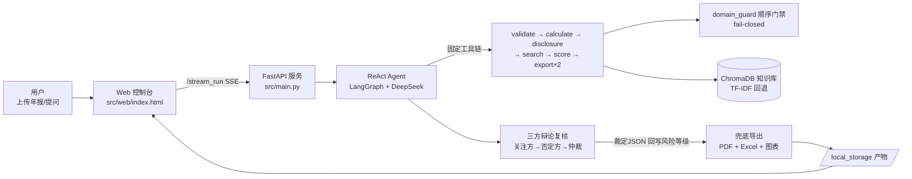

# 上市公司年报风险智能识别系统

> 2026年北京市大学生数智会计创新应用竞赛 · 智能审计赛道参赛项目

## 📌 项目简介
本系统是基于 Multi-Agent 架构的上市公司年报审计风险智能识别平台。用户上传年报 PDF 或输入公司名称，系统自动完成财务指标计算、法规检索、风险识别与评估，并生成结构化的 PDF 审计报告和 Excel 审计底稿。

## 🏗️ 技术架构
- **LLM**: DeepSeek-V4（全链路 deepseek-v4-flash 速度优先，OpenAI 兼容协议；config 可切 v4-pro 提升推理深度）
- **Agent 框架**: LangGraph（ReAct 模式） + LangChain
- **知识库**: ChromaDB 向量语义检索（内置审计准则、证监会法规、典型案例；不可用时自动回退 TF-IDF）
- **Web 后端**: FastAPI + SSE 流式输出
- **前端界面**: 原生 HTML（暗色主题，支持实时思考动画）
- **数据处理**: pandas / numpy / matplotlib
- **报告导出**: reportlab（PDF） / openpyxl（Excel）

### 架构图



## 🚀 核心功能
1. **PDF 年报解析**：自动提取上市公司年报全文文本。
2. **16 项财务指标计算**：毛利率、资产负债率、存贷双高等核心指标。
3. **三大勾稽校验**：资产负债表平衡、现金流勾稽、未分配利润一致性。
4. **法规知识库检索**：ChromaDB 向量语义检索审计准则和处罚案例（RAG，TF-IDF 自动回退）。
5. **五大风险维度识别**：财务错报、关联交易、信披合规、持续经营、监管处罚。
6. **思维链推理（CoT）**：每条风险识别前输出「观察→推理→验证→结论」推理过程。
7. **三方辩论复核**：风险关注方 → 风险否定方 → 裁判仲裁三方制衡；仲裁【裁定JSON】自动回写风险等级（白名单校验，保留 original_level 可追溯）。
8. **可视化图表**：自动生成风险热力图、财务雷达图、多年趋势图。
9. **报告一键导出**：PDF 风险报告 + Excel 审计底稿（均含 AI 生成免责声明）。
10. **多公司批量分析**：支持线程池并行处理与行业横向对比。
11. **量化效果评估**：80+ 单元测试 + 合成集/盲测集双轨 Precision/Recall/F1 评估报告。
12. **多用户登录与分析历史**：PBKDF2 加盐口令 + 会话令牌，每个用户拥有独立的分析历史（公司/评分/报告文件可回溯）；游客模式不影响分析，仅不保存历史。

## 🛠️ 快速启动

### 环境要求
- Windows 10/11
- Python 3.10 及以上版本
- VC++ 运行库（项目目录已附带 `VC_redist.x64.exe`）

### 一键启动（推荐）
1. 双击 `前置库安装.bat`（首次运行，自动配置环境和依赖）
2. 双击 `启动.bat`（后续日常运行）
3. 浏览器将自动打开 http://localhost:5000

### 手动复现（开发者/评委）
```bash
# 1. 安装 uv 包管理器（若未安装）
pip install uv

# 2. 一键同步全部依赖（基于 pyproject.toml + uv.lock）
uv sync --locked

# 3. 配置环境变量（复制模板并填入真实 API Key）
cp .env.example .env
# 编辑 .env，将 OPENAI_API_KEY 替换为真实的 DeepSeek API Key

# 4. 启动服务
uv run python src/main.py -m http -p 5000
```

### 效果评估复现
```bash
# 工具模式评估（<1秒，22 合成用例 + 5 盲测用例）
uv run python tests/evaluation_report.py --mode tool

# Agent 全链路评估（约 3 分钟，需 API Key）
uv run python tests/evaluation_report.py --mode agent
```

### 手动启动（开发者模式）
```bash
# 1. 同步依赖
uv sync --locked

# 2. 配置环境变量（复制 .env.example 为 .env 并填入你的 API Key）
cp .env.example .env

# 3. 启动服务
powershell -File start.ps1 -Mode web
```
## 📂 项目结构
projects/
├── src/
│   ├── agents/agent.py            # Agent 构建 + 兜底导出 + 三方辩论复核（仲裁回写）
│   ├── tools/                     # 16 个核心分析工具
│   │   ├── financial_calculator.py   # 16 项财务指标计算
│   │   ├── data_validator.py         # 三大勾稽校验
│   │   ├── knowledge_search.py       # 法规知识库检索（RAG）
│   │   ├── pdf_parser.py             # PDF 年报解析
│   │   ├── visualizer.py             # 三种可视化图表生成
│   │   ├── pdf_export.py             # PDF 风险报告导出
│   │   ├── excel_export.py           # Excel 审计底稿导出
│   │   ├── multi_year_comparison.py  # 多年财务对比分析
│   │   └── batch_processor.py        # 多公司批量分析
│   ├── storage/                   # 存储层（SQLite/S3/内存；含用户认证与分析历史 user_service）
│   ├── web/index.html             # Web 可视化交互界面
│   └── main.py                    # FastAPI 服务入口
├── tests/                         # 测试与效果评估
│   ├── test_financial_calculator.py  # 财务指标计算工具测试（10 用例）
│   ├── test_data_validator.py        # 数据校验工具测试（7 用例）
│   ├── evaluation_report.py          # 量化效果评估脚本（F1/Precision/Recall）
│   └── evaluation_results.json       # 评估结果数据
├── config/
│   └── agent_llm_config.json      # LLM 配置 + 系统提示词（含思维链推理）
├── knowledge_base/                # 审计法规知识库（txt，来源见 DATA_SOURCES.md）
├── assets/                        # 字体文件、行业基准值配置
├── samples/                       # 示例产物（图表示例，纳入版本库，见 samples/README.md）
├── start.ps1                      # PowerShell 启动脚本
├── .env.example                   # 环境变量模板
├── DATA_SOURCES.md                # 知识库数据来源声明
└── pyproject.toml                 # 项目依赖与元数据配置

> 运行期产物不纳入版本库：生成的图表/报告（`local_storage/`、`src/local_storage/`）、
> 日志（`*.log`）、向量库（`.chroma_db/`）、检查点（`checkpoints.sqlite`）均已在 `.gitignore` 中忽略，
> 应用启动/运行时会自动创建对应目录（无需手动建立）。需展示的图表示例请放入版本化的 `samples/` 目录。

## 📊 效果评估

运行量化评估脚本查看系统性能指标：
```bash
uv run python tests/evaluation_report.py
```

评估结果摘要（数据来源 `tests/evaluation_results.json`，重跑评估后以该文件为准）：
- 合成集（22 用例，验证规则正确性）：Precision / Recall / F1 均 **100%**，正常用例误报 **0/2**
- 盲测集（5 真实处罚案例公开数据，未参与阈值设计，验证泛化）：F1 **100%**，正常对照误报 **0/1**
- vs 基线方案（单规则引擎）召回率提升: **+92.3pp**

> Precision 与 Recall 分别从误报/漏报两个方向独立统计（Precision 分母为系统实际告警数，
> Recall 分母为标注风险数），盲测集与合成集分开报告，避免循环验证。

运行单元测试：
```bash
uv run pytest tests/ -v
```


## ⚠️ 免责声明
本系统分析结果由 AI 辅助生成，仅供审计参考与风险提示，不构成最终审计意见或投资建议。
